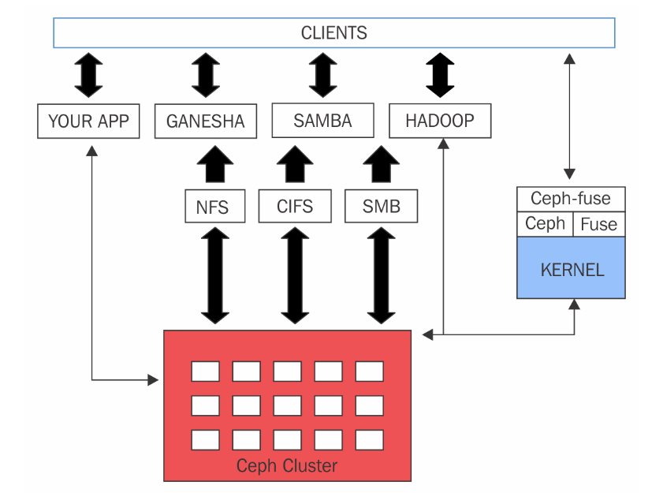

### CEPH MDS ( Metadata Server )

- Ceph MDS là daemon cho Ceph filesystem (CephFS). Ceph MDS cho phép Client mount 1 POSIX filesystem ở bất cứ kích thước nào. MDS không đưa dữ liệu tới 
người dùng, OSD làm việc đó. MDS cung cấp một filesystem chia sẻ với lớp cache thông minh , giảm đáng kể lượng đọc và ghi.

- MDS là thành phần duy nhất trong ceph chưa production, hiện chỉ 1 ceph MDS daemon hoạt động tại 1 thời điểm. MDS không lưu dữ liệu local. Nếu 1 MDS daemon 
lỗi, ta có thể tạo lại trên bất cứ hệ thống nào mà cluster có thể truy cập. Các metadata server daemon được cấu hình là active-passive. Primary MDS là acive,
còn các node khác chạy standby.

