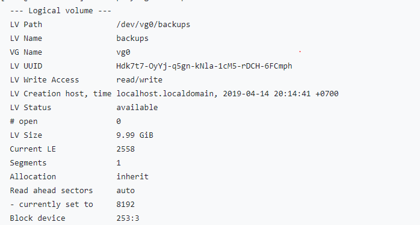

### Ý nghĩa các thông số trong lệnh vgdisplay , lvdisplay ,pvdisplay
### 1. Các thông số trong lệnh ` vgdisplay `

- ` VG name ` : Tên volume group
- ` System ID ` : 
- ` Format ` : Kiến trúc LVM được sử dụng.
- ` Metadata Areas ` :
- ` Metadata Sequencd No ` : 
- ` VG Access ` : Volume group có thể đọc/viết và sẵn sàng sử dụng.
- ` VG status ` : Volume group có thể được thay đổi size , có thể mở rộng thêm dung lượng cho VG . 
- ` MAX LV ` :
- ` Cur LV ` : 
- ` Open LV ` : 
- ` MAX PV ` :
- ` Cur PV ` : 
- ` VG size ` : Kích thước hiện tại của VG
- ` PE size ` : Mở rộng physical , kích thước cho đĩa có thể xác định bằng kích thước PE hoặc GB , 4MB là kích thước PE mặc định của LVM
- ` Total PE ` : Dung lượng PE mà VG có
- ` Alloc PE ` : Tổng PE sử dụng
- ` Free PE ` : Tổng PE chưa được sử dụng 

### 2. Các thông số trong `lvdisplay`

- LV Path : thư mục chứa Logical Volume
- LV Name : tên của Logical Volume
- VG Name : tên của Volume Group mà Logical Volume thuộc vào.
- LV UUID : Universally Unique IDentifier, định danh duy nhất.
- LV Write Access : Logical Volume ghi truy cập
- LV Creation host, time : thời gian
- LV Status : Trạng thái Logical Volume
- LV Size : Dung lượng Logical Volume
- Currents LE: Số lượng phạm vi hiện tại
- Allocation :Trạng thái phân bổ hiện tại

### 3. Các thông số trong `pvsdisplay`

- ` PV Name ` : partition được sử dụng
- ` VG Name ` : 
- ` PV Size ` : Kích thước của physical volume

