### Quản lý phân vùng đĩa cứng trên Linux
### A. Các khái niệm cơ bản

### 1.File System
> Một file system xác định cách lưu trữ hoặc thông tin và truy xuất dữ liệu từ ổ đĩa. Đối với hệ thống Windows thì file systems phổ biến là FAT32 và NTFS.
Trên hệ điều hành Linux, các file system phổ biến là ext2 , ext4 ,xfs,vfat,swap ,ZFS và GlusterFS.


### 2.Bảng phân vùng
> Phân vùng là một phần của không gian đĩa cứng .Một bảng phân vùng là một phân vùng (partition table) của đĩa chứa thông tin về kích thước và
vị tri của phân vùng đó trong đĩa cứng . Hai bảng phân vùng phổ biến nhất là MBR và GPT.

### 2.1 Master Boot Record (MBR)
- MBR được IBM giới thiệu lần đầu tiên vào năm 1983.
- MBR chứa thông tin về các phân vùng logical chứa các hệ thống tập được sắp xếp trên đĩa.
- Nó chứa code thực thi (bộ tải khởi động) để hoạt động như một trình tải cho hệ đều hành được cài đặt.
- MBR chỉ hỗ trợ tối đa 4 phân vùng chính .
- MBR sử dụng 32 bit để lưu trữ địa chỉ khối và đối với các đĩa cứng có các sectors 512 , MBR xử lý tối đa 2TB (2^32 x 512 byte)

### 2.2 Bản phân vùng GUID (GPT)

- GPT có thể có 128 phân vùng . GPT sử dụng 64 bit cho địa chỉ khối và cho các đĩa cứng có các sectors 512 byte. 
- Kích thước tối đa là 9,4 ZB (9,4 x 10^21 byte) hoặc 8ZiB.
- 1ZB = 10^21 byte = 1triệu Petabye (PB) ( lưu gì cho hết được bây nhiêu nhỉ ;)))


### B. Quản lý phân vùng ổ cứng bằng tiện ích fdisk
### 1 Giới thiệu fdisk

> ` fdisk ` là tiện ích quả lý phân vùng đĩa cứng trên linux. Sử dụng fdisk ta có thể xem , tạo , thay đổi kích thước , xóa , thay đổi ,sao
chép và di chuyển các phân vùng.

- fdisk cho phép tạo tối đa 4 phân vùng chính được Linux cho phép với mỗi phân vùng yêu cầu kích thước tối thiể 40MB.
- fdisk không thể sử dụng với phân vùng GUID(GPT) và nó không hoạt động được trên phân vùng lớn hơn 2TB.

### 2 Sử dụng lệnh fdisk
- Để xem tất cả các phân vùng trong hệ thống dùng lệnh `fdisk -l `


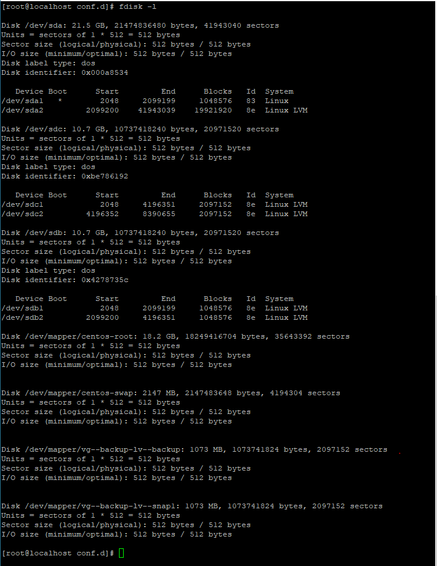

- Để xem một phân vùng trên đĩa cụ thể  ta dùng lệnh ` fdisk -l /dev/sdb `


### 2.1 Tạo phân vùng mới
- Sử dụng lệnh ` fdisk /dev/sdb `
- Sau khi tạo xong phân vùng , cập nhật phân vùng cho hệ điều hành : ` partprobe /dev/sdb `
- Định dạng  phân vùng bằng lệnh : ` mkfs -t ext4 /dev/sdb1 ` hoặc ` mkfs.xfs /dev/sdb1 `
- Tạo thư mục và `mount ` phân vùng đó với thư mục để sử dụng dùng lệnh ` mount /dev/sdb1 /mnt/thumuc `

### 2.2 Xóa phân vùng đĩa cứng
- Đầu tien ngắt kết nối và xóa mục nhập trong `/etc/fstab `
- Sau đó phải gỡ bỏ các liên kết của phân vùng với file bằng lệnh ` umount /dev/sdb1 `
- Sau đó dùng lệnh xóa ` fdisk /dev/sdb ` với command là ` d` 


### 3.Quản lý phân vùng ổ cứng bằng tiện ích parted.
### 3.1 Giới thiệu về parted

- ` parted` là một chương trình để thao tác phân vùng đĩa . nõ hỗ trợ nhiều định dạng bảng phân vùng bao gồm cả GPT hoặc MS-DOS . 

- ` parted ` là công cụ cao câp hơn fdisk , cho phép ta tạo ra phân vùng với kích thước đĩa lớn hơn 2TB .

### 3.2 Cài đặt parted

- parted cài sẵn trên hầu hết các bản phân phối của Linux . Nếu chưa cài đặt mặc định , ta có thể cài đặt thêm bằng lệnh:

	- Debian / Ubuntu : ` apt-get install parted `
	- RHEL / CentOS : ` yum install parted ` 

### 3.3 Sử dụng tiện ích parted

- Lệnh ` parted ` dưới đây sẽ chọn đĩa  `/dev/sda ` vì đây là ổ cứng đầu tiên trong hệ thống.

- Chúng ta có thể di chuyển đến các đĩa khác bằng cách sử dụng  lệnh
```
(parted) select /dev/sdb
Using /dev/sdb

```

- Khi muốn vào một ổ đĩa cụ thể nào dùng lệnh: ` parted /dev/sdb `

- Xem tất cả các phân vùng đĩa hiện có dùng lệnh : ` parted - l `

### 3.4 Tạo phân vùng mới
- Truy cập vào phân vùng để tạo ` parted /dev/sdb `
- Chọn loại partition table cho đĩa mới bằng lệnh: ` (parted) mklabel msdos `
	- msdos : tương ứng với MBR 
	- gpt : tương ứng với GPT
- Đăt đơn vị tính bằng  GB : ` (parted) unit GB `
- Tạo ra phân vùng mới với ` mkpart `. Nhập primary cho phân vùng chính hoặc extended cho phân vùng mở rộng. Sau đó nhập size của phân vùng (GB)


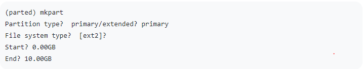

- Kiểm tra phân vùng vừa được tạo bằng `print`


- Thoát (quit) và kiểm tra kết quả với lệnh ` parted /dev/sdb print `


- Mount phân vùng vừa tạo 
` mount /dev/sdb1 /data `

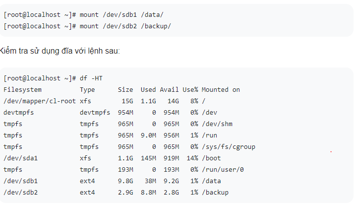

- Lấy UUID ta dùng lệnh ` blkid /dev/sdb1 ` 


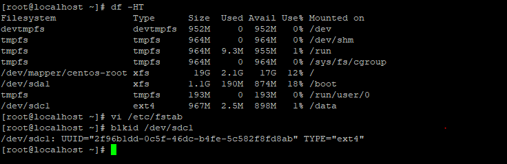


/dev/sdc1: UUID="2f96b1dd-0c5f-46dc-b4fe-5c582f8fd8ab" TYPE="ext4"


- Các phân vùng gắt kết của chúng là tạm thời . Nếu hệ điều hành khởi động lại , các thư mục gắn kết này sẽ biến mất. Vì vậy , để  gắn kết vĩnh
viễn ca kết nối này  phải nhập trong tệp ` /etc/fstab `.

```
/dev/mapper/cl-swap     swap                    swap    defaults        0 0

UUID=709d2fc0-699f-4b33-a973-86f4942c207d  /data	    etx4     defaults	      0 0


```


- Lưu lại file ` etc/fstab ` và chạy lệnh ` mount -a `.

### 3.5 Tạo phân vùng mới với tất cả không gian còn lại 
- Lệnh này tạo ra một phân vùng với tất cả không gian lưu trữ còn lại của hệ thống ( từ kết phân vùng cũng tới khoảng không gian còn lại )
- Chúng ta có thể tạo phân vùng với câu lệnh
` parted [Disk Name] [mkpart] [Partition Type] [Filesystem Type] [Partition Start Size] [Partition End Size] `


### 3.6 Xóa phân vùng 
- umount trước khi phân vùng đã gắn kết trước đó. Cú pháp dưới đây sẽ loại bỏ phân vùng 3 ` dev/sdc 2 `
- Dùng lệnh ` parted /dev/sdc rm 2 `


### 3.7 Đặt hoặc thay đổi cờ cho phân vùng


### 3.8 Thay đổi kích thước phân vùng
- Chạy lệnh ` parted /dev/sdc print free ` để kiểm tra dung lượng ổ đĩa

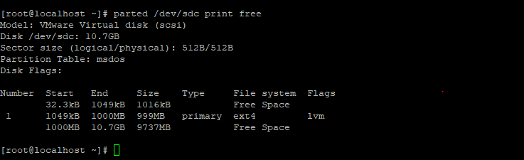


- Tăng kích thước phân vùng bằng command truyền tham số trực tiếp.
	- Sử dụng lệnh ` parted /dev/sdc resizepart 1 3.0GB ` 
	- Có nghĩa là tăng phân vùng 1 lên THÀNH 3.0G

- Khi chạy lệnh trên thì parted chỉ tăng ở partition table , nên dùng lệnh sau để resize:
	- Với file system (ext2 , ext3 , ext4 ) : resize2fs
	- với file system (xfs) : xfs_growfs

` resize2fs -f /dev/sdc1 `

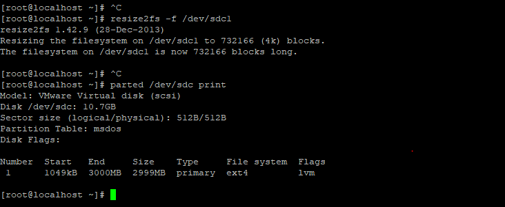


### 4. Quản lý phân vùng Linux trong quá trình vận hành.
### 4.1 Lệnh ` du `

> Lệnh `du` ước tính và tóm tắt sử dụng không gian tệp và thư mục

- Liệt kê kích thước của một thư mục ` du -m /etc/ `
	- -m : đơn vị là MB
	- -k : đơn vị đo là KB
	- -B : đơn vị đo là Byte 

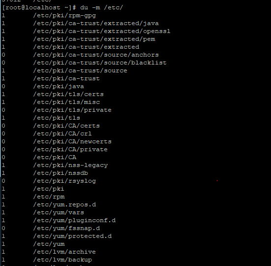


- Liệt kê kích thước của các thư mục trong thư mục cần đọc /var/www dùng lệnh : ` du -h /var/www `


- Hiển thị kích thước của thư mục dung lệnh /var/www dung lệnh : ` du -sh /var/www `

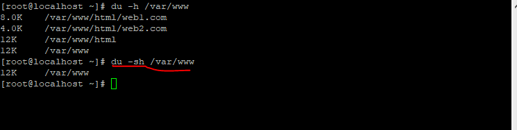

### 4.2 Lệnh ` df `
> Lệnh df cung cấp môt cái nhìn tổng quan về việc sử dụng không gian đĩa của hệ thống tập tin.

- Hiển thị tất cả các hệ thống tệp và sử dụng đĩa của chúng dung lệnh ` df `


- Hiển thị tât cả các hệ thống tập tin và sử dụng không gian đĩa của hệ thống tập tin dưới dạng người dùng đọc được dung 
lượng ` df -h ` (-H tính 1kb=1000byte , -h tính 1kb=1024byte)


### 4.3 Lệnh fsck
> Lệnh fsck vừa kiểm tra và sửa chưa hệ thống tập tin linux

- kiểm tra một hệ thống tập tin cụ thể /dev/sdc1 dùng lệnh ` fsck /dev/sdc1 `.

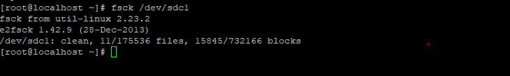

- Các mã (return code ) có thẻ cho lệnh fsck
	- 0 : không có lỗi
	- 1 : sửa lỗi hệ thống tập tin
	- 2 : hệ thống nên được khởi động lại
	- 4 : Lỗi hệ thống tập tin không được quan tâm
	- 8 : Lỗi vận hành
	- 16: Lỗi sử dụng hoặc cú pháp
	- 32 : fsck bị hủy theo yêu cầu người dùng
	- 128: lỗi thư viện dùng chung


- Kiểm tra hệ thống bằng tùy chọn -f với câu lệnh ` fsck /dev/sdc1 -f `


### 4.4 Lệnh ` e2fsck `
> Lệnh e2fsck là một bộ tập hợp các công cụ để bảo trì các kiểu hệ thống tập tin ext2 ,ext3 và ext4

- Kiểm tra và tự động sửa chữa tất cả các vấn đề mà không cần xác nhận lại  dùng lệnh: ` e2fsck -p /dev/sdc1 `
- Sử dụng tùy chọn `-y` thì tất cả câu trả lời đều là yes
- Sử dụng tùy chọn `-n`  thì chỉ thực hiện việc kiểm tra , không thay đổi bất kì điều gì.
- Sử dụng tùy chọn ` -f ` kiểm tra toàn bộ hệ thống tập tin 

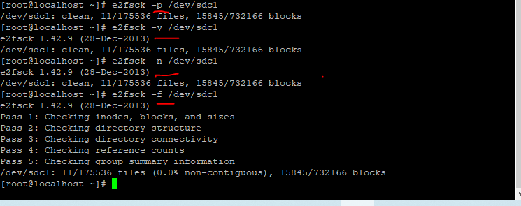


### 4.5 Lệnh ` mke2fs `
> Lệnh mke2fs để tạo một hệ thống tập tin /ext2/ext3 và ext4

- Để tạo một hệ thống tập tin trên thiết bị dùng lệnh ` mke2fs /dev/sdc1 `

- Chỉ dịnh cho kích thước khối theo byte ta dùng lệnh ` mke2fs -b 1024 /dev/sdc1 ` (khối có dung lượng 1024byte).


- Để kiểm tra các thiết bị cho các khối xấu dùng lệnh ` mke2fs -c /dev/sdc1 `


### 4.6 Lệnh ` tune2fs `
> Lệnh tune2fs được sử dụng để sửa đổi các tham số có thể điều chỉnh trên các hệ thống tập kiểu ext2 , ext3 ,ext4

- Liệt kê tất cả các tham số và giá trị của ổ đĩa dùng lệnh  `tune2fs -l /dev/sdc1 `
- Sử dụng `-j `để chuyển hệ thống tập tin từ ext 2  thành ext3
- Sử dụng `-o extents,uninit_bg,dir_index ` để chuyển hệ thống tập tin từ ext 3 thành ext 4


### 4.7 Lệnh ` xfs_repair`
> Lệnh xfs_repair sửa chữa một hệ thống tập tin xfs

- Kiểm tra tính nhất quán hệ thống tệp và sửa chữa xfs và không thay đổi thứ gì trên hệ thống dùng lệnh `xfs_repair -n /dev/sdc1 `

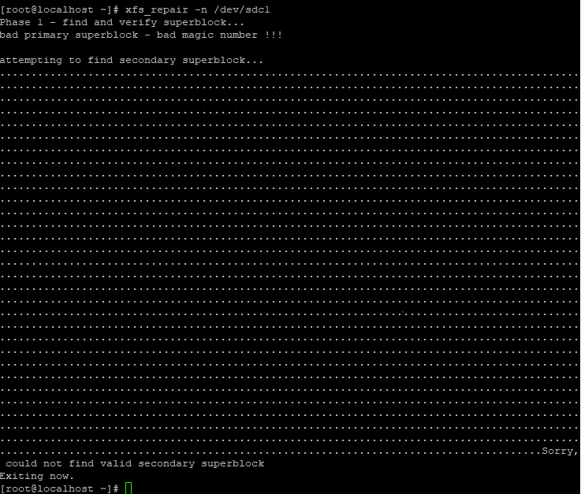


### 4.8 Lệnh `xfs_fsr `

> Lệnh xfs_fsr sắp xếp lại hệ thống tập tin xfs 

### 4.9 Lệnh ` xfs_db `

> Lệnh xfs_db gỡ lỗi hệ thống tập tin xfs


 Tài liệu tham khảo : https://blogd.net/linux/quan-ly-phan-vung-dia-cung-tren-linux/


