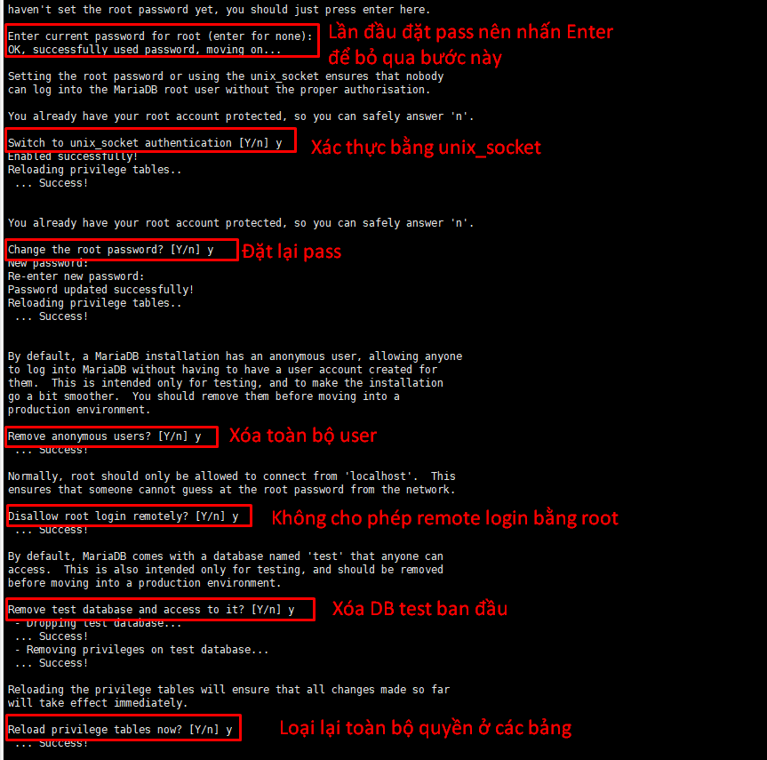

### A.Cài Đặt MariaDB trên Centos_7
### 1. Cài đặt Repository cho MariaDB
```
vi /etc/yum.repos.d/MariaDB.repo

[mariadb]
name = MariaDB
baseurl = http://yum.mariadb.org/10.4/centos7-amd64
gpgkey=https://yum.mariadb.org/RPM-GPG-KEY-MariaDB
gpgcheck=1 

```

- name : Tên của kho lưu trữ
- baseurl : Đường dẫn tới kho lưu trữ
- gpg : Là viết tắt của GNU Private Guard , là một loại chữ kí số giúp bảo vệ quyền riêng tư. Nếu đặt giá trị gpgcheck =1 thì nó sẽ xác thực gói bằng cách kiểm tra chữ kí GPG.
Đặt gpgcheck=0 để bỏ qua xác thực hoặc trong trường hợp gói không được đăng kí
- pgpchek : Cài đặt bảo mặt (1=có , 0=không)
- enable : trạng thái của kho lưu trữ (1=bật , 0=tắt)
- gpgkey : đường dẫn của file key(nếu có)


### 2. Cập nhật bộ đệm và kiêm tra phiên bản từ repo trước khi cài đặt
```
yum makecache fast

yum info mariadb-server

```

### 3. Gỡ bỏ Mariadb trước và các gói liên quan 
```

yum erase mysql
rm -rf /var/lib/mysql
rm /etc/my.cnf

```

### 4. Cài đặt MariaDB
```
yum install MariaDB-server MariaDB-client MariaDB-devel -y

systemctl status mariadb
systemctl start mariadb
systemctl restart mariadb
systemctl enable mariadb
```

### 5. Thiết lập cơ bản cho MariaDB
- mysql_secure_installation




### B. Setting Log MariaDB
### 1. Backup cấu hình trước đó và viết lại file cấu hình
```
cp /etc/my.cnf /etc/my.cnf.org


echo '[mysqld]
slow_query_log                  = 1
slow_query_log_file             = /var/log/mariadb/slow.log
long_query_time                 = 5
log_error                       = /var/log/mariadb/error.log
general_log_file                = /var/log/mariadb/mysql.log
general_log                     = 1

[client-server]
!includedir /etc/my.cnf.d' > /etc/my.cnf

```
- slow_query_log : =0 có nghĩa là tắt tính năng này , =1 tức là kích hoạt tính năng này
- long_query_time : nếu câu truy vấn trong database có phải hồi chậm hơn 5s thì coi đó là truy vấn chậm(slow_query)
- log_error : nơi chứa error log 

### 2. Tạo thư mục chứa log và start
```
mkdir -p /var/log/mariadb/
chown -R mysql. /var/log/mariadb/

systemctl restart mariadb

```
- Nếu slow query log không nhận , thực hiện bước dưới
```
mysql -u root -p

SET GLOBAL slow_query_log = 'ON';

exit

```

### 3. Kiểm tra cấu hình sau khi cài đặt
```
mysql -u root -p

show global variables like 'slow_query_log';
show global variables like 'slow_query_log_file';
show global variables like 'long_query_time';
show global variables like 'log_error';
show global variables like 'general_log_file';
show global variables like 'general_log';

exit
```

### 4. Thử tạo Slow query và test
```
mysql -u root

SELECT SLEEP(10);

exit
```


### C. Thiết lập đăng nhập bằng mật khẩu cho Root
### 1. Tổng quan
- Trong MariaDB có nhiều hơn một plugin xác thực mật khẩu cho tài khoản. Khi cài MariaDB , mặc định sẽ tạo ra một user root và có 2 plugin xác thực 
	- ` unix_socket `: cho phép user root đăng nhập mà không cần mật khẩu thông qua local Unix socket file được xác định bởi socket biến hệ thống, miễn là root user của OS là có thể dăng nhập được
	- ` mysql_native_password ` : được khuyến khích sử dụng xác thực  bằng password. Để thực hiện điều này , ta phải set password 

### 2. Set password
```
mysql -u root -p

alter user 'root'@'localhost' identified by '123@123a';
flush privileges;

```

- Tắt plugin `unix_socket` trong fil `/etc/my.cnf.d/server.cnf`
```
[mariadb]
...
unix_socket=OFF
hoặc

[mariadb]
...
disable_unix_socket

```

- Restart lại Mariadb
```
systemctl restart mariadb
```
