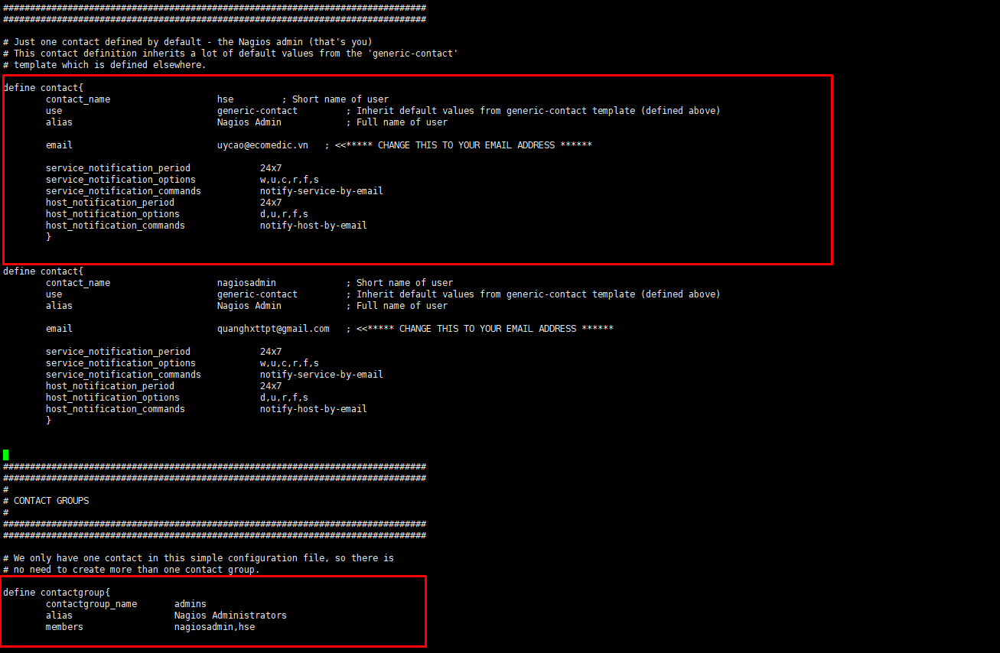

### Cảnh báo mail trong Nagios
### A. Cấu hình cảnh báo mail 
### 1. Cài đặt Mail Postfix

` https://github.com/LeeQHSE123/B-o-c-o-05-2019/blob/master/baocao/Send%20mail%20%20with%20postfix/docs/1.Cau_hinh.md `

### 2. Gửi cảnh báo khi có sự cố 
### 2.1 Thêm các thông tin liên lạc của Nagios trong ` /usr/local/nagios/etc/objects/contacts.cfg `
```
vi /usr/local/nagios/etc/objects/contacts.cfg


define contact{
        contact_name                    nagiosadmin             ; Short name of user
        use                             generic-contact         ; Inherit default values from generic-contact template (defined above)
        alias                           Nagios Admin            ; Full name of user

        email                           quanghxttpt@gmail.com        ; <<***** CHANGE THIS TO YOUR EMAIL ADDRESS ****** ( Mail nhận thông báo)

        service_notification_period             24x7
        service_notification_options            w,u,c,r,f,s
        service_notification_commands           notify-service-by-email
        host_notification_period                24x7
        host_notification_options               d,u,r,f,s
        host_notification_commands              notify-host-by-email
        }

```

### 2.2 Ý nghĩa của các tham số khai báo trên
- ` service_notification_options `: trạng thái sẽ gửi cảnh báo của service
- ` w `: warning
- ` u `: unknown service
- ` c `: critical
- ` r `: recovery service (trạng thái OK)
- ` f `: cảnh báo khi service khởi động và tắt FLAPPING
- ` s `: gửi cảnh báo khi dịch vụ downtime trong lịch trình
- ` host_notification_options `: trạng thái sẽ gửi cảnh báo của host
- ` d `: DOWN, cảnh báo khi host rơi vào trạng thái down

### 2.3 Khởi động lại dịch vụ 
` systemctl restart nagios `


### B. Gửi mail cảnh báo cho nhiều người

### 1. Tạo user để truy cập website nagios ( user_name=hse )
```
useradd hse
htpasswd -c (D) /usr/local/nagios/etc/htpasswd.users hse 		# -c trước dùng -D ????

```

### 2. Khai báo thông tin về user trong ` vi /usr/local/nagios/etc/objects/contacts.cfg `
```
define contact{
        contact_name                    nagiosadmina         ; Short name of user
        use                             generic-contact         ; Inherit default values from generic-contact template (defined above)
        alias                           Nagios Admin            ; Full name of user

        email                           uycao@ecomedic.vn   ; <<***** CHANGE THIS TO YOUR EMAIL ADDRESS ****** mail nhận thông báo

        service_notification_period             24x7
        service_notification_options            w,u,c,r,f,s
        service_notification_commands           notify-service-by-email
        host_notification_period                24x7
        host_notification_options               d,u,r,f,s
        host_notification_commands              notify-host-by-email
        }


define contact{
        contact_name                    nagiosadmin             ; Short name of user
        use                             generic-contact         ; Inherit default values from generic-contact template (defined above)
        alias                           Nagios Admin            ; Full name of user

        email                           quanghxttpt@gmail.com   ; <<***** CHANGE THIS TO YOUR EMAIL ADDRESS ******

        service_notification_period             24x7
        service_notification_options            w,u,c,r,f,s
        service_notification_commands           notify-service-by-email
        host_notification_period                24x7
        host_notification_options               d,u,r,f,s
        host_notification_commands              notify-host-by-email
        }


###############################################################################
###############################################################################
#
# CONTACT GROUPS
#
###############################################################################
###############################################################################

# We only have one contact in this simple configuration file, so there is
# no need to create more than one contact group.

define contactgroup{
        contactgroup_name       admins
        alias                   Nagios Administrators
        members                 nagiosadmin,nagiosadmina
```



### 3. Restart lại dịch vụ
` systemctl restart nagios `


