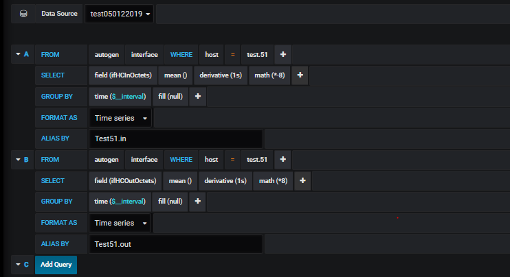
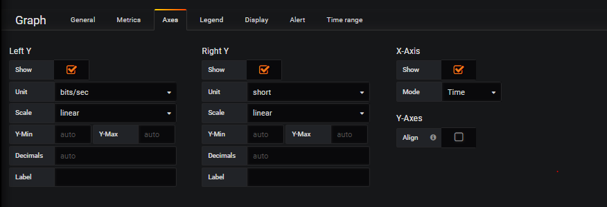

### A. Cài đặt moitor với Telegraf , Influxdb và grafana trên CentOS 7.

##### Update hệ thống
` yum update -y `

### 1. Cài đặt Telegraf , Influxdb và Grafana
### 1.1 Cài đặt Telegraf v1.8.3-1
```
# Get the software
wget https://dl.influxdata.com/telegraf/releases/telegraf-1.8.3-1.x86_64.rpm

# and install
sudo yum localinstall telegraf-1.8.3-1.x86_64.rpm
systemctl enable telegraf
systemctl start telegraf

```

### 1.2 Cài đặt Influxdb v1.7.1
```
# Get the software
wget https://dl.influxdata.com/influxdb/releases/influxdb-1.7.1.x86_64.rpm

# and install
yum localinstall influxdb-1.7.1.x86_64.rpm
systemctl enable influxdb
systemctl start influxdb
systemctl status influxd

```

### 1.3 Cài đặt Grafana 5.3.4-1

```
# Get the software
wget https://s3-us-west-2.amazonaws.com/grafana-releases/release/grafana-5.3.4-1.x86_64.rpm

# and install
sudo yum localinstall grafana-5.3.4-1.x86_64.rpm
systemctl enable grafana-server
systemctl start grafana-server
systemctl status grafana-server

```

### 1.4 Cài đặt SNMP 

```

yum -y install net-snmp net-snmp-utils
mv /etc/snmp/snmpd.conf /etc/snmp/snmpd.conf.orig
vi /etc/snmp/snmpd.conf

# Map 'idv90we3rnov90wer' community to the 'ConfigUser'
# Map '209ijvfwer0df92jd' community to the 'AllUser'
#       sec.name        source          community
com2sec ConfigUser      default         idv90we3rnov90wer
com2sec AllUser         default         209ijvfwer0df92jd
# Map 'ConfigUser' to 'ConfigGroup' for SNMP Version 2c
# Map 'AllUser' to 'AllGroup' for SNMP Version 2c
#                       sec.model       sec.name
group   ConfigGroup     v2c             ConfigUser
group   AllGroup        v2c             AllUser
# Define 'SystemView', which includes everything under .1.3.6.1.2.1.1 (or .1.3.6.1.2.1.25.1)
# Define 'AllView', which includes everything under .1
#                       incl/excl       subtree
view    SystemView      included        .1.3.6.1.2.1.1
view    SystemView      included        .1.3.6.1.2.1.25.1.1
view    AllView         included        .1
# Give 'ConfigGroup' read access to objects in the view 'SystemView'
# Give 'AllGroup' read access to objects in the view 'AllView'
#                       context model   level   prefix  read            write   notify
access  ConfigGroup     ""      any     noauth  exact   SystemView      none    none
access  AllGroup        ""      any     noauth  exact   AllView         none    none

systemctl restart snmpd
systemctl enable snmpd

snmpwalk -v 2c -c idv90we3rnov90wer -O e 127.0.0.1
snmpwalk -v 2c -c 209ijvfwer0df92jd -O e 127.0.0.1


```

###### Sau khi cài đặt xong , muốn truy cập vào dashboard Grafana sử dụng ` ip:3000 ` hoặc `dns:3000` . Tài khoản/mật khẩu mặc định là admin-admin
( Các server còn lại chỉ cần cài đặt  Telegraf ).

### 2. Config

### 2.1 Configure Influxdb 
- Tạo cơ sở dữ liệu và người dùng : Influxdb cung ấp công cụ CLI tương tác với máy chủ Influxdb . Lệnh Influx giống như 'mysql' trên MYSQL và 'mongo' trên cơ sở dữ liệ MongoDB.

```
influx
> create database telegraf
> create user hse11 with password 'hse@12345' with all privileges
> show databases
> show users

```
- Sử trong file cấu hình ` /etc/influxdb/infulxdb.conf ` bỏ ghi chú `auth-enabled ` và set lại thành giá trị true


##### NOTE : Nếu đăng nhập mà ko tạo được bất cứ thứ gì thì chuyển `  auth-enabled = fail `

##### 2.1.1 Truy vấn trong influxdb (tương quan với mysql)
- ` measurements ` : Tương đương với table ,nhưng primary index là các trường thời gian.
- ` tags ` : tương đương với colume , các colume được đánh index để hỗ trợ group trong các câu query 
- ` value ` : Cũng tương tự với colume của table . Đây là giá trị quan trọng trong trong việc phân tích dữ liệu.


### 2.2 Configure Telegraf

- Telegraf là một tác nhân điều khiển plugin và có 4 loại plugin : 
	- Sử dụng "Input Plugins" để thu thập số liệu (clollect metrics).
	- Sử dụng " Processor Plugins" đểchuyển đổi ,decorate và lọc các số liệu (filter metrics).
	- Sử dụng " Aggregator Plungins" để tạo và tổng hợp số liệu.
	- Sử dụng "Output Plugins  " để ghi số liệu tới các dích khác nhau ,bao gồm cả influxdb.

- Chuyển tập tin cấu hình và tạo file cấu hình mới trong mục ` telegraf.conf`

```
cd /etc/telegraf/
mv telegraf.conf telegraf.conf.default

vi telegraf.conf

# Global Agent Configuration
[agent]
  hostname = "hakase-tig"
  flush_interval = "15s"
  interval = "15s"


# Input Plugins
[[inputs.cpu]]
    percpu = true
    totalcpu = true
    collect_cpu_time = false
    report_active = false
[[inputs.disk]]
    ignore_fs = ["tmpfs", "devtmpfs", "devfs"]
[[inputs.io]]
[[inputs.mem]]
[[inputs.net]]
[[inputs.system]]
[[inputs.swap]]
[[inputs.netstat]]
[[inputs.processes]]
[[inputs.kernel]]
[[inputs.nstat]]
   proc_net_netstat = "/proc/net/netstat"
   proc_net_snmp = "/proc/net/snmp"
   proc_net_snmp6 = "/proc/net/snmp6"
   dump_zeros     = true

 [[inputs.snmp]]
  agents = [ "127.0.0.1:161" ]
  version = 2
  community = "209ijvfwer0df92jd"
  interval = "60s"
 [[inputs.snmp.field]]
    name = "hostname"
    oid = "SNMPv2-MIB::sysName.0"
    is_tag = true

  [[inputs.snmp.field]]
    name = "uptime"
    oid = "DISMAN-EVENT-MIB::sysUpTimeInstance"
  [[inputs.snmp.table]]
    name = "interface"
    inherit_tags = [ "hostname" ]
    oid = "IF-MIB::ifTable"
  [[inputs.snmp.table.field]]
    name = "ifDescr"
    oid = "IF-MIB::ifDescr"
    is_tag = true
  [[inputs.snmp.table]]
    name = "interface"
    inherit_tags = [ "hostname" ]
    oid = "IF-MIB::ifXTable"
  [[inputs.snmp.table.field]]
    name = "ifDescr"
    oid = "IF-MIB::ifDescr"
    is_tag = true
  [[inputs.snmp.table]]
    name = "interface"
    inherit_tags = [ "hostname" ]
    oid = "EtherLike-MIB::dot3StatsTable"
  [[inputs.snmp.table.field]]
    name = "ifDescr"
    oid = "IF-MIB::ifDescr"
    is_tag = true


# Output Plugin InfluxDB
[[outputs.influxdb]]
  database = "telegraf"
  urls = [ "http://127.0.0.1:8086" ]
  username = "hse11"
  password = "hse@12345"

```
#### Trong đó : 
- hostname : Ghi đè tên máy chủ mặc định
- flush_interval : Khoảng thời gian đẩy dữ liệu mặc định , cài trên interval
- interval : Khoảng thời gian thu thập dữ liệu 

- database : tên database lưu các số liệu telegraf gửi về influxdb 
- urls : đường dẫn tới nơi chứ influxdb
- name : tài khoản đăng nhập vào influxdb
- password : mật khẩu đăng nhập vào influxdb 

##### Đăng nhập vào Influx bằng tài khoản mật khẩu cài đặt trước đó và test các phép đó mà Telegraf thực hiện.

```
influx -username 'hse11' -password 'hse@12345'
show databases
use telegraf
show measurements

```
- Kết quả nhìn thấy sẽ là : 


### 2.3 Test grafana 
- Đăng nhập website bằng địa chỉ  ` IP:3000 ` hoặc `DNS:3000 ` với tài khoản mặc định đều là admin


### 3. Dashboard on Grafana
 
- B1 : Tạo datasource  với type : InfluxDB  và các thông số tương ứng ở phần cài đặt Telegraf và InfluxDB .
- B2 : Tạo dashboard với type graph  và chọn edit.
- B3 : Trong mục ` metrics ` chọn data source là một trong các datasource ta tạo ở b1.
- B4 : Chỉnh sửa các thông số để ra được biểu đồ thich hợp nhất.

- B4.1 : Trong mục From (chọn nơi gửi dữ liệu về ) trong mục from có các thông số :
	- default/autogen : Lấy biểu đồ tại thời điểm hiện tại  hoặc tự động tăng theo thời gian
	- Select measurement : Chọn các phép đo như CPU , disk ,kernel ,process.....
	- Sau WHERE là các điều kiện đi kèm..

- B4.2 : Trong mục Select 
	- Chọn field (trường giá trị) running , stop ,total .....
	- Chọn mean (định nghĩa ) hoặc một yêu cầu biểu diễn khác như max , min, sum...

- B4.3 : Trong mục Group By
	- Chọn khoảng thời gian cách nhau giữa những lần đo.
	- Format As : để định dạng time series.

- B4.4 : Trong mục Alias By
	- Đặt tên cho phép đo trên


- B5 : Chỉnh các thông số trong mục Axex (các hệ trục )

- B6 : Chỉnh phần mục Legend để hiển thị thêm các thông số trong phép đo như:
	- Value : min , max , total , avg...

- B7 : Trong mục display tùy chỉnh cách hiển thị của phép đo
	- Draw mode (chế độ vẽ ) : Bars (thanh) , lines (dòng) , point (điểm)
	- Mode Options : fill (tỉ lệ lấp đầy hình vẽ ) , line width (chiều rộng đường)  
	- staircase : để chế độ hình vẽ bậc thang hoặc không
	- Hover tooltip : Công cụ di chuột - all series hoặc single
	- Stack & Null value : Có xếp chồng các giá trị với nhau hay không.

- B8 : Lưu biểu đồ 
 

### 4. Tạo Dashboard cho hệ thống.

### 4.1 Dashbord với CPU

- usage_idle: CPU đang ở trạng thái chờ , không hoạt động.
- nice: Người dùng có thể thực thi mức độ ưu tiên ở mức bình thường.
- irq - softirq : Kernel phục vụ yêu cầu ngắt IRQ  
- steal: Dành CPU cà cho tiến trình khác ( môi trường ảo hóa )
- system: CPU đang chạy kernel , include..
- user: CPU run ở trạng thái người dùng.
- I/O wait : Thời gian CPU chờ I/O hoàn thành.
- Guest - Guest Nice : Quá trình đang chạy CPU ảo.


### 4.2 Dashboard với plugin men (Memory)

- Used: Lượng bộ nhớ đã được sử dụng: mem_used = mem_total - (mem_free + mem_buffered + mem_cached + mem_slab_total);

- Buffered: Vùng nhớ đệm giống cache (theo KB) , vùng dữ liệu tạm thời hấp thụ nhu cầu cao và sau đó ghi lại dữ liệu vào bộ nhớ chính. 

- Cached: Vùng lưu trữ dữ liệu tạm thời có tốc độ truy cập cao hơn so với bộ nhớ chính.

- Free: Lượng bộ nhớ RAM vật lý (theo KB) có sẵn mà không được hệ thống sử dụng.

- Total: Tổng lượng RAM có thể sử dụng (theo KB) đó là lượng RAM vật lý không tính lượng dữ trữ.

- slab_recl: The part of Slab that can be reclaimed, such as caches.

- slab_unrecl: The part of Slab that cannot be reclaimed even when lacking memory


#### 4.3 Dashboard với plugin Disk 

- indes : Đại diện cho số lượng tập tin.
- Free : Dung lượng trống và cso thể sử dụng được tiếp.
- Total : Tổng dung lượng của bộ nhớ.
- User : Dung lượng đã sử dụng.


#### 4.4 Dashboard với plugin Disk I/O ( vào ra của disk)

- read | write : số request đã hoàn thành.
- read | write_byte : Đếm số byte đã được đọc và ghi vào thiết bị .
- read | write_time : Thời gian (ms) I/O đợi ở thiết bị này.
- I/O time : thời gian (ms) device có các I/O xếp hàng.
- Weighted_io_time : Thời gian I/O chờ thiết bị này .
- IOPS_in_program : Số I/O đã được cấp cho tiến trình điều khiển nhưng chưa được hoàn thành.


#### 4.5 Dashboard với plugin Net ( Network).

- byte_sent : Tổng số byte đã gửi qua interface.
- byte_revc : Tổng sô byte nhận được qua interface.
- packet_sent : Tổng số gói tin đã gửi qua interface.
- packet_revc : Tổng số gói tin đã nhận được qua interface.
- err in : Tổng số lỗi khi nhận về bị phát hiện.
- err out : Tổng số lỗi bị phát hiện khi gửi đi.
- drop in : Tổng số gói tin nhận đã bị drop.
- drop out : Tổng số gói tin gửi đi đã bị drop.

#### 4.6 Dashboard với plugin SNMP (interface)

- `field (ifHCInOctets) mean ()derivative (1s) math (*-8)` : Lưu lượng đi vào interface (*-8 để vẽ trục tung dưới )
- `field (ifHCOutOctets) mean ()derivative (1s) math (*8)` : Lưu lượng đi vào interface (*8 để vẽ trục tung trên )
- đơn bị đo là bit/s







### 5. Một số tính năng nâng cao của Grafana
### 5.1 Tạo controllist bằng cách add variable 

- Tạo biến variable :


- Tạo tên biến : 


- Thực hiện truy vấn :


### 5.2 Import Dashboard
- Vào trang chủ Grafana : https://grafana.com/grafana/dashboards để sử dụng các dashboard có sẵn và thiết kế đẹp 


### 5.3 Tính năng tạo cảnh báo

https://github.com/hocchudong/thuctap012017/blob/master/TamNT/Graphite-Collectd-Grafana/docs/10.Grafana_nang_cao.md


