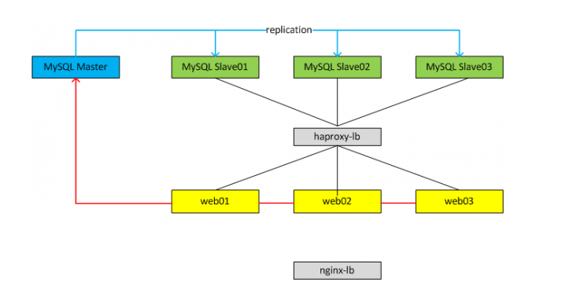

### 1. Scale up và Scale out.
> Để giải quyết bài toán quá tải hệ thống cơ sở dữ liệu , người ta mở rộng hệ thống bằng hai phương pháp là Scale up và Scale out.

#### 1.1 Scale up

> Phương pháp Scale up có nghĩa là trên một máy chủ ta thực hiện các giải pháp để tăng số lượng kết nối , truy vấn vào cơ sở dữ liệu.

###### Một số giải trong Scale up
- Tăng phần cứng của máy chủ lên như tăng CPU , tăng Ram.
- Optimize (tối ưu hóa) ứng dụng , câu truy vấn.

##### 1.2 Scale out

> Scale out là phương pháp tăng số lượng server và dùng các giải pháp load-balacer ( cân bằng tải) để phân phối truy vấn ra nhiều server.
MySQL Replication là một giải pháp Scale out.

###### Các bài toán mà MySQL Replication giải quyết tốt:
- Scale read 
	- Ứng dụng có truy vấn đọc nhiều hơn ghi read/write có thể là 4/1 điển hình là các trang tin tức. 
	- Trong Scale read sẽ sử dụng 1 server master phục vụ write và một hoặc nhiều server salve phụ vụ read.
	- Một số ứng dụng write nhiều ( thương mại điện tử ) cũng sử dụng MySql replicate để Scale out hệ thống. 
- Data report
	- Việc truy cập trực tiếp vào data production sẽ rất nguy hiểm vì có thể vô tình chỉnh sửa sai lệch dữ liệu, hay thực hiện câu truy vấn tốn tài nguyên làm treo hệ thống.
	- Việc tạo ra một máy chủ làm data report làm giảm thiểu các khả năng trên.
- Read time backup
	- Giải pháp bổ xung cho offline backup.
### 2.MySql Replication

> MySQL Replication là một quá trình cho phép dữ liệu từ một máy chủ MySQL database(master) có thể tự động sao chép dữ liệu sang một hoặc 
nhiều máy chủ MySQL server (slave) khác. Nó được sử dụng để tăng khả năng đọc dữ liệu từ nhiều server(slave) và có thể làm phương án backup 
dữ liệu.

#### 2.1 Một vài ưu điểm khi sử dụng Mysql Replication
- Giảm tải truy suất dữ liệu tới server master, tải trọng của server được chia cho các con slave tăng đáng kể hiệu năng cho hệ thống.
- Bảo mật dữ liệu cao : Các server slave có thể tạm dừng quá trình sao chép và nếu dữ liệu trên server slave bị hư hỏng cũng ko tổn hại tới dữ liệu toàn hệ thống
- Tính phân tích dữ liệu : Phân tích dữ liệu trên các server slave sẽ không gây ảnh hướng tới hiệu suất hay an toàn dữ liệu của server master
- Tính điều phối dữ liệu từ xa : Có thể tạo bản sao dữ liệu qua server slave để sư dụng.
 
#### 2.2 Một số mô hình hoạt động.

###### Trong cả hai mô hình trên sẽ luôn có 1 server database master phục vụ cho việc Write dữ liệu và có một hoặc nhiều hơn các server database Read
dữ liệu .  

#### 2.3 Cách hoạt động

##### Trên Server Database Master
- Các kết nối từ web, app tới Master DB sẽ mở `Session_Thread` khi có nhu cầu ghi dữ liệu . Các `Session_Thread` sẽ ghi các `statement SQL` vào file
`binlog` ( với format của binlog là `statenment-based` hoặc `mix`). `Binlog` được lưu trong `data_dir` (file cấu hình `my.conf`) và có thể cấu hình các thông số
như size và thời gian lưu trữ trong bao nhiêu ngày.

- Master Database sẽ mở một `Dump_Thread` và gửi binlog tới `I/O_Thread` mỗi khi `I/O_Thread` từ `Salve DB` yêu cầu dữ liệu.

##### Trên Server Database Master
- Trên mỗi Slave server sẽ mở một `I/O_Thread` kết nối tới  Master DB thông qua Network , giao thức TCP (với MySQL 5.5 replication chỉ hỗ trợ `Single_Thread` nên mỗi
Slave DB sẽ chỉ mở duy nhất một kết nối tới Master DB , các phiên bản sau 5.6  , 5.7 hỗ trợ mở đồng thời nhiều kết nối hơn) yêu cầu `binlog`.

- Sau khi `Dump_Thread` gửi tới `I/O_Thread` , `I/O_Thread` sẽ có nhiệm vụ đọc `binlog` này và ghi vào `relaylog`

- Đồng thời trên Slave DB sẽ mở môt `SQL_Thread` , `SQL_Thread` có nhiệm vụ đọc các event từ relaylog và apply các event đó vào Slave , hoàn thành quá trình replication  
