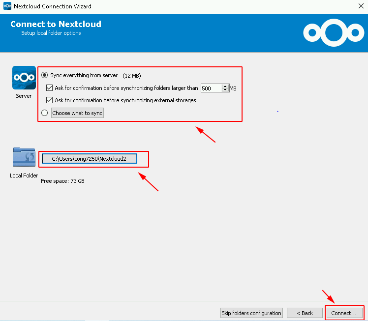

###  A. Cài đặt Nextcloud trên CentOS 7

### 1. Update hệ thống và cài đặt Apache

- Update 
```
yum install -y epel-release
yum update -y 
```

- Mở firewalld cho traffic của httpd (web) đi qua
```
firewall-cmd --permanent --zone=public --add-service=http 
firewall-cmd --permanent --zone=public --add-service=https
firewall-cmd --reload
```

- Cấu hình disable Selinux
```
sudo setenforce 0
sed -i 's/SELINUX=enforcing/SELINUX=disabled/g' /etc/sysconfig/selinux
sed -i 's/SELINUX=permissive/SELINUX=disabled/g' /etc/sysconfig/selinux
sed -i 's/SELINUX=enforcing/SELINUX=disabled/g' /etc/selinux/config
sed -i 's/SELINUX=permissive/SELINUX=disabled/g' /etc/selinux/config
```

- Cài đặt HTTPD ( Apache )
```
yum -y install httpd 
systemctl start httpd.service
systemctl enable httpd.service
```

### 2. Cài đặt MySQL (mariadb)
```
yum install -y mariadb-server
sudo systemctl start mariadb
mysql_secure_installation
systemctl enable mariadb.service
```

- Tạo DB và User
```
mysql
CREATE DATABASE nextcloud;
CREATE USER 'nc_user'@'localhost' IDENTIFIED BY 'YOUR_PASSWORD_HERE';
GRANT ALL PRIVILEGES ON nextcloud.* TO 'nc_user'@'localhost';
FLUSH PRIVILEGES;
exit
```
### 3. cài PHP (bản 7.2)
```
yum install -y http://rpms.remirepo.net/enterprise/remi-release-7.rpm
yum install -y yum-utils
yum-config-manager --enable remi-php72
yum install php php-mysql php-dom php-mbstring php-gd php-ldap php-pdo php-json php-xml php-zip php-curl php-mcrypt php-pear php-intl php-fpm setroubleshoot-server -y 

```
### 4. Cài đặt NextCloud

```
yum install wget -y 
wget https://download.nextcloud.com/server/releases/nextcloud-15.0.7.zip -O /opt/nextcloud.zip

yum install unzip -y 
unzip /opt/nextcloud.zip -d /var/www/
rm -f /opt/nextcloud.zip

sudo chmod 755 -R /var/www/nextcloud/
sudo chown apache. -R /var/www/nextcloud/

```

### 5. Thêm cấu hình trong HTTPD
```
cat << EOF >> /etc/httpd/conf.d/nextcloud.conf

<VirtualHost *:80>

ServerAdmin admin@yourdomain.com
DocumentRoot /var/www/nextcloud
#ServerName yourdomain.com 
#ServerAlias www.yourdomain.com

<Directory /var/www/html/nextcloud>
Options +FollowSymlinks
AllowOverride All

<IfModule mod_dav.c>
Dav off
</IfModule>

SetEnv HOME /var/www/nextcloud
SetEnv HTTP_HOME /var/www/nextcloud
</Directory>

ErrorLog /var/log/httpd/nextcloud-error_log
CustomLog /var/log/httpd/nextcloud-access_log common

</VirtualHost>
EOF

```

### B. Cài đặt đồng bộ nextcloud trên client
### 1. Windows

- Truy cập ` https://nextcloud.com/install/#install-clients ` để download phần mềm thích ứng theo máy
- Sau khi cài đặt , login vào nextcloud . Trong đó Server Address là địa chỉ của server cài nextcloud


- Thực hiện đồng bộ với máy clinet .



### 2. Linux


