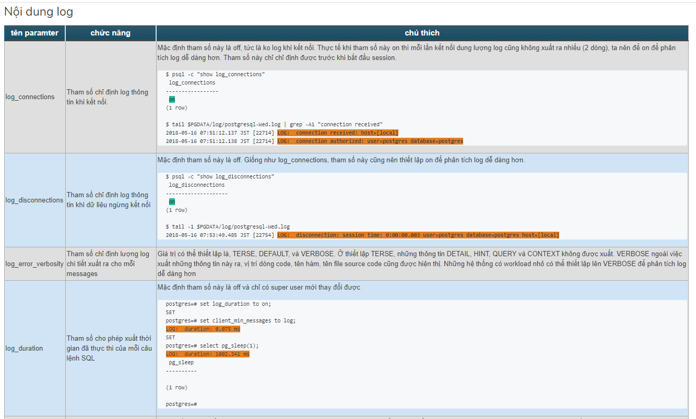

### Log trong PostgreSQL

### 1. Tổng quan về log trong PostgreSQL

> Log là chức năng sẵn có của PostgreSQL được lưu trữ dưới dạng text .Tuy nhiên log của Postgre không phải được lưu trong thư mục
`/var/log ` thông thường  , mà sẽ được lưu trữ ở ` /var/lib/pgsql/10/data/log `.

- Để thu thập log của Postgre vào chỉnh sửa một vài thông số trong thư mục ` /var/lib/pgsql/10/data/postgresql.conf `
```
logging_collector = on
log_directory = 'log' 
log_filename = 'postgresql.log'
``` 

### 2. Một số điểm chú ý về log của PostgreSQL
- Mặc định PostgreSQL sinh ra log và số lượng log sinh ra là không giới hạn 
	- Các tham số ` log_filename , log_truncate_on_rotation `  làm cho log không thể loại bỏ cac log cũ. Ta cần thiết kế để sao cho 
	  tránh được tình trạng trên và phù hợp với yêu cầu của hệ thống.

- Không thể giới hạn được dung lượng xuất log của PostgreSQL
	- Không giới hạn được dung lượng xuất log của PostgreSQL vì thế , ta phải tìm cách giới hạn số lượng PostgreSQL


### 3. Các tham số liên quan tới log của PostgreSQL
##### Có 3 tham số chính trong log của PostgreSQL
- Nơi xuất log
- THời gian xuất log
- Nội dung log

### 3.1 Nơi xuất log


### 3.2 Thời điểm xuất log


### 3.3 Nội dung log





