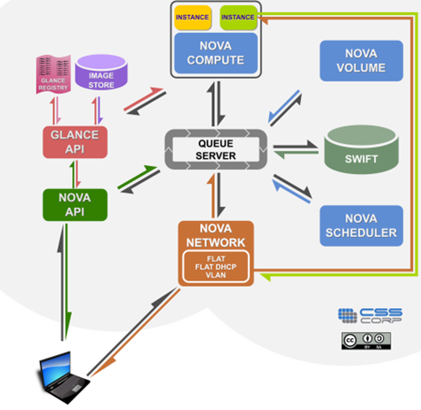
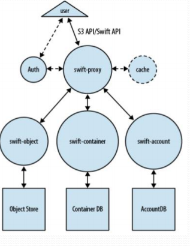

### Swift
### A. Cơ sở lý thuyết.




### 1. Tổng quan về Swift - Object Storage
- Được thiết kế để cung cấp lưu trữ quy mô dữ liệu lớn , có thể được thu cập thông qua các API
- Nó là hoàn toàn phân phối, lưu trữ nhiều bản sao của từng đối tượng để đạt dược tinh sẵn sàng vao và khả năng mở rộng.

### 2. Các chức năng chính 
- Lưu trữ và lấy các đối tượng (file)
- Set và sửa Metadata trên đối tượng (tags)
- Phiên bản đối tượng
- Phục vụ static web và đối tượng thông qua HTTP

### 3. Các thành phần có trong Swift




- Proxy servers : Chấp nhận các OpenStack Object Storage API và các yêu cầu HTTP để upload dữ liệu , chỉnh sửa dữ liệu tạo các container
- Account server : Quản lý các tài khoản của Object Storage
- Container Server : Quản lý kết nối với các Container học thư mục trong Object Storage
- Object Server : Quản lý đối tượng thực tế như các file trên các nút lưu trữ
- Various periodic processes: Thực hiện nhiệm vụ thu dọn trên các store dữ liệu lớn
- WSGI middlware : Xử lý xác thực , thường là Openstack Identity 
- Swift Client : Cho phép user dùng trình lệnh để REST API thông qua commmand-line
- Swift-init : Các Script khởi tạo kiến trúc kết nối của file
- Swift-recon : Công cụ LI để thu thập cá dữ liệu khác nhau và các thông tin từ xa về một cụm đã được thu thập bởi các swift-recon trung gian
- Swift-ring-builder : Vòng lưu trữ xây dựng và tái cân bằng tiện ích

### B. Data encryption
### 1. Volume Encryption
- Tạo và sử dụng Encrypted Volume thông qua dashboard hoặc giao diện dòng lệnh.
	- Cho phép mã hóa với tùy chọn thuật toán mã hóa và key size.
- Volume Data được chứa trong các gói iCSI được mã hóa.
- Hỗ trợ sao lưu mã hóa nếu Volume gốc đã được mã hóa.
- Trên dashboard về mã hóa volume ,ta sẽ thây được volume nào đã được mã hóa, và các thông số như thuật toán hay key size
- Giao diện với quản lý khóa được đăt trong quy trình an toàn.
	- Volume encryption được hỗ trợ quản lý khóa back-end để tăng cường bảo mật ( phần cứng HSM , hoặc KMIP sử dụng barbican back-end secret store)


### 2. Mã hóa đĩa 
- Ephemeral disk được mã hóa với những địa chỉ private riêng . Ephemeral disk là không gian lưu trữ tạm thời được sử
dụng bởi hệ điều hành. Nếu không có mã hóa , thông tin nhạy cảm có thể bị truy cập trên ổ đĩa này và có thể được tìm
thấy sau khi disk bị unmount.

##### Kể từ bản Kilo , các tính năng mã hóa Ephemeral disk được hỗ trợ : 
- Tạo và sử dụng mã hóa LVM ephemeral disks.
- Cấu hình được đặt trong file ` nova.conf ` với các tham số mặc định trong phần `[ephemeral_storage_encryption ]`
	- Option ` cirpher = aes-xtx-plaint64 ` : Sử dụng mã hóa AES ở chế độ XTS . Có thể vào dòng lệnh ` cryptsetup benchmark `
           hoặc `/proc/crypto `: để xem tính khả dụng của các tùy chọn mã hóa.
	- Option ` enable = false ` : Để sử dụng ephemeral disk thì set giá trị ` enable = true `
	- Option ` key_size = 512 ` : 256 bit sẽ được sử dụng làm EAS và 256 bit sử dụng XTX


- Giao diện quản lý khóa được đặt trong một lớp an toàn.
	- Key management sẽ cô lập giữ liệu bằng việc tạo ra khóa và ổ khóa cho cơ sở dữ liệu đó ,và nắm quyền phân phối khóa.
	- Mã hóa Ephemeral disk được hỗ trợ bởi bộ lưu trữ khóa back-end để tăng cường bảo mật ( HSM hoặc KMIP used Barbican )
	- Với key management , khi không cần dùng tới ephemeral thì ta có thể xóa khóa key và có thể ghi đề ephemeral disk.


### C. Mã hóa Object
> Mã hóa dữ liệu ngay tại chính clinet sau đó gửi tới cluster Swift  để đảm bảo sự an toàn cho vòng đời mã hóa dữ liệu.

### 1. Deployment and operation
- Mã hóa được triển khai bằng cách cài thêm 2 bộ filter trong pipeline của Proxy server WSGI  và bao gồm  file cấu hình ` proxy-server.conf `
- Các Keymaster và encryption  middleware filter phải ở phía trước pipe so với các thành phần khác ngoài middleware proxy-logging middleware 
	- Xem thêm ` proxy-server.conf-sample ` để  biết thêm các thông tin chi tiết

```
<other middleware> keymaster encryption proxy-logging proxy-server

[filter:keymaster]
use = egg:swift#keymaster
encryption_root_secret = your_secret

[filter:encryption]
use = egg:swift#encryption
# disable_encryption = False

```

### 2. Keymaster middleware 
- Keymaster sẽ được cấu hình bởi root bằng cách sử dụng encryption_root-secret. Được đặt trong filter ` proxy-server.conf `
```
[filter:keymaster]
use = egg:swift#keymaster
encryption_root_secret = your_secret

```

- Giá trị secret Root phải từ 44-66 ký tự hợp lệ và nhất quán trên tất cả các máy chủ proxy.
- Tạo key mặc định phù hợp vs ` encryption_root_secret sử dụng openssl.
` openssl rand -base64 32 `

### 3. Tập tin cấu hình Keymaster 
- Các ` encryption_root_secret ` được quy định và năm trong đường dẫn cụ thể  trong ` keymaster_config_path `
```
[filter:keymaster]
use = egg:swift#keymaster
keymaster_config_path = /etc/swift/keymaster.conf

```

- Một tập cấu hình keymaster riêng biệt nên có một ` [keymaster ]` chứa ` encryption_root_secret` 
```
[keymaster]
encryption_root_secret = your_secret
```

### 4. Thay đổi secret root
- Khi muốn thay đổi secret root để mã hóa dữ liệu cho các volume được ghi vào cluster. Keymaster middleware cho phép secret rôt được thay thể trong cấu hình của nó.

```
encryption_root_secret_<secret_id> = <secret value>
```

- Trong đó ` secret_id ` : là một định danh duy nhất cho secret root.


### Encryption middleware
https://docs.openstack.org/swift/latest/overview_encryption.html


	
