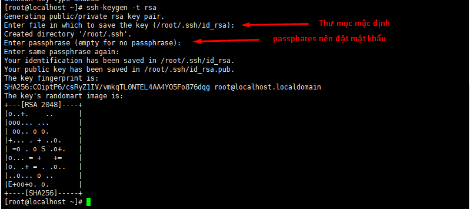
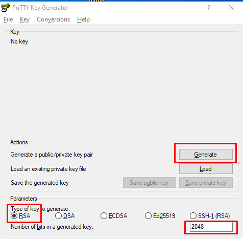

### SSH bằng Key

### A. Cách tạo SSH KEY và đăng nhập bằng SSH KEY

### 1. Môi trường Linux

### 1.1 Tạo SSH key tại Client

` ssh-keygen -t rsa `

- Private Key được kí hiệu là ` id_rsa `
- Public Key được kí hiệu là ` id_rsa.pub `



### 1.2 Đưa SSH key từ Client vào Server
- Tạo ra Public key và private key tại máy server. Sau đó SSH key (public key )sẽ được chuyển từ Server vào Client tại thư mục ` /root/.ssh/authoied_key `


` ssh-copy-id -i ~/.ssh/id_rsa IP(đia chỉ IP của Server) `


### 1.3 Đăng  nhập SSH từ máy linux tới Server

` ssh -i .ssh/id_rsa IP(IP của Server) `l


### 2. Môi trường Windows

### 2.1 Cài PuTTY key Generator 

- Doawnload tại địa chỉ 

` http://the.earth.li/~sgtatham/putty/latest/x86/puttygen.exe `

### 2.2 Tạo key




#### NOTE : Trong lúc Generate rê chuột quanh màn hình để tạo key

- Sau khi generate 


### 2.3 Tạo pasphrase


```
Sau đó ấn Save Private Key và lưu nó trên một nơi thật an toàn, tốt nhất nên đưa 1 bản lên Google Drive nếu bạn có sử dụng.

Lưu ý:
Các bạn lưu ý khi lưu file ssh key đuôi file sẽ là .ppk và hãy lưu giữ nó cẩn thận vì nếu mất file này sẽ không thể kết nối đến VPS qua SSH được nữa.
Bạn không nên đưa file này cho bất kỳ ai tránh trường hợp người khác có thể login vào VPS của bạn khi họ có file này
```

### 2.4 Thêm SSH key vào trong VPS

```
vi /root/.ssh/authorized_keys

NHẬP Public key tạo ở Windown-client vào ` /root/.ssh/authorized_key `

chmod 600 /root/.ssh/authorized_key

```

### 2.5 SSH từ Win-client và CentOS


### 2.6 Tắt SSH bằng user-password

- Truy cập vào file ` /etc/ssh/sshd_config `
- Tìm và sửa thành ` PermitRootLogin no ` , `#PasswordAuthentication no`
- Restart ssh ` systemctl restart sshd `


### B. Tự động gia hạn SSL Let's Encrypt
- Chứng chỉ Let's Encrypt chỉ được sử dụng trong 90 ngày , sau 90 ngày chứng chỉ sẽ hết hiệu lực. Khi đó , nếu bạn cần sử dụng tiếp thì 
phải gia hạn (lấy chứng chỉ mới thì đúng hơn)  bằng việc chạy câu lệnh :
```
/opt/letsencrypt/certbot-auto renew --pre-hook "service nginx stop" --post-hook "service nginx start"
```

- Để việc gia hạn SSL Let's Encrypt được diễn ra tự động , tao có thể dùng crontab 
```
crontab -e
30 2 * * * /opt/letsencrypt/certbot-auto renew --pre-hook "service nginx stop" --post-hook "service nginx start" >> /var/log/le-renew.log
```

- Tất cả thông tin sẽ được ghi đè vào file renew.log


https://cuongquach.com/777.html
https://hocvps.com/cai-dat-lets-encrypt/#4/_T%E1%BB%B1_%C4%91%E1%BB%99ng_gia_h%E1%BA%A1n_Let%E2%80%99s_Encrypt


