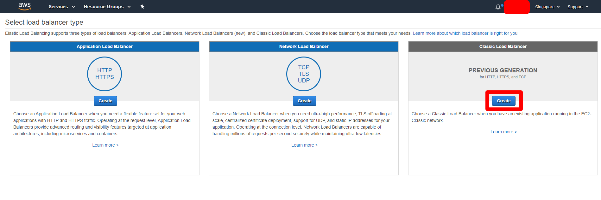
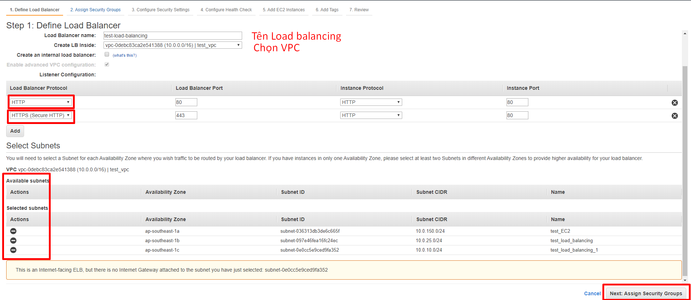
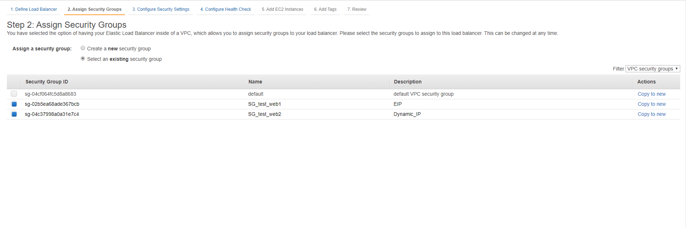
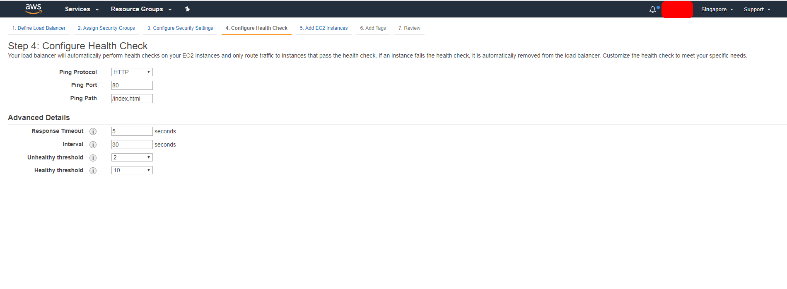
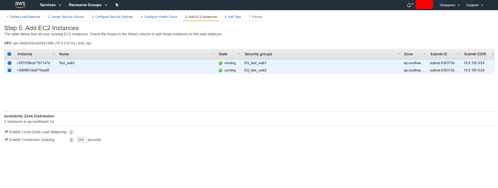
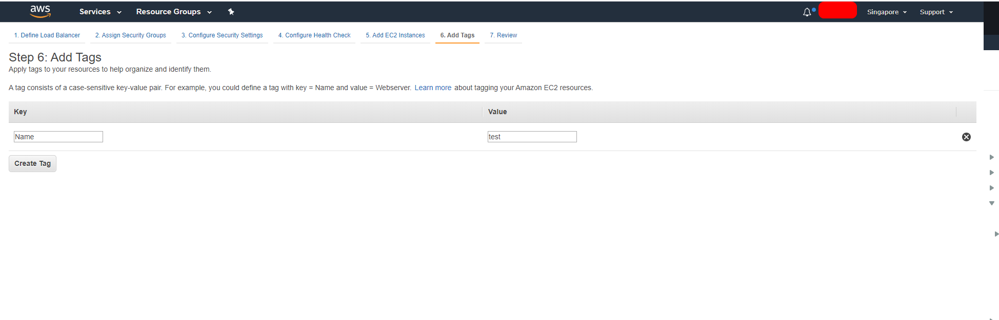
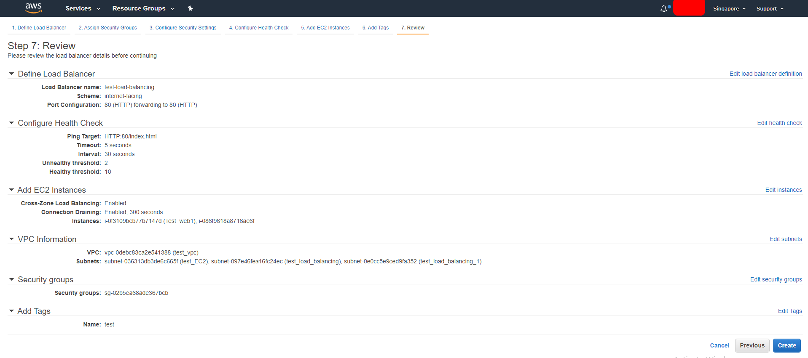
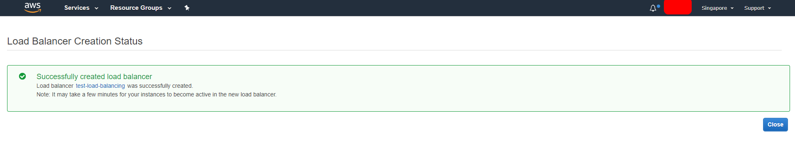
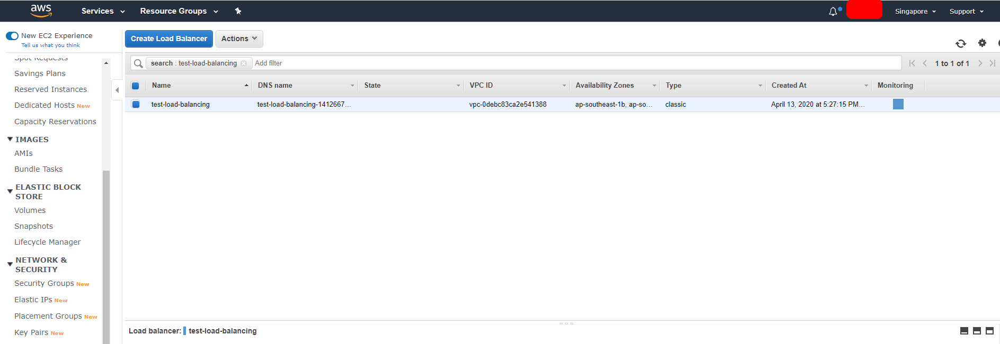

### Load Balancing - Elastic Load Balancing
### 1. Tổng quan và phân loại Elastic Load Balancing
> Load Balancing tự động phân phối lưu lượng truy cập đến ứng dụng trên nhiều đich , chẳng hạn các EC2 instance , container
địa chỉ IP và Lambda function. Elastic Load Balancing có thể tải các lưu lượng truy cập khác nhau của ứng dụng của bạn trên
một hoặc nhiều AZ . Elastic Load Balancing cung cấp 3 bộ cân bằng tải , tất cả đều có khả dụng cao , tự động điều chỉnh
quy mô và khả năng bảo mật mạnh mẽ nhất cần thiết cho ứng dụng.

#### Phân Loại Elastic Load Balancing

- ` Cân bằng tải ứng dụng (application load balancer) `:Phù hợp với cân bằng tải lưu lượng HTTP và HTTPS và cung cấp định tuyến
yêu cầu cao , hướng tới cung cấp các hạ tầng ứng dụng hiện đại bao gôm các micro service và container. Hoạt động ở lớp 7 (application)
trong mô hình OSI .

- ` Network Load Balancer ` :Phù hợp cho việc cân bằng tải lưu lượng. Hoạt động ở lớp 4 (transport TCP) và là nơi có hiệu suất làm việc
rất cao. Các giao thức sử dụng : Giao thức kiểm soát truyền tải `TCP ` giao thức đóng gói dữ liệu người dùng ` UDP ` và
bảo mặt lớp vận chuyển `TLS` dùng load balancing để tăng khả năng xử lý hàng triệu yêu cầu mỗi giây với độ trễ thấp.

- ` Class load Balancer ` : cung cấp cân bằng tải trên nhiều phiên bản Amazone EC2 và hoạt động ở cả cấp độ yêu cầu và cấp độ kết nối. Cân
bằng tải cổ điển được thiết kế cho những ứng dụng được xây dụng dựa trên EC2-Classic.

### 2. Lợi ích của Elastic Load Balancing

- ` Độ săn sàng cao ( Highly avaliable )` : Elastic Load Balancing tự động phân phối lưu lượng truy cập đến trên nhiều đích - các phiên bản Amazone EC2,
bộ chứa , địa chỉ IP và chức năng lambda - trên nhiều Vùng sẵn sàng vả đảm bảo chỉ những đích đến lành mạnh mới có quyền truy cập. Elastic Load balancing 
cũng có thể cân bằng tải trên một khu vựng , hướng lưu lượng tới các đích có tình trạng tốt ở nhiều zone sẵn sàng cao.

- ` Bảo mật (sercure) ` : Elastic Load Balancing kết hợp cùng với Amazon Virtual Private Cloud (VPC) cung cấp các tính năng bảo mật mạnh mẽ , bao gồm quản
lý chứng nhận tích hợp, xác thực người dùng và giải mã SSL/TLS . Khi kết hợp , cả hai mang lại cho bạn sự linh hoạt để quản lý tập trung các cài đặt SSL/TLS
và loại bỏ khối lượng công việc quá tải trên CPU khỏi các ứng dụng.

- `Co dãn (Elastic) ` : Elastic Load Balancing có khả năng xử lý các thay đổi diễn ra nhanh trên các cấu trúc lưu lượng mạng. Ngoài ra, khả nagnw tích hợp
sâu với auto sacalling đảm bảo ứng dụng có đủ công suất để đáp ứng các mức tải khác nhau của ứng dụng mà không cần can thiệp thủ công nào.

- `Linh hoạt (Flexible) `: Elastic Load Balancing cũng cho phép bạn sử dụng địa chỉ IP để chuyển hướng các yêu cầu tới dích ứng dụng .Nhờ đó , bạn có được
sự linh hoạt trong cách ảo hóa và mục đich ứng dụng của mình , có thể lưu trữ nhiều ứng dụng hơn trên cùng một phiên bản .Ngoài ra cá ứng dụng này
có thể có những nhóm bảo mật riêng lẻ và sử dụng chung một cổng mạng để đơn giản hóa khả năng giao tiếp liên ứng dụng trên kiến trúc dựa vào các dịch vụ vi mô.

- ` Giám sát và kiểm tra mạnh mẽ ( Rebust monitoring & auditing ) `: Elastic Load Balancing cho phép bạn giám sát các ứng dụng và có hiệu năng của chúng trong
thời gian thực vằng các chỉ số , tính năng ghi nhật ký và truy bết yêu cầu của Amazon CloudWatch. Việc này giúp hiểu rõ hơn về hành vi của ứng dụng , phát hiện 
vấn đề và nhận diện các điểm thắt cổ chai trên ngăn xếp ứng dụng của bạn ở mức độ một yêu cầu riêng lẻ.

- ` Hybird load balancing ` : Elastic Load Balancing cho phép cân bằng tải giữa các tài nguyên AWS và tại cơ sở bằng cách sử dụng cùng một bộ cần bằng tải. Việc
này giúp bạn di chuyển dễ dàng di chuyển , bung hoặc bảo vệ khi xảy ra lỗi cho các ứng dụng tại cơ sở lên đám mây.

### 3. Trường hợp sử dụng Load Balancing.

- ` Đạt đươc dung sai cao hơn cho ứng dụng của bạn ` : Elastic Load Balancing giúp ứng dụng của bạn có dung sai cao hơn bằng cách tự động cân bằng tải lưu lượng
giữa các dích - các phiên bản AWS EC2, container,địa chỉ IP và Lambda function - trong nhiều vùng sẵn sàng mà vẫn đảm bảo chỉ những đích có tình trạng tốt mới 
nhận được lưu lượng. Nếu toàn bộ đich của bạn ở một vùng sẵng sàng có tình trạng không tốt , elastic load balancing sẽ hướng lưu lượng tới các đich mạnh ở các
Vùng sẵn sàng khác. Sau khi dich đã trở lại bình thường hoạt động tốt , tính năng cân bằng tải sẽ tự động phát hiện và chuyển về đich ở trạng thái ban đầu.

- ` Tự động cân bằng tải và các ứng dụng nằm trong container của bạn `: Load Balancing hỗ trợ container được cải tiến cho container, giờ đây bạn có thể cân 
bằng tải trên nhiều cổng trên cùng một máy ảo EC2. Bạn có thể tận dụng khả năng tích hợp sâu EC2 Container Service (ESC) , một công cụ cung cấp sản phẩm container
được quản lý đầy đủ. Chỉ cần đăng ký một dịch vụ có một bộ cân bằng tải và ESC quản lý một cách minh bachjquas trình đăng ký và hủy đăng ký cá Docker Container.
Bộ cân bằng tải tự động phát hiện cổng và cổng sẽ được tự cấu hình lại.

-  ` Tự động điều chỉnh quy mô ứng dụng của bạn ` : Elastic Load Balancing đảm bảo rằng ứng dụng của bạn sẽ được điều chỉnh quy mô theo nhu cầu của khác hàng của bạn.
Với khả năng kích hoạt Atuto Scalling cho nhóm máy ảo EC2 của bạn khi độ trẽ của một trong bất kì vượt ngưỡng cấu hình trước , ứng dụng của bạn sẽ luôn sẵn sàng
đáp ứng yêu cầu tiếp theo của khách hàng.

- ` Sử dụng Elastic Load balancing trên Amazon Virtual Private Cloud (Amazone VPC) của bạn :
	- Elastic Load balancing giúp dễ tạo một điểm vào hướng internet trên VPC của bạn hoặc hướng lưu lượng yêu cầu giữa các lớp của ứng dụng của bạn tạo trên VPC .
Ta có thể gán cá nhóm bảo mật cho bộ cân bằng tải của mình để kiểm soát cổng nào cần mở đối với danh sách các nguồn được cho phép. Do Elastic Load balancing được tích
hợp với VPC của bạn , toàn bộ các Netwwork Access control List (ACL) và Route Table hiện hành sẽ tiếp tục cung cấp thêm các kiểm soát mạng.
	- Khi bạn tạo một bộ cân bằng tải trên VPC , bạn có thể xác định dùng bộ cân bằng tải hướng internet mặc định hoặc nội bộ. Nếu chọn mội bộ , bạn không cần
phải có một cổng inter net để tiếp cận bộ cân bằng tải và địa chỉ IP riêng của bộ cân bằng tải đó sẽ được dử dụng trên sơ đồ DNS của bộ cân bằng tải.

- `Hybrid load balancing và elastic load balancing ` : 
	- Elastic load balancing cho phép cân bằng tải giữa các tài nguyên AWS và tại cơ sở bằng cách sử dụng cùng một bộ cân bằng tải.
	- bạn cũng có thê sử dụng phương pháp cần bằng tải đẻ có lợi cho cho các ứng dụng độc lập trong đó một bộ nằm trên VPC và một bộ khác nằm tại cơ sở. Chỉ
Cần đưa ra đích VPC vào một nhóm dích và các đích tại cơ sở vòa một nhóm đích khác, rồi sau đố sử dụng phương pháp định tuyens dựa trên nội dụng để hướng
lưu trữ trên từng nhóm đich.

- ` Gọi các Lambda function qua HTTP(s) `: Elastic Load Balancing hỗ trợ gọi các Lambda funciton đẻ phân phối yêu cầu HTTP(s). Nhờ đó nguoiwfdungf có thể truy cập 
cá ứng dụng không cần máy chủ từ bất kỳ máy khác HTTP nào, kể cả trình duyệt web. bạn có thể đăng ký các Lambda function là mục đích và tận dụng sự hỗ trợ cho cho 
quy tắc cho quy tắc định tuyến dựa trên nội dung trong cân bằng tải ứng dụng  để định tuyến yêu cầu với những Lambda function khác nhau. Bạn có thể sử dụng cần
bằng tải ứng dụng làm điểm cuối HTTP chung cho cá ứng dụng dùng máy chủ và máy chủ không cần máy chủ. bạn có thể tạo một trang web hoàn chỉnh bằng cách sử dụng
các Lambda function hoặc kết hợp EC2 , container , on-premises server và Lambda function để xây dựng ứng dụng.

### 4. Target Group
> Mỗi target group được sử dụng để định tuyến cá yeu cầu đến một hoặc nhiều mục tiêu đã đăng ký . Khi bạn tạo Listener rule , bạn chỉ định co một target group
và điều kiện. Khi một điều kiện quy tắc được đáp ứng , lưu lượng được chuyern tiếp đến target group tương ứng . Bạn có thể tạo các target group khác nhau cho
các loại yêu cầu khác nhau.

- bạn xác định cài đặt `heath check` cho bộ cân bằng tải của mình trên cơ sở từng target group. Mỗi target group sử dụng cài đặt heath check mặc định, trừ khi
bạn ghi đề chung khi bạn tạo ra target group hoặc sửa đổi chúng. Sau khi bạn chỉ định target group theo listener rule bộ cân bằng tải liên tục theo dõi health
của tất các mục tiêu đã đăng ký với target group trong zone khẳng năng được bật cho bộ cân bằng tải. Bộ cân bằng tải yêu cầu các mục tiêu đã đăng ký là healthy.

 
### B. Hướng dẫn tạo Classic Load balcaner và Target Group

### 1. Create Load Balancer

### 2. SSL cho Domain Load BaLancing

