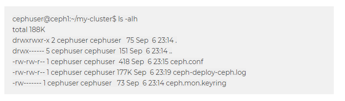
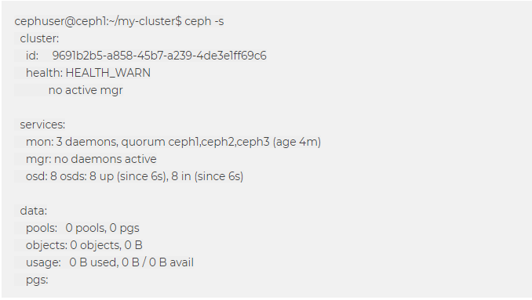

### Cài đặt CEPH sử dụng CEPH-deploy

### 1. Mô hình triển khai
- Mô hình sử dụng 3 server chạy OS CentOS 7 , phiên bản cài đặt CEPH-Nautilus ,trong đó:
- Host `ceph1` cài đặt `ceph-deploy`  ,`ceph-mon`, `ceph-osd`, `ceph-mgr`
- Host `ceph2` cài đặt `ceph-mon` , `ceph-osd`
- Host `ceph3` cài đặt `ceph-mon` , `ceph-osd`

#### Network
- Sử dụng Network 192.168.145.0/24 (VMnet8) : Kết nối internet tải các gói hỗ trợ cài đặt
- Sử dụng Network 192.168.88.0/24 (VMnet1) : Kết nối trao đổi thông tin giữa các Server

### 2. Cài đặt
### 2.1 Thiết lập Hostname  và IP cho từng node 
### 2.1.1 Thiết lập hostname và IP cho node `ceph1`

- Login với tài khoản root và cập nhật các gói tin:

`yum update -y`

- Cài đặt các gói phần mềm bổ trợ

```
yum install epel-release -y
yum update -y
yum install wget byobu curl git byobu python-setuptools python-virtualenv -y
```

- Thiết lập hostname cho CEPH1
`hostnamectl set-hostname ceph1` 

- Cấu hình các card mạng 

- Cấu hình chế độ firewall để tiện trong môi trường lab. Trong môi trường production cần bật firewall hoặc iptables hoặc có biện pháp xử lý khác tương ứng 
để đảm bảo các vấn đề về an toàn.

```
sudo systemctl disable firewalld
sudo systemctl stop firewalld
sudo systemctl disable NetworkManager
sudo systemctl stop NetworkManager
sudo systemctl enable network
sudo systemctl start network
```

- Disable SELINUX (SELINUX=disabled)

- Khai báo các hostname trong file /etc/hosts. Các hostname này sẽ được sử dụng để cấu hình phía dưới.
```
cat << EOF > /etc/hosts
127.0.0.1 `hostname` localhost
192.168.88.2 ceph1
192.168.88.3 ceph2
192.168.88.4 ceph3

192.168.145.2 ceph1
192.168.145.3 ceph2
192.168.145.4 ceph3
EOF
```

- Cài đặt NTP,việc đồng bộ thời gian cũng là quan trọng khi triển khai CEPH. Hãy đảm bảo timezone và thời gian được đồng bộ để đúng với hệ thống của bạn.

` yum install ntp ntpdate ntp-doc `

- Khởi động lại node CEPH1
` reboot`

#### Thực hiện tương tự như node CEPH1 đối với node Ceph2 và node Ceph3

### 2.2 Tạo user cài đặt CEPH và khai báo repos

### 2.2.1 Tạo user cài đặt CEPH trên cả 3 node
- Tạo user là cephuser với mật khẩu là matkhau2019
```
useradd cephuser
passwd cephuser
```

- Cấp quyền sudo cho user cephuser
```
echo "cephuser ALL = (root) NOPASSWD:ALL" | sudo tee /etc/sudoers.d/cephuser
chmod 0440 /etc/sudoers.d/cephuser
```

### 2.2.2  Khai báo repo cho ceph nautilus 

- Thực hiện hiện khai báo repo cho ceph nautilus trên tất cả các node CEPH.

```
cat <<EOF> /etc/yum.repos.d/ceph.repo
[ceph]
name=Ceph packages for $basearch
baseurl=https://download.ceph.com/rpm-nautilus/el7/x86_64/
enabled=1
priority=2
gpgcheck=1
gpgkey=https://download.ceph.com/keys/release.asc

[ceph-noarch]
name=Ceph noarch packages
baseurl=https://download.ceph.com/rpm-nautilus/el7/noarch
enabled=1
priority=2
gpgcheck=1
gpgkey=https://download.ceph.com/keys/release.asc

[ceph-source]
name=Ceph source packages
baseurl=https://download.ceph.com/rpm-nautilus/el7/SRPMS
enabled=0
priority=2
gpgcheck=1
gpgkey=https://download.ceph.com/keys/release.asc
EOF
```
- Thực hiện update sau khi khai bao repo
` yum update -y `

### 2.3 Cài đặt ceph-deploy và cấu hình

- Theo docs của CEPH thì ta có thể cài đặt CEPH theo 03 cách, bao gồm: CEPH manual, ceph-deploy và ceph-ansible. Trong hướng dẫn này sẽ sử dụng ceph-deploy, 
một công cụ để triển khai CEPH.

### 2.3.1 Cài đặt CEPH-deploy
#### Thực hiện trên node CEPH1 ( node amdin)
- Chỉ cần theo tác trên CEPH1 (node admin) các node ceph2 và ceph3 sẽ được thực hiện từ xa ngay trên node ceph1

```
sudo yum install -y epel-release
sudo yum install -y ceph-deploy
```

- Chuyển sang tài khoản cài đặt ceph `cephuser`
` su - cephuser`

- Tạo ssh key, sau đó copy sang các node còn lại, nhập mật khẩu của user cephuser ở trên khi được hỏi tại màn hình. Lưu ý không dùng sudo với lệnh ssh-keygen

` ssh-keygen `

- Nhấn Enter để mặc định các tham số, bước này sẽ sinh ra private key và public key cho user cephuser. Sau đó tiến hành các lệnh dưới để copy public key sang các node.

- Nhập mật khẩu của user cephuser tạo ở các node trước đó trong bước trên.Thực hiện từ lệnh:
```
ssh-copy-id cephuser@ceph1
ssh-copy-id cephuser@ceph2
ssh-copy-id cephuser@ceph3
```

- Tạo thư mục chứa các file cấu hình khi cài đặt CEPH

```
cd ~
mkdir my-cluster
cd my-cluster
```

- Khai báo các node ceph trong cluser.

```
ceph-deploy new ceph1 ceph2 ceph3
```

- Lệnh trên sẽ sinh ra các file cấu hình trong thư mục hiện tại, kiểm tra bằng lệnh  ` ls – alh `



- ` ceph.conf` : file config được tự động khởi tạo

- ` ceph-deploy-ceph.log ` : file log của toàn bộ thao tác đối với việc sử dụng lệnh ceph-deploy

- ` ceph.mon.keyring` : Key monitoring được ceph sinh ra tự động để khởi tạo Cluster

- Khai báo thêm các tùy chọn cho việc triển khai, vận hành CEPH vào file ceph.conf này trước khi cài đặt các gói cần thiết cho ceph trên các node. Lưu ý các 
tham số về network.

- Chúng ta sẽ bổ sung thêm vào file ceph.conf một vài thông tin cơ bản như sau:

```
cat << EOF >> ceph.conf
osd pool default size = 2
osd pool default min size = 1
osd pool default pg num = 128
osd pool default pgp num = 128

osd crush chooseleaf type = 1

public network = 10.10.13.0/24
cluster network = 192.168.88.0/24
EOF
```
- public network : Đường trao đổi thông tin giữa các node Ceph và cũng là đường client kết nối vào
- cluster network : Đường đồng bộ dữ liệu 


- Bắt đầu cài đặt phiên bản CEPH Nautilus lên các node ceph1, ceph2, ceph3. Lệnh dưới sẽ cài đặt lần lượt lên các node.

` ceph-deploy install --release nautilus ceph1 ceph2 ceph3 `

- Kết quả của lệnh trên sẽ hiển thị như bên dưới, trong đó có phiên bản của ceph được cài trên các node.


- Kiểm tra kết quả sau khi cài đặt
` ceph -v `
- Kết quả như sau là cài đặt thành công:
`ceph version 14.2.2 (4f8fa0a0024755aae7d95567c63f11d6862d55be) nautilus (stable)`

- Thiết lập thành phần MON cho CEPH. Trong hướng dẫn này khai báo 03 node đều có thành phần MON của CEPH.

` ceph-deploy mon create-initial` 

- Kết quả sinh ra các file trong thư mục hiện tại


- Thực hiện copy file ceph.client.admin.keyring sang các node trong cụm ceph cluster. File này sẽ được copy vào thư mục /etc/ceph/ trên các node.

` ceph-deploy admin ceph1 ceph2 ceph3 `

- Đứng trên node ceph1 phân quyền cho file /etc/ceph/ceph.client.admin.keyring cho cả 03 node.

```
ssh cephuser@ceph1 'sudo chmod +r /etc/ceph/ceph.client.admin.keyring'
ssh cephuser@ceph2 'sudo chmod +r /etc/ceph/ceph.client.admin.keyring'
ssh cephuser@ceph3 'sudo chmod +r /etc/ceph/ceph.client.admin.keyring'
```

### 2.3.2 Khai báo các OSD cho node CEPH.

- Đứng trên node ceph1 và thực hiện khai báo các OSD disk. Bước này sẽ thực hiện format các disk trên cả 3 node và join chúng vào làm các OSD (Thành phần 
chứa dữ liệu của CEPH).

```
ceph-deploy osd create --data /dev/sdb ceph1

ceph-deploy osd create --data /dev/sdc ceph1

ceph-deploy osd create --data /dev/sdd ceph1


ceph-deploy osd create --data /dev/sdb ceph2

ceph-deploy osd create --data /dev/sdc ceph2

ceph-deploy osd create --data /dev/sdd ceph2


ceph-deploy osd create --data /dev/sdb ceph3

ceph-deploy osd create --data /dev/sdc ceph3

ceph-deploy osd create --data /dev/sdd ceph3
```

- Tới đây các bước cơ bản cấu hình ceph cluser đã hoàn tất. Kiểm tra trạng thái của cụm cluster ceph bằng lệnh ceph -s



- Ta thấy trạng thái sẽ là `HEALTH_WARN` , lý do là vì `ceph-mgr` chưa được `enable`. Tiếp theo ta sẽ xử lý để kích hoạt `ceph-mgr`

### 2.3.3  Cấu hình manager và dashboad cho ceph cluster

- Ceph-dashboard là một thành phần thuộc ceph-mgr. Trong bản Nautilus thì thành phần dashboard được cả tiến khá lớn. Cung cấp nhiều quyền hạn thao tác với 
CEPH hơn các bản trước đó (thành phần này được đóng góp chính bởi team SUSE).

- Thực hiện trên node ceph1 việc cài đặt này.

-Trong bản ceph nautilus 14.2.3 (tính đến ngày 06.09.2019), khi cài ceph dashboard theo các cách cũ gặp một vài vấn đề, cách xử lý như sau.

- Cài thêm các gói bổ trợ trước khi cài

` sudo yum install -y python-jwt python-routes`

- Tải ceph-dashboad ceph-mgr-dashboard-14.2.3-0.el7.noarch.rpm và ceph-grafana-dashboards-14.2.3-0.el7.noarch.rpm. Lưu ý nên đúng phiên bản với ceph ở trên.
(Truy cập vào `download.ceph.com/rpm-nautilus/el7/noarch` để tìm các phiên bản phù hợp )

```
sudo rpm -Uvh http://download.ceph.com/rpm-nautilus/el7/noarch/ceph-grafana-dashboards-14.2.4-0.el7.noarch.rpm

sudo rpm -Uvh http://download.ceph.com/rpm-nautilus/el7/noarch/ceph-mgr-dashboard-14.2.4-0.el7.noarch.rpm
```

- Thực hiện kích hoạt ceph-mgr và ceph-dashboard

```
ceph-deploy mgr create ceph1 ceph2 ceph3
ceph mgr module enable dashboard --force
ceph mgr module ls 
```

- Kết quả 
```
{
    "enabled_modules": [
        "dashboard",
        "iostat",
        "restful"
    ],
    "disabled_modules": []
}
```

- Tạo cert cho ceph-dashboad

` sudo ceph dashboard create-self-signed-cert  `

- Kết quả trả về dòng Self-signed certificate created là thành công.
- Tạo tài khoản cho ceph-dashboard, trong hướng dẫn này tạo tài khoản tên là cephadmin và mật khẩu là matkhau2019@
` ceph dashboard ac-user-create cephadmin matkhau2019@ administrator  `

- Kết quả trả về là:
```
{"username": "cephadmin", "lastUpdate": 1567415960, "name": null, "roles": ["administrator"],
 "password": "$2b$12$QhFs2Yo9KTICIqT8v5xLC.kRCjzuLyXqyzBQVQ4MwQhDbSLKni6pC", "email": null}
```

- Kiểm tra xem ceph-dashboard đã được cài đặt thành công hay chưa

` ceph mgr services `

- Kết quả trả về sẽ là dòng bên dưới.

- Trước khi tiến hành đăng nhập vào web, có thể kiểm tra trạng thái cluser bằng lệnh ceph -s . Ta sẽ có kết quả trạng thái là OK.

- Kết quả sẽ là địa chỉ truy cập ceph-dashboad, ta có thể vào bằng địa chỉ IP thay vì hostname, https://Dia_Chi_IP_CEPH1:8443

- Ta có một số màn hình đăng nhập


