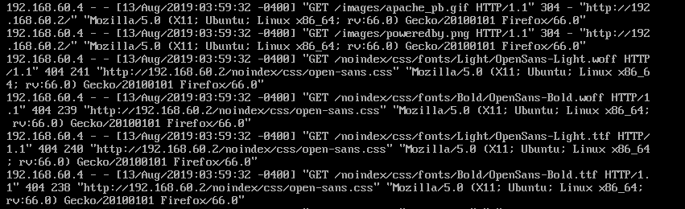
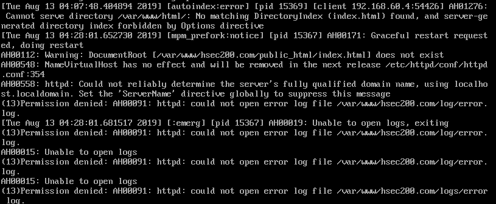

### File log trong httpd (apache)

> File log (file nhật ký ) của apache được lưu tại thư mục  /var/log/httpd/ .  Tại đây tất cả các truy cập vào apache sẽ được lưu lại tại hai fiile mặc định  access_log và error_log .

#### 1. Access_log
> Nhật ký truy cập máy chỉ ghi lại tất cả những yêu cầu truy cập được máy chủ xử lý. CustomLog sẽ chỉ định vị trí và nội dung của access log . 

- Cấu trúc điển hình cho nhật ký truy cập  
```
LogFormat "%h %l %u %t \"%r\" %>s %b" common
CustomLog logs/access_log common
 ```


 



- %h (192.168.60.4) :  Địa chỉ IP của máy khách yêu cầu truy cập tới server 
- %I (-) : "Dấu gạch nối" trong đầu ra chỉ ra rằng phần thông tin yêu cầu không có sẵn  
- %u (-) : Đây là userid của người yêu cầu tài liệu đượ xác định bằng xác thực HTTP . Nếu tài liệu không được bảo vệ bằng mật khẩu , mục này sẽ có giá trị " - " như mục trước đó .
- %t ( [13/Aug/2019 : 03:59:32  -400] ) : thời gian máy chủ xử lý xong yêu cầu với định dạng là ` day/month/year :hour:minute:second  (+ | - ) area `
- "%r" ( "GET /images/apache_pb.gif HTTP/1.1 "  ) : Yêu cầu của khách hàng : 
  - GET   :    phương thức khách hàng sử dụng 
  - image/apache_pb.gif   :    Khách hàng yêu cầu tài nguyên 
  - Http/1.1   :   Phương thức khách hàng sử dung 

- %>s (304) : Mã trạng thái mà máy khách gửi cho máy chủ , nếu mã bắt đầu bằng :
  - 2 : Phản hồi có thành công hay không 
  - 3 : Chuyển hướng
  - 4 : Lỗi do máy khách
  - 5 : Lỗi trong máy chủ 

- %b ( - ) : Cho biết kích thước máy chủ gửi về máy máy khách không tính tiêu đề phản hồi . Nếu không có nội dung nào trả về cho máy khách thì giá trị sẽ là  ` - ` .

> Định dạng nhật ký kết hợp `  LogFormat "%h %l %u %t \"%r\" %>s %b \"%{Referer}i\" \"%{User-agent}i\"" combined
CustomLog log/acces_log combined ` 

- "%{referrer}i"  :  Tieu đề yêu cầu HTTP " người giới thiệu"  cung cấp trang web mà các báo cáo khách hàng đa được giới thiệu .

- "%{User-agent}I" :  Tác nhân người dung . Thông tin nhận dạng mà trình duyệt máy khách báo cáo về chính nó .

#### 2. Error log 
.
> Nhật ký ghi lại các lỗi của máy chủ , ErrorLog sẽ chỉ định vị trí và nội dung của error log . Đây được coi là tập nhật ký quan trọng nhất .
  Nhật ký thường được ghi vào một tệp ` error_log ` với unix hoặc Linux  , ` error.log ` với windows





- Các trường trong cặp ngoặc [ ] có  nội dung lần lượt là 
  - Ngày tháng - thời gian nhận được thông báo từ server 
  - Mức độ nghiêm trọng của lỗi được báo cáo 
  - Cung cấp địa chỉ IP đã tạo ra lỗi .

















