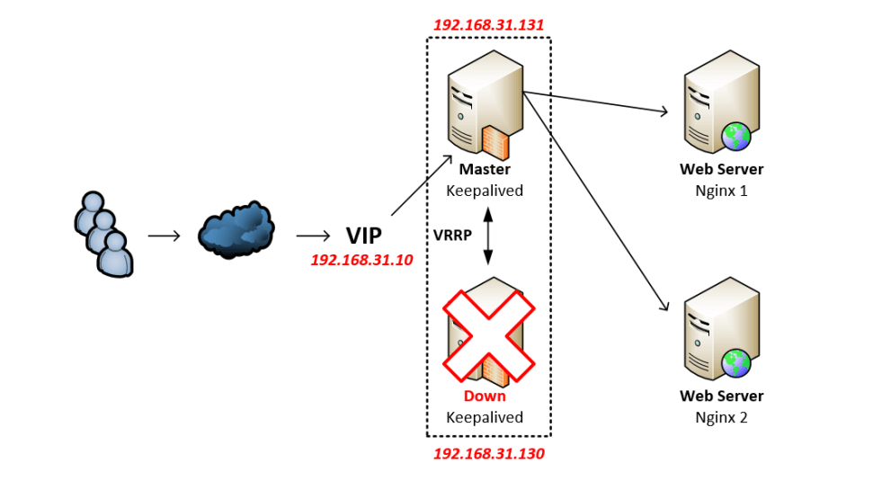

### 1. Keepalived 
> Keepalived là chương trình trong môi trương linux cung cấp khả năng tạo độ sẵn sàng cao (HA : high availability ) cho hệ thống dịch vụ 
và khả năng cân bằng tải(load balancing) đơn giản. Keepalived là một giải pháp active-Backup dịch vụ tốt , nhưng khả năng load balancing thì
không bằng các giải pháp như cả Ngĩn và HAproxy.

- Tính năng chính được sử dụng của Keepalived là HA IP Failover , chứ ít dùng tới tính năng câng bằng tài(load balancing). 

##### NOTE Keepalived
- Keepalived cung cấp các bộ thư viện (framework) cho hai chức năng chính : cân bằng tải (load balancing) dùng cơ chế health checking
và độ sẵn sàng cao cho hệ thống (high avilability) với VRRP.
- Tính năng cân bằng tải sư dụng Linux Virtual Server (lPVS) module kernel trên linux.
- Luôn cập nhật , kiểm tra trạng thái của các máy chủ backend linh động , duy trì pool server dịch vụ còn sống để cân bằng tải.
- Tính sẵn sàng cao (HA) sẽ được Keepalived sử dụng kĩ thuật VRRP ( Virtual Redundancy Routing Protocal). VRRP được ứng dụng nhiều trong Router failover.

### 2.Hoạt động Keepalived Failover IP .

- Keepalived sẽ gom các server tham gia cụm HA , khởi tạo một Virtual Server đại diện cho cụm .Với một Virtual IP (VIP) và một địa chỉ MAC vật lý
của máy chủ đang giữ Virtual Server. Tại một thời điểm chỉ một server dùng đại chỉ MAC tương ứng với Virtual IP.
- Các máy chủ trong cụm sử dụng chung Virtual IP phải liên lạc với nhau bằng địa chỉ Multicast 224.0.0.18 bằng giao thức VRRP. Các máy chủ sẽ có 
độ ưu tiên (priority) từ 1-254. Máy chủ nào có độ ưu tiên cao nhất sẽ trở thành Master , các máy khác sẽ thành Slave/Backup hoạt động chế độ chờ.
- Nếu sau một khoảng thời gian nhất định , các server Slave/Backup không nhận được gói tin quảng bá từ server Master thì sẽ chọn ra một server
Master mới , Server Master mới này sẽ tiếp quản địa chỉ Virtual IP và sử dụng địa chỉ MAC của chính nó. Khi server Master trước đó khôi phục, thì
server đó có thể trở lại thành Server Master hoặc trở thành Slave/Backup tùy vào độ ưu tiên của các router.

### 3.Các thành phần Linux Kernel mà Keepalived sử dụng. 
#### Keepalived sử dụng 4 module kernel Linux chính: 
- LVS Framework : Dùng để giao tiếp socket
- Netfilter Framework: Hỗ trợ hoạt dộng IP Virtual Server (IPVS) NAT và Masquerading.
- Netlink Interface : điều khiển thêm/xóa VRRP Virtual IP trên card mạng.
- Multicast : VRRP advertisement packet được gửi tới lớp địa chỉ mạng VRRP Multicast(224.0.0.18).

### 4. Kiến trúc chương trình Keepalived 

### 4.1 WatchDog
- Thư viện framework WatchDog sẽ sản sinh ra các tiến trình con hoạt động giám sát tình trạng (VRRP và healthchecking). WatchDog giao
tiếp với các tiến trình con qua unix domain socket trên linux để quản lý tiến trình con.

### 4.2 Checkers
- Checkers sẽ bảo đảm nhiệm vụ kiểm tra trạng thái của server backup  khác trong mô hình load balancing.

### 4.3 VRRP stack 
#### Một số đặc điểm của VRRP , hiểu theo server thay cho router.
- VRRP tạo ra một Gateway dự phòng từ một nhóm các server. Node action được gọi là server Master , tất cả các server còn lại trong trạng thái
backup . Server master là server có priority cao nhất trong  nhóm VRRP.
- Chỉ số nhóm của VRRP thay đổi từ 0-255, độ ưu tiên của router thay đổi từ 1 đến 254 (254 là cao nhất , mặc định là 100).
- Các gói tin quảng bá sẽ gửi theo chu kỳ 1 giây . Các server backup có thể hiểu được các chu kỳ quảng bá từ server master.
- Server nào có độ ưu tiên cao hơn Master server hiện tại , thì server đó sẽ chiếm quyền lên làm Master server.
- VRRP sẽ dùng địa chỉ broadcast là: 224.0.0.18 và sử dụng giao thức IP.

### 4.4 SMTP
- Dùng giao thức SMTP để thực hiện gửi email, hỗ trợ công việc quản trị .

### 4.5 System Call
- Keepalived cho phép chạy các script kịch bản hệ thống . Thường dùng cho hoạt động kiểm tra dạng MISC . Đối với VRRP framework, thư viện này cho 
phép chạy script kịch bản ngoài trong quá trình chuyển đổi trạng thái của giao thức.
