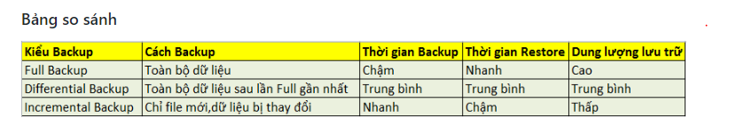
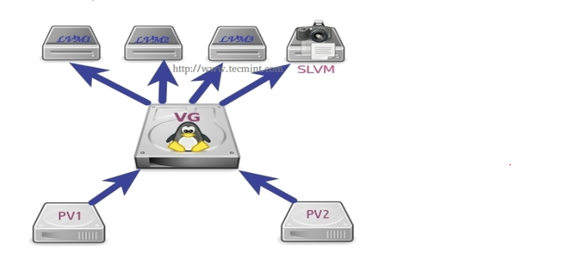
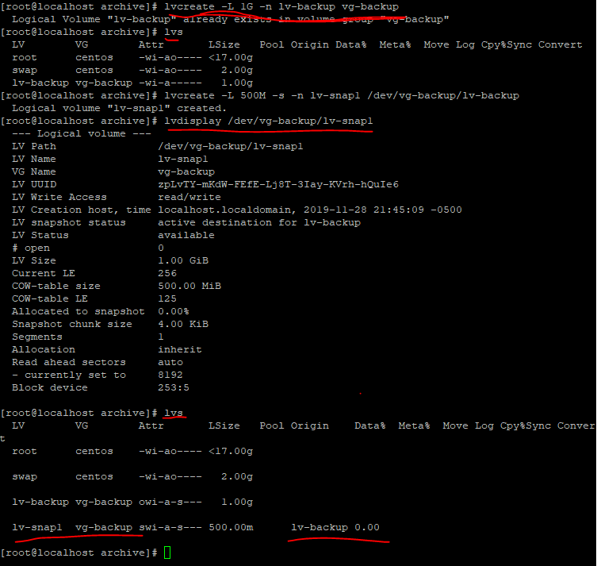
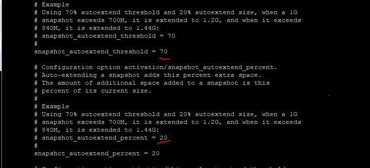

### A. Backup dữ liệu

### 1. Các kiểu backup dữ liệu
### 1.1 Full Backup
> FUll backup là backup toàn bộ dữ liệu hiện tại ta đang lưu trữ


##### Ưu điểm :
- Dễ dàng phục hồi dữ liệu . 
- Tính an toàn cao cho dữ liệu

##### Nhược điểm :

- Thời gian Backup lâu , càng nhiều dữ liệu backup càng lâu.
- Tốn dung lượng lưu trữ.
- Chi phí đầu tư thiết bị lớn.

### 1.2 Differential backup
> Differetial backup là backup những gì thay đổi so với lần Full backup trước đó.


##### Ưu điểm
- Thời gian backup nhanh hơn , tùy thuộc vào thời gian , dung lượng cần backup trước đó.
- Dung lượng nhỏ hơn so với Full Backup
- Tốc độ phục hồi nhanh hơn so với Incremental backup

##### Nhược điểm
- Khi khôi phục dữ liệu cần có 2 bản backup : 1 file full backup lần gần nhất và 1 file Differential Backup vào thời điểm cần restore


### 1.3 Incremental Backup
> Incremental Backup là backup những gì thay đổi so với lần Incremental Backup gần nhất


##### Ưu điểm 
- Thời gian backup nhanh nhất
- Dung lượng backup nhỏ nhất

##### Nhược điểm
- Khi cần khôi phục dữ liệu cần phải có đầy đr các bản backup
- 1 File full backup lần gần nhất và tất cả các file Incremental Backup từ thời điểm full backup đến thời điểm cần restore
- Thời gian Restore lâu hơn so với Differential Backup




#### P/s khuyên dùng
- Incremental backup : dùng hàng ngày
- Differential Backup : dùng theo tuần
- Full backup : dùng theo tháng hoặc theo quý.


### B. LVM Backup và Snapshot

### 1. LVM Backup
### 1.1 vgcfgbackup

> Bất cứ khi mọi thay đổi trong LVM như lvcreate , loại bỏ , thêm đĩa .. nên được cập nhật trong tệp conf nhóm đối tượng khối tương ứng 
trong thư mục  `/ec/lvm ` . Nếu đĩa bị lỗi , chúng ta có thể khổi phục cấu hình LVM vào đãi bằng tệp cấu hình sao lưu này. Lệnh `vgcfgbackup `
lấy dữ liệu cấu hình từ lvm của ổ đĩa và lưu vào một vị trí tệp mặc định là ` /etc/lvm/backup/vg_name `

` vgcfgbackup [-f path_newfilename ] vg_name  `

- Trong đó:
	- vg_name : tên của volume group cần được lưu trữu để backup
	- -f chỉ định nơi lưu trữ file backup , nếu ko sẽ lưu mặc định tại `/etc/lvm/backup `


### 1.2 vgcfgrestore
 - Lệnh `vgcfgrestore ` khôi phục LVM VG từ các Physical Volume.

` vgcfgrestore [-f|--file <filename>] [-v] vg_name  `

- Trong đó
	- vg_name : tên VG cần khôi phục
	- -f : đường dẫn lư file backup
	- -v : để biết thêm chi tiết về những gì đang sảy ra

### 1.3 Các tạo và sử dụng LVM backup

- Tạo 1 vg-backup và 1 lv-backup


- Backup

```
vgcfgbackup [-f path_newfilename ] vg_name 
ví dụ:  lvremove /dev/vg-backup/lv-backup

```


- Restore
- Cách 1: dùng lệnh để restore
- Cách 2 : Ta có thể vao file ` /etc/lvm/archive/vgname_xxxx.vg `đây là các file log ghi thời gian mà bạn thao tác trên cá logical volume
	- Tìm file có thời gian gần nhất là file mới được ghi và restore lại được (ví dụ là file : head /etc/lvm/archive/vg-backup_00003-1622706570.vg).
	- Đọc chi tiết xem ngày và giờ khi muốn restore đọc một file nào đó ` head /etc/lvm/archive/vg-backup_00003-1622706570.vg `
	- Restore dữ liệu ` vgcfgrestore vg-backup -v -f /etc/lvm/archive/vg-backup_00003-1622706570.vg `
	- Active lại vùng nhớ đệm để nhận restore ` lvchange -ay /dev/vg-backup/lv-backup `
	- Tới đây ta có thể đọc được nội dung của các file đã bị xóa trong /etc/lvm/backup 


### 2. LVM Snapshot

> Snapshot là cơ chế tạo ra " bản sao " của volume , lưu trữ toàn bộ định dạng và dữ liệu trên volume. Mỗi volume có thể tạo ra một hoặc nhiều
snapshot.




### 2.1 Tạo một snapshot
- Tạo một vg và một lv , sau đó tạo snapshot volume bằng câu lệnh
` lvcreate -L 500M -s -n lv-snap1 /dev/vg-snapshot/lv-snapshot `

- Trong đó:
	- -L 500M : dung lượng của logical volume snapshot ta muốn tạo ra.
	- -s : tạo Snapshot
	- -n : tên của  logical volume sẽ tao ra
	- /dev/vg-snapshot/lv-snapshot/ : đường dẫn của LV mà ta muốn snapshot.

- Kết quả thu được




### 2.2 Tăng dung lượng của snapshot
- Tăng dung lượng của snapshot giống như tăng dung lượng của LV , tuy nhiên lv của snapshot có thể mở rộng tự động bằng cách chỉnh file cấu
hình trong `/etc/lvm/lvm.conf ` với các thông số sau (tìm bằng ` /chuỗi cần tìm ` bấm n để chuyển tới vị trí tiếp theo ) :



- `snapshot_autoextend_threshold = 70` : khi dung lượng đạt tới 70% thì `snapshot_autoextend_percent = 20` kích thước snapshot sẽ tự tăng lên 20%


### 2.3 Restore snapshot


