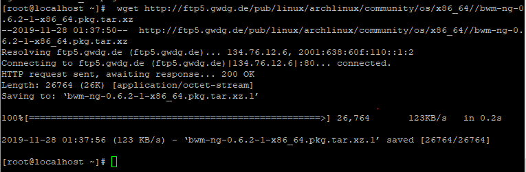
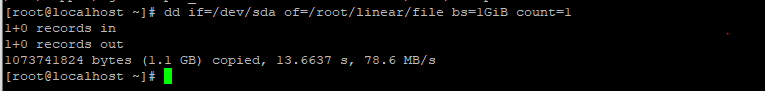

### A. Tìm hiểu các kiểu lưu trữ trên LVM

### 1. Logical Volume Manager trong LVM.

#### Linear Logical Volume

> Linear : Dữ liệu sẽ được lưu hết phân vùng này rồi chuyển đến phân vùng khác để lưu trữ.


### Striped Logical Volumes

> Striped : sẽ chia đều các dữ liệu ra và ghi vào các phân vùng đã có. Người dùng có thể set được con số chia dữ liệu thành các phần bằng nhau.


### Mirrored Logical Volumes

- Mirrored Logical Volumes duy trì các bản sao dữ liệu giống hệt nhau trên các thiết bị khác nhau . Khi dữ liệu được ghi vào một thiết bị thì
nó cũng replicate vào biết bị thứ 2 . 

- Trong các LV chạy mirror , nếu một LV bị hỏng , LV còn lại sẽ chạy Linear Volume và vẫn có thể truy cập đến được.

- LVM chia thiết bị được sao chép thành cá vùng có kích thước thương là 512KB.

- LVM có lưu trữ log để theo dõi các phân vùng đồng bộ của cá data được ghi.


### 2. Ưu nhược điểm của các Logic Volume Manager

##### Linear
- Ưu điểm : Các dữ liệu được tập chung vào một phân vùng , dễ dàng quản lý.
- Nhược điểm : Dữ liệu sẽ bị mất hết trong một phân vùng nếu phân vùng đó bị lỗi . Tốc đô read/write chưa cao , vì chỉ có một phân vùng hoạt động các
phân vùng khác thì không hoạt động.

##### Striped
- Ưu điểm : Tốc độ xử lý sẽ nhanh hơn vì tất cả các phân vùng sẽ cùng làm việc 
- Nhược điểm : Một phân vùng bị lỗi thì tất cả dữ liệu được phân chia có lưu ở phân vùng này sẽ đề bị hư hại.

##### Mirror
- Ưu điểm : Nếu một LV bị hỏng  , LV còn lại sẽ chạy Linear Volume và vẫn tiếp tục truy cập được
- Nhược điểm : Hạn chế về không gian lưu trữ


### B. Cài đặt 

### 1. Cài đặt Linear Volumes và Striped Volumed
### 1.1 Cài đặt lệnh giám sát quá trình đọc ghi ở ổ đĩa ` bwn-ng `
`  wget http://ftp5.gwdg.de/pub/linux/archlinux/community/os/x86_64//bwm-ng-0.6.2-1-x86_64.pkg.tar.xz `



### 1.2. Tạo ra hai phân vùng để tạo 2 logical có 2 kiểu lưu trữ riêng biệt


### 1.3. Tạo các Volume Group


### 1.4. Ta sẽ tạo ra một logical với keieru lưu trữ là ` linear` và một logical với kiểu lưu trữ là ` striped `.
- Tạo logical có tên là linear_lv với Volume Group vg1 theo cú pháp:

```
 lvcreate --extents (số %)FREE --name (tên logical) (tên Group)

vd: lvcreate --extents 100%Free --name linear_lv vg1

```
- Tạo loglical có tên là striped_lv với VG vg2 theo cú pháp:
```
lvcreate --extents N%FREE --srtipes (số physical chung 1 cụm lưu dữ liệu ) --stripesize (số dung lượng) --name (tên logical) (tên group)

vd:  lvcreate --extents 100%FREE --stripes 2 --stripesize 64 --name striped_lv vg2
```

### 1.5. Định dạng cho logical
```

mkfs -t ext4 /dev/vg1/linear_lv
mkfs -t ext4 /dev/vg2/striped_lv

```
### 1.6. Mount nó với một cây thư mục root để có thẻ dùng chúng . Kiểm tra xem logical đã được mount hay chưa.

```
mount /dev/vg1/linear_lv /root/linear
mount /dev/vg2/striped_lv /root/striped
```


### 1.7. Copy file root vào 2 logical để xem tốc độ đọc/ghi của nó và cách lưu trữ dữ liệu.

- Sử dụng với linear ta sử dụng 2tab terminal với 2 lệnh sau:
` dd if=<địa chỉ đầu vào> of=<địa chỉ đầu ra> option `




- Trong đó:
	- if= địa chỉ nguồn dữ liệu nó sẽ bắt đầu đọc
	- of= viết đầu ra của file
	- option: các tùy trọn của câu lệnh
- với terminal thứ 2 ta sử dụng lệnh:
 ` bwm -ng -u byte -i disk `


=> Tốc độ lưu dữ liệu ở ổ ` striped `  nhanh hơn so với ` linear `

### 1.8. Cài đặt Mirrored Volumes
- Tạo physical volume
`pvcreate /dev/sdb1 /dev/sdb2

- Tạo volume group
`vgcreate vg_mirror /dev/sdb1 /dev/sdb2`

- Tạo logical volume
	- -L : dung lowngj logiacl volume
	- -m1 : số miror lưu (ở đây ta lưu dữ liệu vào 1 ổ , và và lưu bản mirror vào ổ còn lại)
##### p/s: Điều kiện chạy được mirror volume là Logical Volume tạo ra không được vượt quá dung lượng physical Volume bé nhất

` lvcreate -L 50M -m1 -n lv_mirror vg_mirror `


- Kiểm tra cài đặt bằng lệnh ` lvs --segments ` . Nếu thấy type=raid1 tức là đã thành công

![](../images/34.png0


