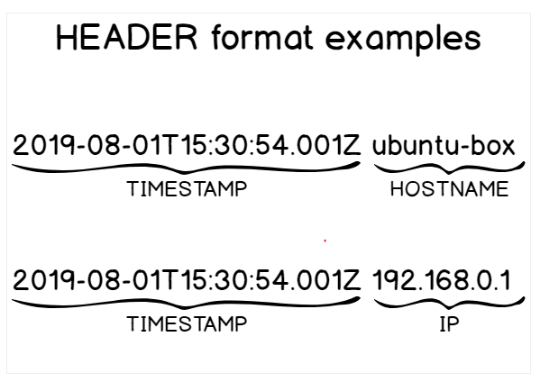
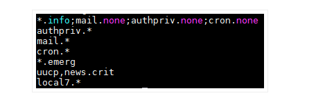
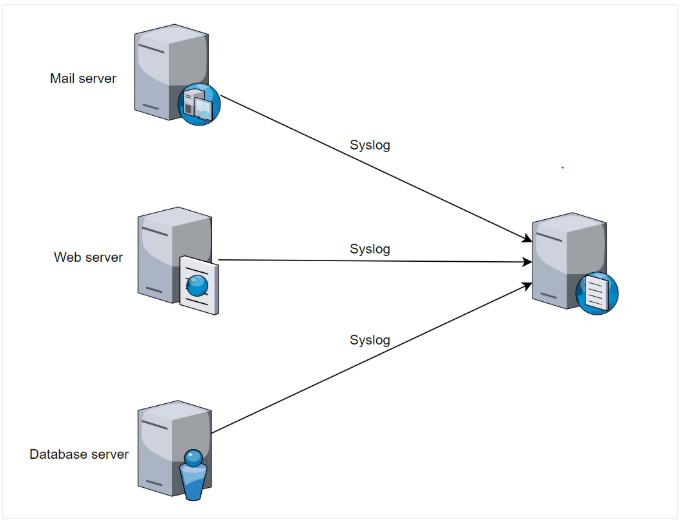

### A. Tổng quan về Log

> Log là một phần quan trọng trong đối với người quản trị viên hệ thống . Log sẽ ghi lại toàn bộ nhật kí hoạt động diễn ra của hệ thống , từ đó
quản trị viên có thể nắm bắt được toàn bộ tình hình đang diễn ra của hệ thống thông qua việc đọc các log.

##### Tác dụng của log.
- Log ` ghi lại liên tục ` các thông báo về hoạt động của cả hệ thống hoặc của các dịch vụ được triển khai  trên hệ thóng và file tương ứng . Log file
thường là các file văn bản thông thường dưới dạng "clear text" dễ dàng đọc được nó, vì thế có thể sử dụng cá trình soạn thảo văn bản (vi , vim..)hoăc
các trình xem văn bản thông thường (cat , tail ,..) là có thể xem được file log.

- Các file log có thể cho ta biết bất cứ thứ gì đang diễn ra trong hệ thống , từ đó nếu ta có thể nắm bắt sự cố và hướng giải quyết thông qua việc
đọc các file log này.

- Trong hầu hết hệ thống Linux thì  ` /var/log ` là nơi lưu lại tất cả các log.

#### Hầu hết các file log được chia làm 1 trong 4 loại sau:
- Application Logs : Nhật ký ứng dụng
- Event Logs : Nhật ký sự kiện
- Service Logs : Nhật ký dịch vụ
- System Logs : Nhật ký hệ thống

### B. Syslog 

> Syslog là một giao thức client/server : đây là giao thức dùng để chuyển log và thông điệp tới máy nhận log. Máy nhận log thường được gọi là ` syslogd ` , `syslog daemon`
hoặc ` syslog server` . Syslg có thể gửi qua UDP hoặc TCP , các dữ liệu được gửi dạng cleartext . ` Syslog  dùng port 514`.

- Syslog được phát triển năm 1980 bởi Eric Allman, nó là một phần của dự án Sendmail, và ban đầu chỉ được sử dụng duy nhất cho Sendmail. Nó đã thể hiện giá trị của mình và
các ứng dụng khác cũng bắt đầu sử dụng nó. Syslog hiện nay trở thành giải pháp khai thác log tiêu chuẩn trên Unix-Linux cũng như trên hàng loạt các hệ điều hành khác và 
thường được tìm thấy trong các thiết bị mạng như router Trong năm 2009, Internet Engineering Task Forec (IETF) đưa ra chuẩn syslog trong RFC 5424.

- Syslog ban đầu sử dụng UDP, điều này là không đảm bảo cho việc truyền tin. Tuy nhiên sau đó IETF đã ban hành RFC 3195 (Đảm bảo tin cậy cho syslog) và 
RFC 6587 (Truyền tải thông báo syslog qua TCP). Điều này có nghĩa là ngoài UDP thì giờ đây syslog cũng đã sử dụng TCP để đảm bảo an toàn cho quá trình truyền tin.

- Trong chuẩn syslog, mỗi thông báo đều được dán nhãn và được gán các mức độ nghiêm trọng khác nhau. Các loại phần mềm sau có thể sinh ra thông báo: auth, authPriv,
daemon, cron, ftp, dhcp, kern, mail, syslog, user,... Với các mức độ nghiêm trọng từ cao nhất trở xuống Emergency, Alert, Critical, Error, Warning, Notice, Info, and Debug.

### 1. Mục đích sử dụng của syslog

- Syslog được sử dụng như một tiêu chuẩn, chuyển tiếp và thu thập log được sử dụng trên một phiên bản Linux. Syslog xác định mức độ nghiêm trọng (severity levels) cũng 
như mức độ cơ sở (facility levels) giúp người dùng hiểu rõ hơn về nhật ký được sinh ra trên máy tính của họ. Log (nhật ký) có thể được phân tích và hiển thị trên các máy
chủ được gọi là máy chủ Syslog.

### 2. Giao thức syslog có những yếu tố sau:

- ` Defining an architecture (xác định kiến ​​trúc)` : Syslog là một giao thức, nó là một phần của kiến ​​trúc mạng hoàn chỉnh, với nhiều máy khách và máy chủ.

- ` Message format (định dạng tin nhắn)` : syslog xác định cách định dạng tin nhắn. Điều này rõ ràng cần phải được chuẩn hóa vì các bản ghi thường được phân tích cú pháp 
và lưu trữ vào các công cụ lưu trữ khác nhau. Do đó, chúng ta cần xác định những gì một máy khách syslog có thể tạo ra và những gì một máy chủ nhật ký hệ thống có thể 
nhận được.

- ` Specifying reliability (chỉ định độ tin cậy) `: syslog cần xác định cách xử lý các tin nhắn không thể gửi được. Là một phần của TCP/IP, syslog rõ ràng sẽ bị thay đổi
trên giao thức mạng cơ bản (TCP hoặc UDP) để lựa chọn.

- ` Dealing with authentication or message authenticity (xử lý xác thực hoặc xác thực thư)` : syslog cần một cách đáng tin cậy để đảm bảo rằng máy khách và máy chủ đang 
nói chuyện một cách an toàn và tin nhắn nhận được không bị thay đổi.

### 3 Kiến trúc Syslog

- Một máy Linux độc lập hoạt động như một máy chủ máy chủ syslog của riêng mình. Nó tạo ra dữ liệu nhật ký, nó được thu thập bởi rsyslog và được lưu trữ ngay vào hệ thống tệp.

##### Dưới đây là các ví dụ kiến trúc xung quanh nguyên tắc trên:

### 4 Định dạng tin nhắn Syslog

##### Định dạng nhật ký hệ thống được chia thành ba phần , và độ dài của một thông báo không được vượt quá 1024 bytes:

- ` PRI ` : Chi tiết các mức độ ưu tiên của tin nhắn ( từ tin nhắn gỡ lỗi `debug` đến trường hợp khẩn cấp) cũng như các mức độ cơ sở (mail, auth , kernel)
- ` Header ` : Bao gồm hai trường TIMESTAMP và HOSTNAME , tên máy chủ và tên máy gửi nhật kí.
- ` MSG ` : Phần này chứa thông tin thực tế về sự kiện đã sảy ra . Nó cũng được chia trường Tag và CONTENT

##### PRI
- PRI hay Priority được đặt trong cặp dấu ngoặc ngon , thể hiện cơ sở sinh ra log hoặc mức độ nghiêm trọng gồm 8 bit
	- 3 bit đầu thể hiện cho tính nghiêm trong của thông báo
	- 5 bít còn lại thể hiện cho cơ sở sinh ra thông báo

##### Header

- TIMESTAMP được định dạng Mmm dd hh:mm:ss . Thời gian này được lấy từ thời gian hệ thống
	- Chú ý : nếu như thời gian của server và thời gian của client khác nhau thì thông báo ghi trên log được gửi lên server là thời gian 
	 của máy client

- HOSTNAME (đôi khi là địa chỉ IP ): Được đưa ra khi muons nhập lệnh tên máy chủ , nếu không tìm thấy , nó sẽ được gán cả IPv4 và IPv6 của máy chủ.

##### MSG
- Phần MSG hay message chứa một số thông tin về quá trình tạo ra thông điệp đó và gồm 2 phần chính:
	- Tag field : Tên chương trình tạo ra thông báo 
	- Content field : Thông tin chi tiết của thông báo

### 4.1 Các cấp độ cơ sở Syslog (Syslog facility levels) 

- Một mức độ cơ sở được sử dụng để xác định chương trình hoặc một phần của hệ thống tạo ra các bản ghi.
- Theo mặc định , một số phần trong hệ thống được cng cấp cá mức facility như kernel sử dụng `kern facility` hoặc mail sử dụng `mail facility`.
- nếu một bên thứ ba muốn phát hành log , có thể đó sẽ là mọt tập hợp các cấp độ faility được bảo lưu từ 16-23 đượ gọi là `local user` facility levels.
- Ngoài ra , có thể dử dụng tiện ích của người dùng cấp độ người dùng " user-level" facility , nghĩa là họ sẽ đưa ra các log liên quan đến người dùng đã ban hành các lệnh.

### 4.2 Mức độ cảnh báo của Syslog

- Mức độ cảnh báo của Syslog được sử dụng để xác định mức độ nghiêm trọng của log event và chúng bao gồm từ gỡ lỗi(debug)  , thông báo thông tin(informational messges) 
đên mức khẩn cấp (emergency leverls).

- Tượng tự như cấp độ cơ sở Syslog , mức độ cảnh báo được chia thành các số từ 0 đến 7 . Mức độ quan trong giảm dần từ 0 về 7

- Chúng ta có thể quyết định lưu trữ các bản ghi theo các mức độ nghiêm trọng ngay cả khi các bản ghi này được lưu trữ theo tên cơ sở mặc định.

- Nếu sử dụng Rsyslog làm máy chủ syslog mặc định , chúng ta có thể kiểm tra cá thuộc tính rsyslog để định cấu hình các bản ghi phân tách.

### 4.3 Syslog hoạt động và gửi tin nhắn.

#### Chuyển tiếp nhật ký hệ thống.
- Chuyển tiếp nhật ký hệ thống (syslgo forwarding) bao gồm gửi log máy khách đến một máy chủ từ xa để chúng được tập chung lại , giúp phần
tích dễ dàng và hiệu quả hơn.

- Quản trị viên không giám sát một máy chủ duy nhất mà họ sẽ phải giám sát đồng thời hàng chục máy chủ khác nhau.

- Việc gửi nhật ký đến một máy ở xa , được gọi là máy chủ ghi log tập chung , sử dụng các giao thức truyền thông khác nhau như UDP hoặc TCP

#### Syslog sử dugj TCP hay UDP

- Syslog ban đầu sử dụng UDP điều này không đảm bảo cho việc truyền tin . Tuy nhiên sau đó IETF đã ban hành RFC 3195 (Đảm bảo tin cậy cho syslog) và 
RFC 6587(Truyền tải thông báo syslog qua TCP) . Hiện nay syslog sử dụng TCP nhiều hơn để đảm bảo an toàn cho quá trình truyền tin.

- Syslog sử dụng port 514 cho UDP
- Rsyslog sử dụng port 10514 cho TCP 
- Có thể sử dụng giao thứ TLS/SSL trên TCP để mã hóa các gói Syslog đảm bảo an toàn thông tin.

### 5. Quá trình phát triển 

- ` Syslog daemon` được xuất bản năm 1980 , `syslog daemon ` có lẽ là bản thực nghiệm đầu tiên và chỉ hỗ trợ một bộ tính năng giới hạn (chẳng 
hạn như truyền UDP). Nó thường được gọi là ` daemon sysklogd ` trên linux
- ` Syslog-ng ` xuất bản nắm 1998 , syslog-ng mở rộng tập hợp các khả năng của trình nền syslog gốc bao gồm chuyển tiếp TCP ( do đó nâng cao 
độ tin cậy ) , mã hóa TLS và bộ lọc dựa trên nội dung .Cũng có thể lưu trữ log vào cơ sở dữ liệ trên local để phân tích

- ` Rsyslog ` "The rocket-fast system for log processing" được bắt đầu phát triển từ nắm 2004 bỏi Rainer Gerhards `rsyslog` là một phần mềm mã 
nguồn mở được sử dụng trên linux dùng để chuyển tiếp các log message đến một địa chỉ mạng (log receiver,log server). Nó thực hiện giao thức 
syslog cơ bản , đặc biệt là sử dụng TCP cho việc truyền tải log từ client tới server . Hiện nay Rsyslog là phần mềm được cài sắn trên hầu
hết hệ thống Unix và các bản phân phối của Linux như : Fedora , Debain , Ubuntu , Red Hat Enterprise Linux.

- Rsyslog là sự phát triển của `syslog` cung cấp cấp khả năng như các modul có thể cấu hihf , được liên kết với nhiều mục tiêu khác nhau
- Rsyslog cũng cung cấp tính năng lọc riêng cũng như tạo khuân mẫu định dạng dữ liệu sang dạng tùy chỉnh.

### C. Rsyslog - File cấu hình 
### 1. File cấu hình rsyslog.conf

##### Cơ bản file `rsyslog.conf` mặc định sẽ lưu trữ tất cả các log tiến trình của hệ thống.

##### Cấu hinh trên được chia làm 2 trường :
#### TH1: Trường Seletor
- Chỉ ra nguồn tạo ra log và mức cảnh báo của log đó
- Trong trường seletor có 2 thành phần và được tách nha bằng dấu ` . `

#### TH2 : Trường ACTION

- Nơi lưu trữ log của tiến trình , có 2 loại là lưu file tại localhost hoặc gửi đến IP của máy chủ Log
 

#### 2. Thay đổi mức cảnh báo mặc định

` mail.info         /var/log/maillog `
- Lúc này , bản tin log sẽ mail với mức cảnh bảo từ info trở lên . Nếu muốn log mail với mức cảnh bảo là info thì phải sử dụng lệnh ` mail.=info /var/log/maillog`

` mail.*` .
-  Lúc này * đại diện cho mức cảnh báo , nó lưu hết các level của mail vào trong thư mục 
- Khi đặt ` *. ` thì nó sẽ log lại các tiến tình của hệ thống vào một file .  Nếu muốn log lại tiến trình của mail ngoại trừ mức info có
thể dùng kí tự  ` !` . VD:  ` mail.!info `

` *.info;mail.none;authpriv.none;cron.none                /var/log/messages ` 

- Lúc này tất cả các log từ info của tiến trình hệ thống sẽ được lưu vào file log mesages nhưng đối với log của mail , authpriv và cron sẽ
không được lưu vào messages.

### D. Log tập trung 

> Log tập trung là quá trình tập trung , thu thập , phân tích .. cá log cần thiết từ nhiều nguồn khác nhau về một nơi an toàn để tiện lợi cho 
việc theo dõi và phân tích hệ thống.

#### Tại sao lại phải sử dụng log tập trung?

- Do có nhiều nguồn sinh log
	- Có nhiều nguồn sinh ra log, log nằm trên nhiều máy chủ khác nhau nên khó quản lý.
 	- Nội dung log không đồng nhất (Giả sử log từ nguồn 1 có có ghi thông tin về ip mà không ghi thông tin về user name đăng nhập mà log
	từ nguồn 2 lại có) -> khó khăn trong việc kết hợp các log với nhau để xử lý vấn đề gặp phải.
	- Định dạng log cũng không đồng nhất -> khó khăn trong việc chuẩn hóa

- Đảm bảo tính toàn vẹn, bí mật, sẵn sàng của log.
	- Do có nhiều các rootkit được thiết kế để xóa bỏ logs.
	- Do log mới được ghi đè lên log cũ -> Log phải được lưu trữ ở một nơi an toàn và phải có kênh truyền đủ đảm bảo tính an toàn và sẵn
	 sàng sử dụng để phân tích hệ thống.

#### Lợi ích dùng log tập trung mang lại 
- Giúp quản trị viên có cái nhìn chi tiết về hệ thống -> có định hướng tốt hơn về hướng giải quyết
- Mọi hoạt động của hệ thống được ghi lại và lưu trữ ở một nơi an toàn (log server) -> đảm bảo tính toàn vẹn phục vụ cho quá trình phân tích 
điều tra các cuộc tấn công vào hệ thống
- Log tập trung kết hợp với các ứng dụng thu thập và phân tích log khác nữa giúp cho việc phân tích log trở nên thuận lợi hơn -> giảm thiểu 
nguồn nhân lực.

#### Nhược điểm khi dùng log tập trung
-  Bạn có nguy cơ quá tải máy chủ syslog của mình: với cấu ​​trúc này, bạn đang đẩy các bản ghi đến một máy chủ từ xa. Hậu quả là, nếu một máy bị 
 tấn công và bắt đầu gửi hàng ngàn log messages, có nguy cơ làm quá tải máy chủ log.

- Nếu máy chủ nhật ký của bạn bị hỏng, bạn sẽ mất khả năng xem tất cả các nhật ký được gửi bởi khách hàng. Hơn nữa, nếu máy chủ ngừng hoạt động, 
máy khách sẽ bắt đầu lưu trữ thư cục bộ cho đến khi máy chủ khả dụng trở lại, do đó không gian đĩa ở phía máy khách sẽ dần bị đầy.

### E. Tài liệu tham khảo:
https://github.com/hocchudong/Mot-vai-hieu-biet-ve-log#2
https://github.com/hocchudong/Syslog
https://news.cloud365.vn/log-ly-thuyet-tong-quan-ve-log-syslog-rsyslog/

