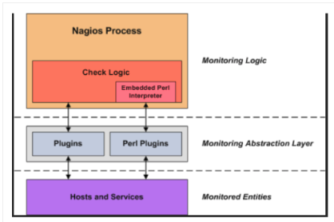
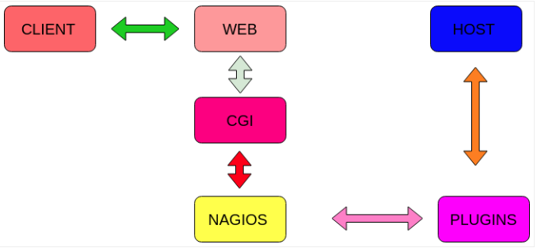

### Tổng Quan về NAGIOS CORE

### 1. Plugins
- Một lớp trừu tượng giữa nagios server và host ( service)
- Một dòng lệnh hoặc một đoạn script
- Chức năng kiểm tra host và service rồi trả kết quả vè cho Nagios server

### 2. Web server

- Nơi lưu trữ các thành phần của website
- Cung cấp dữ liệu của website cho người dùng , cung cấp dữ liệu cho người dùng thông qua internet

### 3. Database
- DB bao gồm DATA và DBMS (Data base Manager System)
- Trong  Nagios hỗ trợ 2 DB là MYSQL và PostgreSQL

### 4. CGI

- CGI hay còn được gọi là giao diện dòng lệnh , cung cấp giao thức webserver sử dụng
- Web server thường gửi thông tin biểu mẫu cho một quy trình xử lý dữ liệu và có thể gửi lại thông báo xác nhận . Quá trình đó được gọi là CGI
- CGI có thể hiểu được viết lên từ ngôn ngữ nào đó như C , Perl , Shell

### 5. Ưu nhược điểm
- Ưu điểm : 
	- Giám sát tập chung
	- Mã nguồn mở , free
	- Tích hợp được nhiều ngôn ngữ
	- Cộng đồng hỗ trợ lớn

- Nhược điểm : 
	- Giao diện đồ họa lâu đời
	- Không có khả năng tự phát hiện host khi thêm vào, người quản trị phải làm bằng cơm.

### 6. Luồng hoạt động 

- Bước 1: Client sẽ sử dụng giao thức http để tạo yêu cầu thông tin website cho nagios server

- Bước 2: Web server sẽ sử dụng CGI để lấy thông tin từ nagios server

- Bước 3: Nagios server sẽ xem lại file cache. Nếu trong đó có thông tin mà client yêu cầu thì nó sẽ lập tức trả lại kết quả. Nếu không có nagios sẽ tạo ra một plugins để kiểm tra lại thông tin mà client yêu cầu

- Bước 4: Plugins sẽ check thông tin theo yêu cầu và sau đó trả lại thông tin lại cho nagios server

- Bước 5: Sau khi được nhận thông tin từ plugins thì nagios server sẽ lưu trữ thông tin đó vào một file hoặc một DB do cài đặt của người quản trị. Và đồng thời nó sẽ lưu trữ thông tin này vào file cache nếu người quản trị có sử dụng chức năng của file này

- Bước 6: Nagios sẽ xác định những việc phải làm dựa trên thông tin được trả về từ nagios. Có cần cảnh báo hay không và đánh giá trạng thái của các host hay service. Rồi sau đó trả lại thông tin cho webserver

- Bước 7: Web server sẽ sử dụng lại giao thức http trả lại thông tin mà client yêu cầu.
