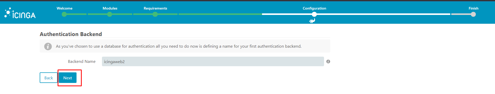
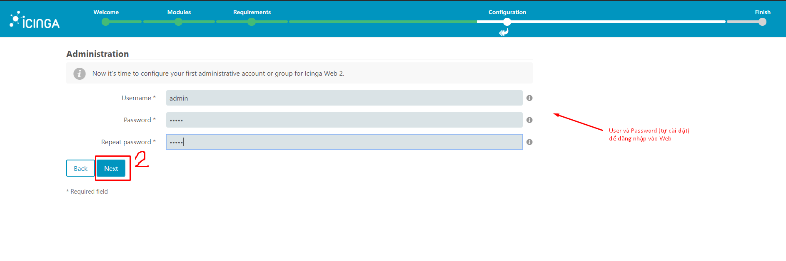
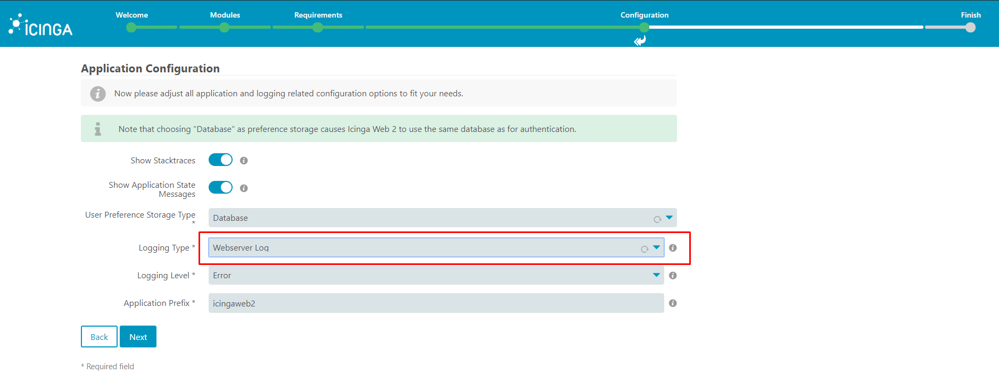
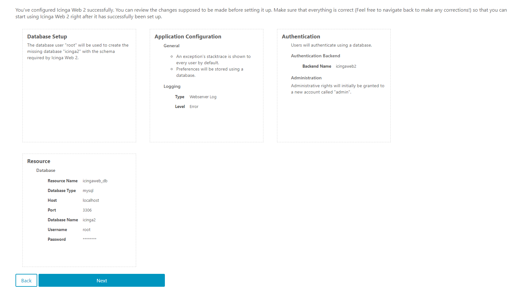
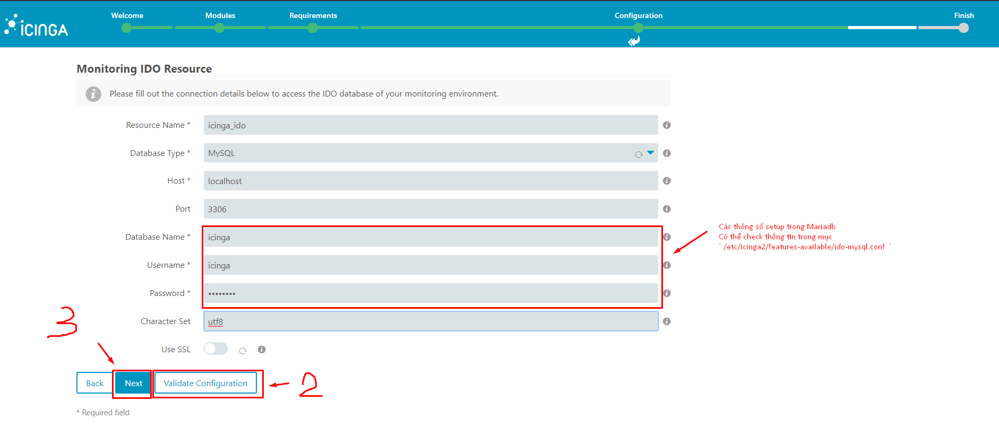
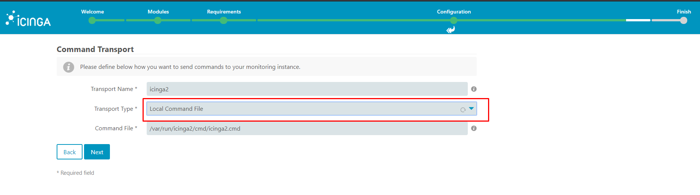
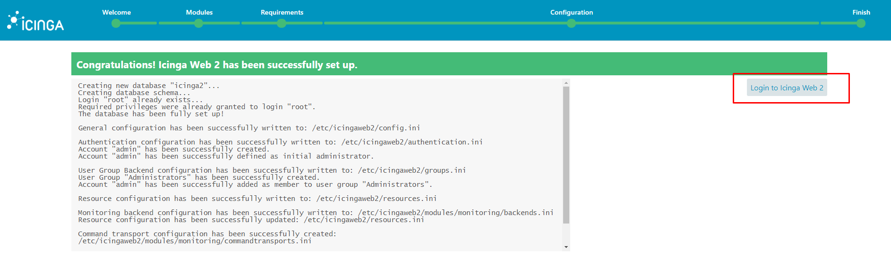
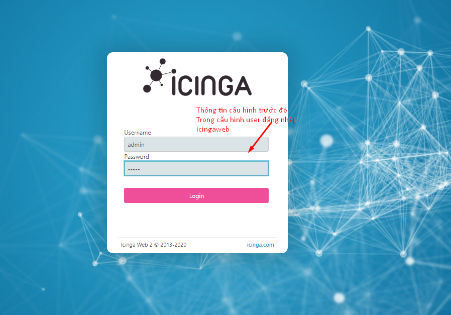

### Cài đặt Icinga2 vs Icingaweb2

### A. Cài đặt Icinga2

### 1. Cài đặt  EPEL repository dành cho CentOS_7 và các gói kích  hoạt bổ xung

```
rpm -ivh https://dl.fedoraproject.org/pub/epel/epel-release-latest-7.noarch.rpm

subscription-manager repos --enable rhel-7-server-optional-rpms
subscription-manager repos --enable rhel-7-server-extras-rpms
```

### 2. Cài đặt Repository Icinga2
```
rpm --import https://packages.icinga.com/icinga.key
yum install https://packages.icinga.com/epel/icinga-rpm-release-7-latest.noarch.rpm
```
### 3. Cài đặt Icinga2

```
yum -y install icinga2
systemctl start icinga2
systemctl enable icinga2
```
### 4.Cài đặt SElinux - Firewalld (icinga2 và incingaweb2 đều có cấu hình Selinux riêng)
```
yum install -y icinga2-selinux 
firewall-cmd --permanent --add-port=5665/tcp
firewall-cmd --reload
```

### 5. Cài đặt Nagios Plugins
` yum -y install nagios-plugins-all `

### 6. Cài đặt Mariadb và IDO Mariadb
```
yum -y install mariadb-server mariadb

systemctl start mariadb
systemctl enable mariadb

yum -y install icinga2-ido-mysql

```
### 7. Cấu hình DB icinga2 ( user/DB IDO: icinga2 , Userweb/DBweb: icingaweb2 )
```
mysql -u root -p

CREATE DATABASE icinga2;
CREATE DATABASE icingaweb2;

grant all privileges on icinga2.* to icinga2@localhost identified by 'Hse@123a';
grant all privileges on icingaweb2.* to icingaweb2@localhost identified by 'Hse@123a';

FLUSH PRIVILEGES;
quit


mysql -u root -p icinga2 < /usr/share/icinga2-ido-mysql/schema/mysql.sql


vi /etc/icinga2/features-enabled/ido-mysql.conf
user = "icinga2",
password = "Hse@123a",
host = "localhost",
database = "icinga2"


```

### 8. Enable IDO Mysql Module
```
icinga2 feature list
icinga2 feature enable ido-mysql
icinga2 feature enable command

```

### B. Cài đặt Icingawweb2
### 1. Cài đặt PHP và các gói mở rộng cho Icinga web2
```
yum install -y centos-release-scl

yum -y install rh-php71-php-json rh-php71-php-pgsql rh-php71-php-xml rh-php71-php-intl rh-php71-php-common rh-php71-php-pdo rh-php71-php-mysqlnd rh-php71-php-cli rh-php71-php-mbstring rh-php71-php-fpm rh-php71-php-gd rh-php71-php-zip rh-php71-php-ldap rh-php71-php-imagick
```

### 2. Set timezone - Start PHP
```
vi /etc/opt/rh/rh-php71/php.ini
date.timezone = Asia/Ho_Chi_Minh

systemctl restart rh-php71-php-fpm
systemctl enable rh-php71-php-fpm


```

### 3. Cài đặt IcingaWeb2
```
rpm --import https://packages.icinga.com/icinga.key
yum install https://packages.icinga.com/epel/icinga-rpm-release-7-latest.noarch.rpm

yum -y install icingaweb2 icingacli httpd
systemctl start httpd
systemctl enable httpd
```

### 4.Selinux - Firewalld

```
yum -y install icingaweb2-selinux

firewall-cmd --permanent --add-service=http
firewall-cmd --reload
```

### NOTE : User/DB lần đầu setup Icingaweb2 là của WEB( icingawed2) . User/DB lần sau setup là của IDO (icinga2) 


### C. Setup Icingaweb2
### 1. Cấp quyền và test
```
http://10.2.9.52/incingaweb2/setup
groupadd -r icingaweb2;
usermod -a -G icingaweb2 apache;
icingacli setup config directory --group icingaweb2;
icingacli setup token create;

```
### 2. Setup





















