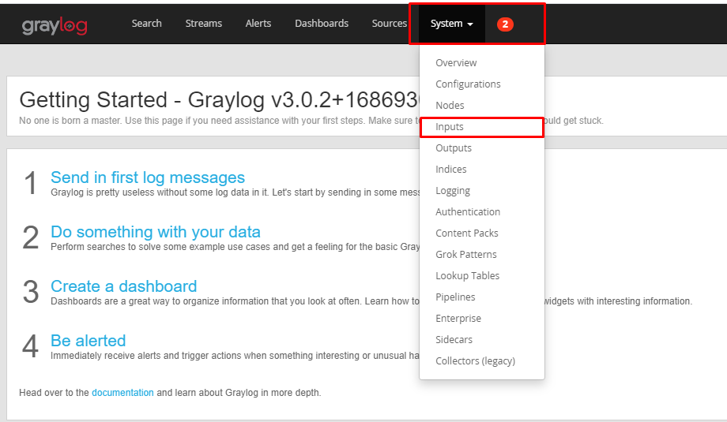
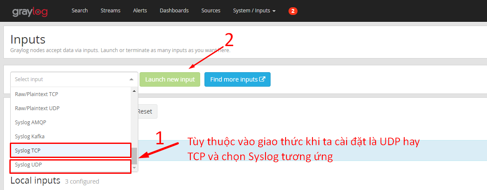
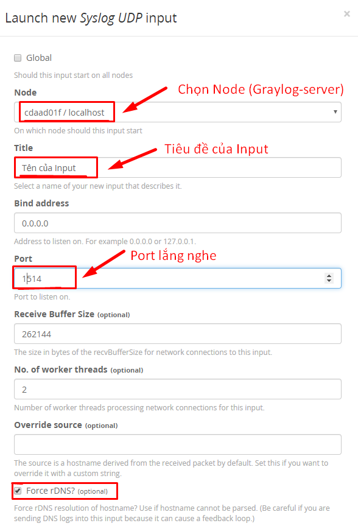
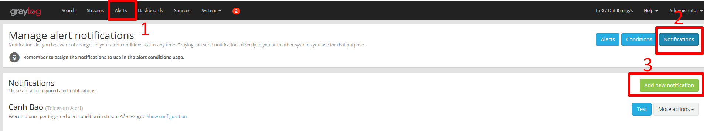
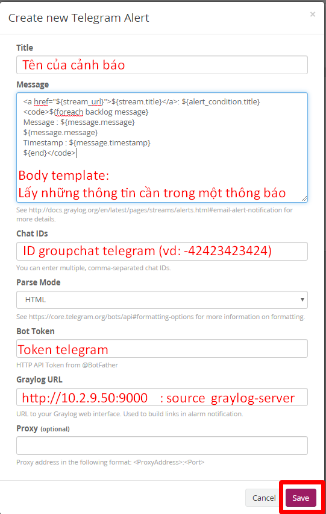
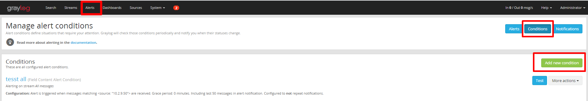
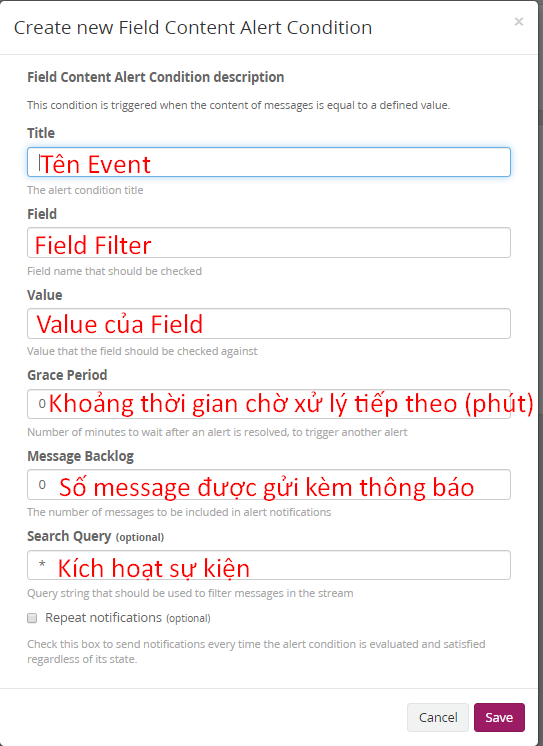

### B. Cài đặt Graylog 3.0 trên CentOS 7.

#### 1. Mô hình và các modul cài đặt.
- Sử dụng mô hình triển khai trên 1 máy server ( All - in - one)
- Cài đặt MongoDB 4.0 : Nơi lưu trữ metadata cấu hình , chắng hạn như thông tin người dùng hoặc cấu hình luồng.
- Cài đặt Elasticsearch 6.x: Công cụ tìm kiếm và phân tích Graylog một bộ lưu trữ dữ liệu nhật ký trung tâm.

### 2. Cài dặt MongoDB 4 trên CentOS 7.

- Thêm kho lưu trữ MongoDB
```
vi /etc/yum.repos.d/mongodb-org-4.0.repo

[mongodb-org-4.0]
name=MongoDB Repository
baseurl=https://repo.mongodb.org/yum/redhat/7/mongodb-org/4.0/x86_64/
gpgcheck=1
enabled=1
gpgkey=https://www.mongodb.org/static/pgp/server-4.0.asc

```

- Cài đặt MongoDB 4 bằng gói mongodb-org , gói này sẽ tự động cài thêm  mongodb-org-server , mongodb-org-mongos , mongodb-org-shell và mongodb-org-tools.

```
yum install mongodb-org 
systemctl start mongod
systemctl enable  mongod
systemctl status mongod
mongod --version

```

### 3.Cài đặt Elasticsearch 6.x trên CentOS 7.

### 3.1 Cài đặt Java 12 trên CentOS 7.

```
yum install java-1.8.0-openjdk-headless

java -version
```

### 3.2 Cài đặt Elasticsearch 6.x
- Thêm kho lưu trữ Elasticsearch 

```
vi /etc/yum.repos.d/elasticsearc-6.repo

[elasticsearch-6.x]
name=Elasticsearch repository for 6.x packages
baseurl=https://artifacts.elastic.co/packages/6.x/yum
gpgcheck=1
gpgkey=https://artifacts.elastic.co/GPG-KEY-elasticsearch
enabled=1
autorefresh=1
type=rpm-md

```
- Nhập khóa ký tên repo của Elasticsearch PGP và cài đặt Elasticsearch 6.x
```
rpm --import https://artifacts.elastic.co/GPG-KEY-elasticsearch

yum install elasticsearch

```

### 4. Config Elasticsearch
- Trong cấu hình cơ bản , Graylog yêu cầu đổi tên cụm Elasticsearch thành Graylog trong thư mục ` etc/elasticsearch/elasticsearch.yml `


- Khởi động elasticsearch
```
systemctl daemon-reload 
systemctl restart elasticsearch 
systemctl enable elasticsearch

```

- Kiểm tra elasticsearch đã hoạt động bình thương chưa sử dụng lệnh: 
```
curl -X GET http://localhost:9200
```
- Kết quả 


### 5. Cài đặt Graylog 3.0

- Thêm kho lưu trữ cho Graylog 3.x RPM  và cài đặt Graylog 3.0

``` 
rpm -Uvh https://packages.graylog2.org/repo/packages/graylog-3.0-repository_latest.rpm

yum install graylog-server

```
### 5.1 Config Graylog
- Cần có 1 mật khẩu bí mật và băm mật khẩu người dùng root . Để tạo mật khẩu bí mật ngẫu nhiên dùng lệnh ` pwgen `
```
yum install epel-release
yum install pwgen

```

- Tạo khóa bí mật bằng cách chạy lệnh:  ` pwgen -N 1 -s 96 `
- Băm mật khẩu thành sha256 : ` echo -n "hse@12345" | sha256sum | cut -d" " -f1 `

- Kết quả thu được 
	- 5KnU84m0zxT2x90e1JMUTxoREdkEFoZBKsV2nmpe554s4vTBMCNIdhcdugFEQZJWo5JtjWB37zdarkL8iTSk6c24GCdAasCG
	- 82fba6cc9259b2198e0d30ed03f82eaac290110cdf280e4f1a80d9fecf3de524


- Sửa file cấu hình Graylog trong file ` etc/graylog/server/server.conf `
```
...
password_secret = 5KnU84m0zxT2x90e1JMUTxoREdkEFoZBKsV2nmpe554s4vTBMCNIdhcdugFEQZJWo5JtjWB37zdarkL8iTSk6c24GCdAasCG
...
...
root_password_sha2 = 82fba6cc9259b2198e0d30ed03f82eaac290110cdf280e4f1a80d9fecf3de524

```
- Chuyển địa chỉ Http_bind_address để cho truy cập graylog server


- Mô hình chạy 1 nút elasticsearch nên để giá trị ` elasticsearch_shards ` thành 1 .


- Khởi động Graylog-Server
```
systemctl daemon-reload
systemctl enable graylog-server.service
systemctl start graylog-server.service
systemctl status graylog-server.service
```


- Truy cập web của graylog ` http://10.2.9.50:9000 `
	- user : admin
	- password : hse@12345 ( Mật khẩu root đã khai báo, được băm ở phía trên )
	


- Cài đặt Rsyslog và thực hiện đẩy qua cổng 8514 ( trong phần cổng lắng nghe UDP và TCP của /etc/rsyslog.conf)


https://kifarunix.com/install-graylog-3-0-on-centos-7/
https://github.com/letran3691/Graylog


### C. Thu thập Log qua Syslog
### 1. Setup thời gian 

- Đồng bộ thời gian giữa các host vs nhau bằng NTP , và set timezone
```
yum install -y ntp

timedatectl set-timezone Asia/Ho_Chi_Minh

```

- Cài đặt thời gian đồng bộ giữa host và web (Graylog_server)
```

vi /etc/graylog/server/server.conf

root_timezone = Asia/Ho_Chi_Minh

```

### 2. Add thêm host giám sát 
```
echo '*.*  @10.2.9.50:1514;RSYSLOG_SyslogProtocol23Format' >> /etc/rsyslog.conf

systemctl restart rsyslog

```
- Trong đó :
	- 10.2.9.50 : Địa chỉ IP của Graylog-server
	- 1514 : Port khi connect tới Graylog-server
	- Ngoài ra , muốn thu thập log của chính Graylog-server ta cũng chỉ cần thêm câu lệnh trên vào cuối file trong `/etc/rsyslog.conf`


### 3. Cấu hình Web interface trên Graylog-Server
- Input và hiển thị log trên web










- Tương tự , có bao nhiêu host ta muốn hiển thị trên web thì input các host cần giám sát vào


### 4. Alert ( Telegram)
### 4.1 Tạo chat_bot và lấy ID group chat , vs Token

### 4.1.1. Tạo Bot cho nhóm
- B1 : Tìm và chat BotFather
- B2 : /newbot
- B3 : Đặt tên cho Bot (ví dụ " hsekma")
- B4 : Hoàn tất việc đăng kí bằng " hsekma_bot"
- Sau khi hoàn tất việc đăng kí Bot trong Telegram , BotFather sẽ sinh ra một token (ví dụ: TOKEN = 1076399516:AAH3BIWNzQrA1L5eGaSbclNnc0SkKAYoRcE)

### 4.1.2. Thêm Bot vào nhóm chat 
- ` /start ` : Start Bot trong nhóm chat
- ` https://api.telegram.org/bot[TOKEN]/getUpdates ` : Truy cập vào links và lấy  được ID của nhóm chat (ví dụ: -441326255 )

### 4.1.3. Test coi Bot Telegram đã hoạt động hay chưa
- Qua API : ` https://api.telegram.org/bot[TOKEN]/sendMessage?chat_id=[CHAT_ID]&text=[MY_MESSAGE_TEXT]` 
- Sử dụng Curl  ` https://api.telegram.org/bot[TOKEN]/sendMessage?chat_id=[CHAT_ID]&text=[MY_MESSAGE_TEXT] `


### 4.2 Tạo Notifications







```
<a href="${stream_url}">${stream.title}</a>: ${alert_condition.title}
<code>${foreach backlog message}
Message source : ${message.source}
Message : ${message.message}
Timestamp : ${message.timestamp}
${end}</code>

```


### 4.3 Event gửi cảnh báo







