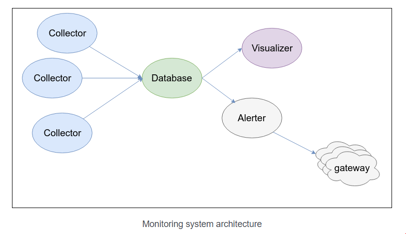

### A. Giới thiệu MONITORING SYSTEM

> Monitoring system là một hệ thống theo dõi , ghi lại các trạng thái , hoạt động của máy tính hay ứng dụng một cách liên tục.

### 1. Các ưu điểm nổi bật của Monitoring system 

- Điều chỉnh tài nguyên ( CPU , Ram , Disk ,...) sao cho phù hợp dựa vào kết quả của hệ thống monitoring .
- Ngăn chặn sự cố có thể xảy ra , nếu có xảy ra chúng ta cũng có thể phát hiện sớm hơn.
- Giảm thiểu thời gian quản lý hệ thống.

###### => Một hệ thống Monitoring tốt sẽ giúp tăng hiệu quả khi làm việc với hệ thống.

### 2. Các đặc điểm của một hệ thống Monitoring 

- Xử lý real time.
- Có hệ thống cản báo 
- Visualization
- Có khả năng tạo reports
- Có khả năng cài cắm các plugins

### 3. Kiến trúc của monitoring system.




##### Thông thường một hệ thống monitoring thường có bốn thành phần chính:

- Collector : Được cài trên các máy agent (các máy muốn monitor ) có nhiệm vụ collect metrics của host gửi về database
( cadvisor , telegraf,beat...).
- Database : Lưu trữ các metric mà collector thu thập được , thường thì chúng ta sẽ sử dụng các time series database
(ElasticSearch , InfluxDB , Prometheus, Graphite(whisper)). 

- Visualize : Có nhiệm vụ trực quan hóa các metrics thu thập được qua cá biểu đồ bảng ( Kibanna , grafana , chronograf ).
- Alerter : Gửi thông báo tới systemadmin khi có sự có sảy ra.

###### Có nhất nhiều Stack phổ biến như : 
- Logstash - Elasticsearch - Kibana
- Promethues - Node Exporter - grafana
- Telegraf - IndluxDB - Grafana	


### B. Telegraf - Influxdb - Grafana Stack
### 1. Kiến trúc TIG Stack (Telegraf Influxdb Grafana )


- Telegraf và Influxdb đều là sản phẩm của InfluxData , cả 2 đều là mã nguồn mở và được viết bỏi GO.Mặc dù InfluxData cung cấp một stack 
hoàn chỉnh để monitor với Chronograf để visualize và Kapactitor để alerting (TICK stack ) nhưng chúng ta có thể sử dụng Grafana để thay thế
cho cả Chronograf lẫn Kapacitor.

### 2. Telegraf 

> Telegraf để tạo một agent để collecting và reporting metrics và data được viết bỏi Go.

- Nó có thể tích hợp để collect nhiều lại nguồn dữ liệu khác nhau của metrics , events , và logs trực tiếp từ containers và system mà nó
chạy trên đó. Nó cũng có thể pull metrics từ các third-party APIs , Kafka. Nó cũng có nhiều output plugin để gửi metrics thu thập được tới 
nhiều dạng datastores, services, message queues khác nhau như  InfluxDB, Graphite, OpenTSDB, Datadog, Librato, Kafka, ...

### 3. InfluxDB 

> InfluxDB là một Time Series Database (là database được tối ưu hóa để xử lý dữ liệu chuỗi thời gian ,các dãy số dược lập theo chỉ mục thời gian).
InfluxDB được sử dụng để lưu các dữ liệu cho các trường hợp liên quan đến một lượng lớn time-stamped data , bao gồm DevOps monitoring log data, 
application metrics, IoT sensor data, và real-time analytics. Nó có thể tự động xóa các dữ liệu cũ, không cần thiết và cung cấp một ngôn ngữ 
giống SQL để tương tác với dữ liệu.

- Data trong InfluxDB được tổ chức dưới dạng time series . Time series có thể có một hoặc nhiều points , mỗi point là một mẫu rời rạc các số liệu.

- Point gồm:
	- Time (timestamp)
	- Một measurement (ví dụ "cpu_load")
	- Ít nhất một key-value field 
	- không hoặc nhiều key-value tags chứa metadata của value

- Chúng ta có thể xem measurement như là table trong sql có primary index luôn là time.tags và field và columns của table , tags được index còn 
field thì không. Điểm mạnh của InfluxDB có thể có hàng triệu measurements , chúng ta không cần định nghĩa schemas trước và giá trị null không được lưu trữ.


### 3.1 Downsampling and data retention 

> InfluxDB có thể xử lý được hàng trăm nghìn dữ liệu trong 1 giây . Cách lưu trữ dữ liệu giúp nó làm được điều này.InfluxDB cung cấp 2 tính năng 
chính là ` Continuous Queries ` (CQ) và ` Retention Policies ` (RP) . Chugs tự động xử lý downsampling data và expiring old data .

- Continuous Query (CQ) là một InfluxQL query cái mà sẽ chạy tự động và theo định kỳ trong database. CQs yêu cầu một function trong mệnh đề 
SELECT và phải bao gồm mệnh đề GROUP BY time() - có thể hiểu là thằng này sẽ chạy trước các câu truy vấn của mình.

- Retention Policy (RP) là một phần của InfluxDB’s data structure, biểu thị thời gian mà InfluxDB lưu giữu data. InfluxDB sẽ so sánh giữa 
thời gian của host với thời gian của dữ liệu và xóa bỏ các dữ liệu có thời gian cũ hơn RP’s DURATION (do chúng ta cấu hình). Một single 
database có thể có một số RPs và RPs là duy nhất cho mỗi database.


### 4. Grafana 

> Là một mã nguồn mở cho phép chúng ta query, visualize, alert các metrics thu thập được.Khẩu hiệu của Grafana:
No matter where your data is, or what kind of database it lives in, you can bring it together with Grafana. Beautifully.


### Các tính năng của Grafana:
- Visualize: table, chart, ...
- Alert: alert to email, slack, ...
- Unify: Hỗ trợ nhiều loại database như InfluxDB, ElasticSearch, Graphite, ...
- Open: mã nguồn mở, có thể chạy trên nhiều hệ điều hành, có office Docker image
- Extend: Cung cấp nhiều plugin, nhiều dashboard template
- Collaborate: Hỗ trợ teamwork


### C. Một số lưu ý trước khi cài đặt Monitoring System.

### 1. Telegraf 

> Mặc định khi chạy Telegraf bằng container nó chỉ collect metrics của container đó , để có thể collect data của host chúng ta cần mount một số fie từ host
vào và thay đổi một số config.

- Chúng ta cần mount các file sau (chú ý mode là ro):

```
/var/run/docker.sock:/var/run/docker.sock:ro # collect docker metrics
/sys:/rootfs/sys:ro
/proc:/rootfs/proc:ro
/etc:/rootfs/etc:ro
```
- Mặc định khi gửi metric đến database , Telegraf sẽ gửi kèm hostname (hostname của container ). Vì thế chúng ta nên thay đổi config hostname trong file config 
của Telegraf hoặc đổi tên hostname của container cho phù hợp.

- Để collect thông tin của các docker container chạy trên host chúng ta cần umcomment phần ` [[inputs.docker]]ư ` trong file congfig , và mout file `/var/run/docker.sock `
của host.

- Trong trường hợp mốn collect dữ liệ file log của một ứng dụng chạy trên host , chúng ta cần mount các file log vào trong Telegraf container và sử dụng plugin
logparser để collect log.

- Trong trường hợp muốn collect các metrics của các service như mongo , rabitmq (chạy trong container) , chúng ta cần container của Telegraf có thể kết nối với
các container của cá services kia . Để giải quyết vấn đề này chúng ta có thể làm theo 2 cách : 
	- Tạo external docker network và sử dụng cho tất cả các container 
	- Mapping port của services ra bên ngoài và Telegraf có thể sử dụng ip của host hoặc docker0 để truy cập.

### 2. InfluxDB 
- Chạy InfluxDB với docker container chúng ta cần chú ý giữ an toàn cơ sở dữ liệu của nó bằng cách sử dụng  volume.
```
volumes:
     - "influxdb-data:/var/lib/influxdb"
```
- Chúng ta có thể thêm biến environment để tạo sẵn databases cho Telegraf

```
environment:
     - INFLUXDB_DB=telegraf
```

- Cấu hình data retention cho database của Telegraf . Mặc định InluxDB sẽ tạo một RETENTION POLICY có tên là autogen với DURATION là vô hạn cho  mỗi ddataabase,
Vì thé để câu hình lại data retention cho datatabase ta ó thể sửa chữ policy này: 

` ALTER RETENTION POLICY autogen ON telegraf DURATION 30d REPLICATION 1 SHARD DURATION 24h0 `

### 3. Grafana 

- Với Grafana chúng ta cũng cần giữ an toàn dữ an toàn các dữ liệu của nó bằng cách sử dụng volume : 

```
volumes:
      - grafana-data:/var/lib/grafana
```

- Chúng ta cũng có thể sử dụng các biến environment để cấu hình password cho admin hoặc tài khoản để gửi mail alert


