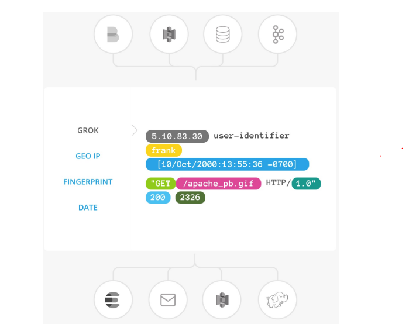
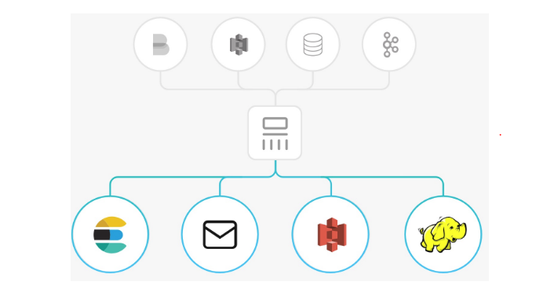

### A. Giới thiệu Logstash

### 1. Tổng quan về Logstash
> Logstash là công cụ mã nguồn mở dùng để thu thập dữ liệu và có khả năng liên kết theo thời gian thực. Logstash có khả năng tổng hợp dữ liệu tự các nguồn khác nhau và chuẩn hóa chúng .

- Logstash có 3 thành phần chính (3 bước xử lý chính của logstash)
	- INPUT : Nó có thể lấy đầu vào từ TCP/UDP , các file từ syslog ...và từ nhiều nguồn khác .
	- FILER : Lọc các log được gửi về
	- OUTPUT : Gửi dữ liệu thu thập được tới nơi nào khác ...

### 2. Cách hoạt động của logstash


### 2.1 Input


- Các nguồn dữ liệu có thể đẩy về logstash có thể là 
	- file : đọc từ một tập tin của hệ thống.
	- Syslog : lắng nghe nhật kí của hệ thống.
	- Beat : xử lý các beat do beat gửi về.

### 2.2 Filter



- Fileter là thiết bị xử lý trung gian trong đường dẫn logstash . Một số bộ lọc filter hữu ích :
	- Grok : Phân tích cú pháp và cấu trúc văn bản tùy ý - chỉnh sửa định dạng log từ clietn về. Hiện nay Grok là cách tốt nhất trong Logstash để phân tích cú pháp dữ liệu .
	- Mutate : Có thể đổi tên , xóa , thay thế và sửa dổi các trường tỏng sự kiện.
	- Drop : Xóa hoàn toàn sự kiện
	- Clone : Tạo bản sao của sự kiện , có thể thêm hoặc xóa các trường
	- Geoip : Thêm thông tin về vị trí địa lý của địa chỉ IP

### 2.3 Outputs




- Đầu ra của Outputs thường được sử dụng : 
	- Elasticsearch : Thường được sử dụng để lưu trữ các log từ logstash gủi về.
	- File : Ghi vào dưới dạng file
	- Graphite : Công cụ phổ biến dể lưu trữ và vẽ đồ thị số liệu
	- Statsd : Dịch vụ lăng nghe và thống kê

### 3. Một số mẫu khai báo input , filter , output

- Input

```
input {
  beats {
    port => 5044
    ssl => false
  }
}

```

- Filter

```
filter {
    grok {
      match => {
        "message" => [
          "%{SYSLOGTIMESTAMP:syslog_timestamp} %{SYSLOGHOST:syslog_hostname} %{DATA:syslog_program}(?:\[%{POSINT:syslog_pid}\])?:? %{SSH_INVALID_USER:message}"
        ]
      }
      patterns_dir => "/etc/logstash/patterns/sshd"
      named_captures_only => true
      remove_tag => ["_grokparsefailure"]
      break_on_match => true
      add_tag => [ "SSH", "SSH_INVALID_USER" ]
      add_field => { "event_type" => "SSH_INVALID_USER" }
      overwrite => "message"
    }
}

# Grok Filter for SSH Failed Password
filter{
    grok {
      match => {
        "message" => [
          "%{SYSLOGTIMESTAMP:syslog_timestamp} %{SYSLOGHOST:syslog_hostname} %{DATA:syslog_program}(?:\[%{POSINT:syslog_pid}\])?:? %{SSH_FAILED_PASSWORD:message}"
        ]
      }
      patterns_dir => "/etc/logstash/patterns/sshd"
      named_captures_only => true
      remove_tag => ["_grokparsefailure"]
      break_on_match => true
      add_tag => [ "SSH", "SSH_FAILED_PASSWORD" ]
      add_field => { "event_type" => "SSH_FAILED_PASSWORD" }
      overwrite => "message"
    }
}

filter {
# Grok Filter for SSH Password Accepted

    grok {
      match => {
        "message" => [
          "%{SYSLOGTIMESTAMP:syslog_timestamp} %{SYSLOGHOST:syslog_hostname} %{DATA:syslog_program}(?:\[%{POSINT:syslog_pid}\])?:? %{SSH_ACCEPTED_PASSWORD}"
        ]
      }
      patterns_dir => "/etc/logstash/patterns/sshd"
      named_captures_only => true
      remove_tag => ["_grokparsefailure"]
      break_on_match => true
      add_tag => [ "SSH", "SSH_ACCEPTED_PASSWORD" ]
      add_field => { "event_type" => "SSH_ACCEPTED_PASSWORD" }
    }
}

```

- Output

```
output {
     elasticsearch {
       hosts => ["localhost:9200"]
       sniffing => true
       index => "%{[@metadata][beat]}-%{+YYYY.MM.dd}"
     }
}

```


  