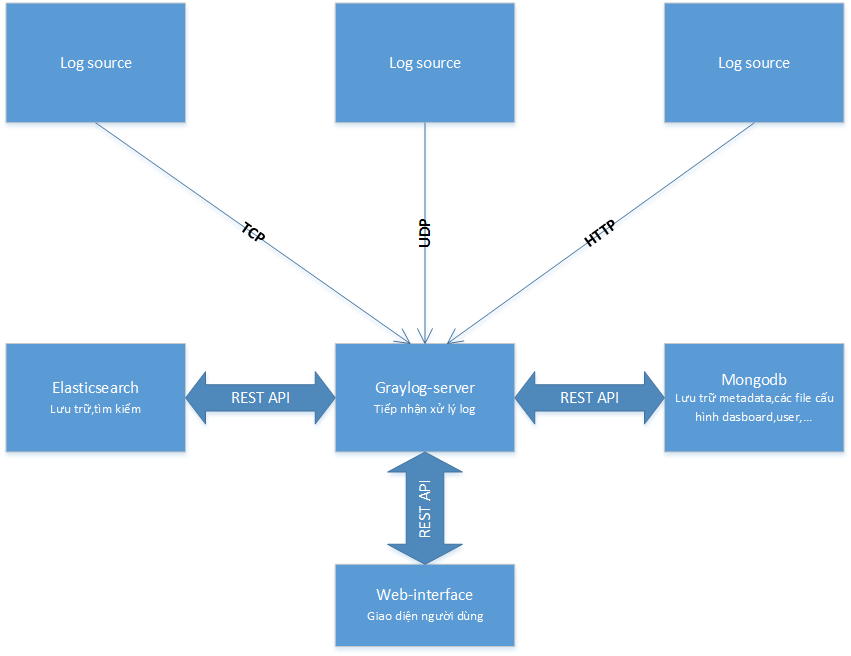
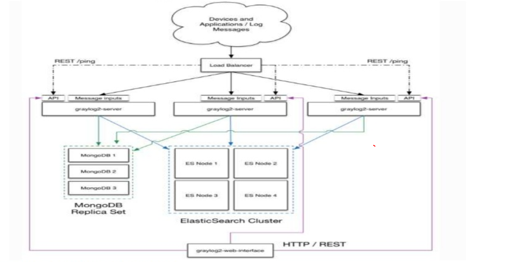
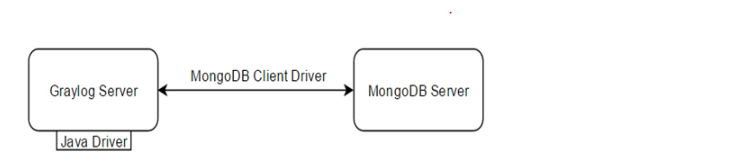

### A. Giới thiệu về Graylog
### 1. Tổng quan về Graylog

> Graylog là một nền tẳng quản lý log mã nguồn mở với nhiều tính năng mạnh mẽ , cho phép quản lý log dễ dàng với cả dữ liệu có cấu trúc và dữ liệu phi cấu
trúc và các ứng dụng debug. Graylog thường kết hợp với Grafana để trực quan hóa dữ liệu nhận được , hai công cụ này cho phép chúng ta theo dõi hiệu suất và 
trạng thái kĩ thuật của các phần mềm , ứng dụng và toàn bộ hệ thống.  Graylog dựa trên Elaticsearch , MongoDB và Scala , và sử dụng graylog chủ yếu cho việc giám sát các ứng dụng web.

- Ưu điểm chính chả Graylog là cung cấp một cách nhìn trực quan về nhật ký (log) của toàn bộ hệ thống.
	- Graylog là một phần mềm mã nguồn mở
	- Các thông báo được sử dụng trong Graylog gần như tức thời , giúp theo dõi hệ thống được liên tục và ổn định hơn.
	- Với các error stack từ Graylog giúp admin nắm được tình hình và giải quyết vấn đề được nhanh chóng hơn.
	- Graylog có công cụ tìm kiếm mạnh mẽ các log ,giúp ta có thể tìm kiếm nhanh chóng những thứ ta cần.
	- Graylog cung cấp thêm chức năng lưu trữ các log .
	- Graylog có thể dễ dàng kết nối với các ứng dụng python , vì chúng có riêng một thư viện hỗ trợ kết nối này.

- Graylog kết hợp với ` MongoDB ` và ` Elasticsearch` thường được so sánh với ELK stack ( Elasticsearch , logstash và Kibana ).
	- Điểm khác biệt quan trọng , trong khi Graylay dành cho mục đích ghi lại và biểu diễn trực quan các log thì ELK được sử dụng cho bài toán dữ liệu lớn.
	- Mặt khác , ELK là giải pháp phân tích các bản ghi văn bản đơn giản bằng cách sử dụng Logstash sau đó phân tích cú pháp và chuyển hướng vào Elasticsearch.
	- Trong ELK , Kibana đóng vai trò bảng điều khiển và hiển thị dữ liệu từ logstash.
	- Từ những gì phân tích ở trên , ta có thể sử dụng Graylog để tiết kiệm thời gian và thân thiện dễ sử dụng.....

- Ứng dụng của Graylog trong `cloud computing `
	- SSH : Thống kê user, ip đăng nhập, số lần đăng nhập SSH thành công, thất bại, tổng số lần đăng nhập.
	- OpenVPN : Thống kê user, ip đăng nhập , ip được cấp VPN trên hệ thống Lab và hệ thống thực.
	- OpenStack : Thống kê user, số lần đăng nhập dashboard thành công và thật bại, số máy ảo được tạo, xóa, hỏng.
	- `SSH` : Thống kê `user`, `ip` đăng nhập, số lần đăng nhập `ssh` thành công, thất bại, tổng số lần đăng nhập.
	- `OpenVPN` : Thống kê `user`, `ip` đăng nhập , `ip` được cấp `VPN` trên hệ thống Lab và hệ thống thực.
	- OpenStack : Thống kê `user`, số lần đăng nhập `dashboard` thành công và thật bại, số máy ảo được tạo, xóa, hỏng.

### 2. Kiến trúc của Graylog
### 2.1 Mô hình tổng quát.

- ` Graylog Server `: Nhận và sử lý các bản tin được nhận về và truyền thông trao đổi với các modul khác trong hệ thống ( Cần CPU để xử lý)
- ` Elasticsearch ` : Công cụ lưu trữ , tìm kiếm dữ liệu - tốc độ phụ thuộc vào tốc độ I/O  ( cần RAM )
- ` MongoDB ` : Lưu trữ metadata  
- ` Web interface ` : Cung cấp giao diện cho người dùng.

### 2.2 Mô hình triển khai trên 1 máy server (All - in -  one).

### 2.3 Mô hình triển khai  Bigger production

### 3. Mối quan hệ giữa các modul trong kiến trúc của Graylog.
### 3.1 Graylog-server  với Elasticsearch.

- ` Graylog-server ` sẽ phải khai báo như một `node` để kết nối tới ` elasticsearch Cluster `

- Phiên bản `elasticsearch ` với ` Graylog-server `

### 3.2 Graylog-server với MongoDB 

- ` Graylog-server ` tương tác với ` Mongodb ` theo cơ chế `client-server ` với Graylog đóng vai trò là client và MongoDB là server.

### 4. Elasticsearch

### 4.1 Tổng quan về Elasticsearch 

- Elasticsearch là server chạy trên nền tảng ` Apache lucene ` cung cấp ` API ` tìm kiếm lưu trữ đơn giản hay một search engine
- Elasticsearch phát triển bằng java
- Phần mêm tương tự ` Solr `
- Elasticsearch là một node server thì sẽ chịu trách nhiệm lưu trữ và search log.
- Elasticsearch triển khai thành cluster thì sẽ phải có 1 node là master (lựa chọn tự động) . Các node kết nối với nhau qua giao thức unicast
- Type là document 
- Document là đơn vị cơ bản của thông tin mà có thể đánh chỉ số , ở dạng JSON (javaScript Object Notation ) phải có type nhất định.

### 4.2 Cấu trúc Elasticsearch

 

- Trong `Cluster ` các node liên lạc với nhau bằng ` API ` và nhận diện nhau bằng ` unicast-discovery `.

https://www.slideshare.net/Mnhinh2/graylog-manhdv-v15
https://github.com/hocchudong/thuctap032016/blob/master/HTHieu/BaoCaoThuTap/Graylog/BaocaoGraylog.md