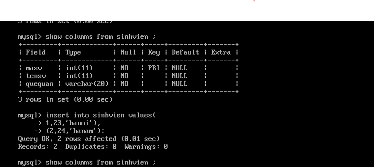
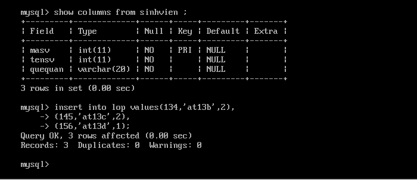
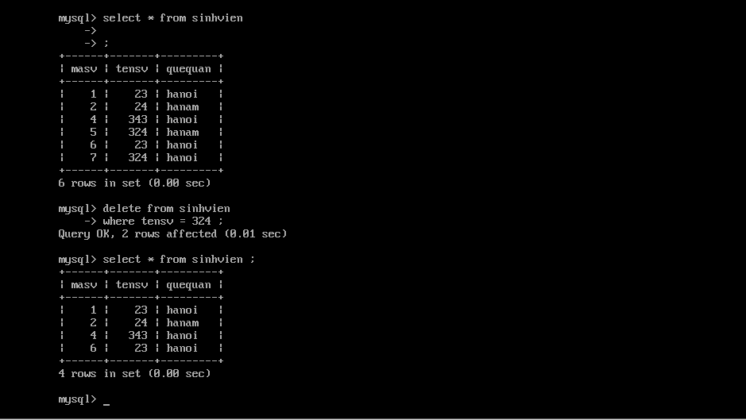

### 1. INSERT 

> Chèn dữ liệu vào table 

#### Cấu trúc của INSERT 
` INSERT INTO table_name VALUES(1 , 'hoa' , 'ht' , 2) ; `
- Các giá trị lần lượt đươc chèn vào theo thứ tự các trường .
- Với trường hợp insert vào table có chứa khóa ngoại thì trong table tham chiếu , trường tham chiếu phải có giá trị . 
	- Insert giá trị vào table có chứa khóa ngoại phải có giá trị nằm trong trường được chứa bởi table tham chiếu đến.

- Có thể dùng ` INSERT INTO table_name(trường 1, trường 2, ..) VALUES( 1 ,'hoa',2,'fasf') ;) ` để tiện nhớ tên các trường và insert chính xác. 
- Muốn insert cùng một lúc nhiều data có thể dùng câu lệnh
	- `INSERT INTO table_name VALUES(thêm 1),(thêm 2)....; `







### 2. TRUY VẤN - SELECT 
#### Cấu trúc của câu lệnh SELECT 
```
SELECT trường 1,trường 2,trường 3....
FROM table-name 
WHERE .........
GROUP BY ......
HAVING .....
ORDER BY ....

```

- Nếu muốn truy suất toàn bộ các trường thì thay các trường băng `*` 
- Điều kiện truy suât có thể có hoặc không, tùy vào mục đích của người dùng 


1. Mệnh đề WHERE 
```
SELECT * FROM sinhvien
WHERE masv= 1 ;
```

- Điều kiện để thực hiện truy suất , nếu có nhiều điều kiện cần truy suất sử dụng mệnh đề where thì sẽ có hai kiểu:
	- AND : đồng thời đáp ứng 
	- OR : chỉ cần đáp ứng một trong số các điều kiện 
- Kết hợp giữa AND và OR trong mệnh đề WHERE thì AND phải được nhóm trước và đặt trong cặp ngoặc kép sau đó OR với nhau
	- vs dụ: where (masv=1 AND quê='hanoi') OR (masv=2 AND quê='hanam' ); 


2. Mệnh đề ODERBY 
```
SELECT * FROM sinhvien
ORDER BY masv ASC ;
```

- Sắp xếp trường theo một thứ tự nào đó . Được dùng trong các trường có kiểu dữ liệu là số 
	- ASC : thứ tự tăng dần
	- DESC : thứ tự giảm dần 
- Kết hợp cả ASC và DESC với hai trường khác nhau ta ngăn cách các trường đó bằng dấu phẩy . Thứ tự ưu tiên lần lượt từ trái sang phải


3. Mệnh đề GROUP BY 
```
SELECT quequan ,Sum(tensv) AS 'tongtensv') FROM sinhvien
GROUP BY quequan ;
```


- Dùng để nhóm các row trong cùng trường có có chung đặc điểm ( tên, masv...)
- GROUP BY phải đứng trước ORDER BY 
- Mệnh đều GROUP BY thường được đi kèm với các hàm SUM ( tính tổng) , COUNT (đếm ) ,MIN (nhỏ nhất) ,MAX(lớn nhất) 
- Dùng AS để đặt tên cho GROUP nhóm được 


4. Mệnh đề HAVING 

```
SELECT quequan ,Sum(quequan) AS 'tongquequan') FROM sinhvien
GROUP BY quequan 
HAVING Sum(quequan) > 2 ;
```
- Mệnh đề HAVING thường đi kèm với GROUP BY để bổ xung cho câu lệnh truy vấn 


### 3. DELETE 
```
DELETE FROM table_name 
WHERE đk ;

```
- Xóa bản ghi trong table đáp ứng điều kiện nào đó 
- Không thể xóa bản ghi, nếu bản ghi đó được liên kết với khóa ngoại của một table khác.



### 4. UPDATE

```
UPDATE table_name SET tensv=1199 , quequan='phutho' 
where masv=1 ;

```

- Update để thay đổi thông tin của row , có thể là một hoặc nhiều row khi đáp ứng điều kiện của mệnh đề where 
- Các trường muốn update ngăn cách nhau bởi dấu phẩy 
- Không thể update trường có tham chiếu khóa ngoại của một table khác  


