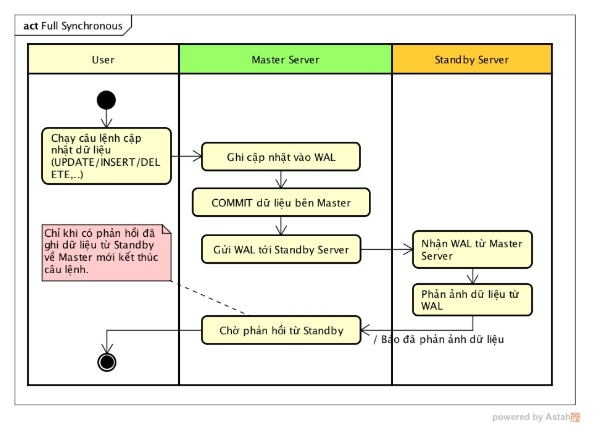

### Đồng bộ và backup 

### 1. Đồng bộ hóa dữ liệu



### 2. Logical Replication

- Chức năng này được phát triển và bổ xung ở phiên bản PostgreSQL 10 trở về sau . Master Server public WAL , Standby Server
nhận WAL giải mã thành các câu lệnh SQL rồi chạy các câu lệnh đó trên Standby Server


### 3. Backup và Restore dữ liệu  ( dưới dạng text)
### 3.1 Backup dữ liệu
` pg_dump -U john -h localhost -W -a -d mydb -f backup.sql `

- Ý nghĩa các tham số
	- U username
	- h domain, địa chỉ host
	- p port của Postgres service
	- W yêu cầu nhập password
	- a data-only chỉ xuất data
	- s schema-only chỉ xuất cấu trúc bảng
	- d tên database muốn backup
	- f tên file để lưu trữ
### 3.2 Restore 
` psql -U john -h localhost -W -d mydb -1 -f backup.sql `

- Các tham số tương đối giống với ` pg_dump ` chỉ có một chut khác biệt
	- f tên file lưu trữ để import vào
	- 1 chạy từng lệnh 1

### 4. Backup và Restore dữ liệu  ( dưới dạng file nén )
### 4.1 Backup
` pg_dump -U john -h localhost -W -a -d mydb -Fc -Z9 -f backup.psql `

- Ý nghĩa các tham số

	- U username
	- h domain, địa chỉ host
	- p port của Postgres service
	- W yêu cầu nhập password
	- a data-only chỉ xuất data
	- s schema-only chỉ xuất cấu trúc bảng
	- d tên database muốn backup
	- f tên file để lưu trữ
	- Fc: tham số -F cho phép chọn kiểu lưu trữ (c:custom, d:directory, t:tar, p:plain_text), ta dùng c
	- Z9: tham số -Z cho phép tùy chọn cấp độ nén từ 0-9

### 4.2 Restore
` pg_restore -U john -h localhost -W -j 8 -d mydb backup.psql `

- Các tham số tương đối giống pgsql và pg_dump ở trên, chỉ có 1 chút khác biệt:
	- chỉ đặt tên tên file ở cuối lệnh, ko dùng tham số -f
	- j số lượng job chạy song song đồng thời. ở đây ta dùng 8. Hữu ích khi import file lớn

### 5. So sánh cách sử dụng file text 
- File text: dump nhanh, kích thướng lớn, restore lâu,
- File nén: dump lâu hơn, kích thước nhở, restore nhanh (với tham số -j)

### Note : Backup vs import data

### Import dữ liệu 

```
psql -U user -h localhost -d databaes_name < name.sql

#Add role
\du 
create role name_role with WITH SUPERUSER CREATEDB CREATEROLE LOGIN;

#Drop role
\du
drop role name_role;
```
### Export dữ liệu 

```
pg_dump -U user -h localhost -d database_name > name.sql

```

