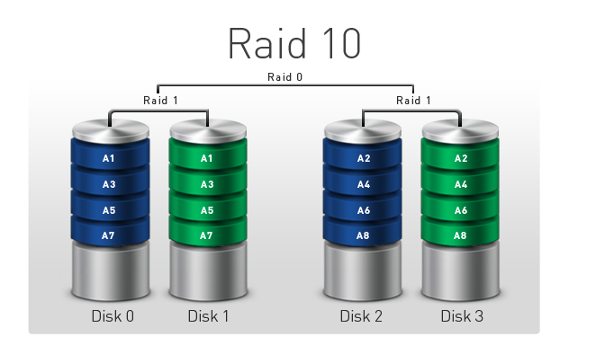

### A. Tổng quan về RAID 

> RAID (Redundant Array of Inexpensive Disks) : Đây là hình thức ghép nhiều ổ đĩa cứng vật lý có chức gia tăng tốc độ đọc/ghi dữ liệu hoặc nhằm tăng thêm sự 
an toàn của dữ liệu chứa trên hệ thống đĩa hoặc kết hợp cả hai yếu tố trên.

#### Lợi thế của RAID

- Giá thành thấp
- Hiệu quả cao
- Dự phòng

- Dự phòng là yếu tố quan trọng trong quá trình phát triển RAID cho môi trường máy chủ . Dự phòng cho phép sao lưu dữ liệu bộ nhớ khi gặp sự cố . Nếu một ổ
cứng trong hệ thống bị hỏng , thì nó có thể hoán đổi sang ổ cứng khác trong hệ thống khác mà không làm ảnh hưởng tới service của hệ thống. Phương pháp dự 
phòng phụ thuộc vào phiên bản RAID được sử dụng.

- Khi áp dụng các phiên bản RAID mạnh bạn có thể thấy rõ hiệu quả tăng cao của nó. Hiệu quả cũng tùy thuộc vào số lượng ổ cứng được liên kết với nhau và các 
mạch điều khiển.

- Tất cả các nhà quản lý những tập đoàn CNTT đều muốn giảm giá thành. Khi chuẩn RAID ra đời, giá thành là một vấn đề chủ chốt. Mục tiêu của các dãy RAID là 
cung cấp bộ nhớ tốt hơn cho hệ thống so với việc sử dụng riêng biệt các ổ đĩa có dung lượng lớn.

#### Về phân loại thì có khả nhiều loại Raid được sử dụng như Raid 0, Raid 1, Raid 3, Raid 4, Raid 5, Raid 10 .v.v…

### B. Các loại RAID
### 1. RAID 0

- RAID 0 là loại RAID được sử dụng khá phổ biến và được nhiều người sử dụng do có khả năng nâng cao hiệu suất tốc độ đọc ghi , trao đổi dữ liệu của ổ cứng .Để
tiến hành setup RAID 0 thì server cần 2 tối thiểu 2 ổ đĩa 

- RAID sử dụng kỹ thuật ` striping` , phân chia khối dữ liệu thành các khối nhỏ hơn và trải chúng vào các ổ đĩa . Việc này giúp tăng tốc độ đọc/ghi dữ liệu .

#### Ưu điểm RAID 0
- Tăng tốc độ đọc ghi dữ liệu 
- Tăng khả năng tối ưu vùng lưu trữ dữ liệu
#### Nhược điểm RAID 0
- Dữ liệu được lưu đồng thời ở 2 ổ cứng , 1 ổ cững bị hỏng thì dữ liệu đó không thể truy cập được
- Không có ổ đĩa dự phòng.
- Yêu cầu 2 ổ cứng phải cùng dung lượng , nếu một ổ cứng nhỏ hơn thì sẽ lấy dung lượng theo ổ cứng có dung lượng nhỏ hơn
#### Đối tượng sử dụng: Phù hợp với những dịch vụ lưu trữ cần tốc độ truy cập cao .

### 2. RAID 1

- RAID 1 là loại cơ bản và được sử dụng khá phổ biến hiện nay do khả năng đạt an toàn về dữ liệu. Để tiến hành Setup RAID 1 thì server cũng cần ít nhất 2 disk.

- RAID cung cấp phương pháp lưu trữ dự phòng dữ liệu đơn giản bằng kỹ thuật ` mirroring `( nhân bản dữ liệu). Một ổ đĩa sẽ hoạt động bình thường , một ổ đĩa 
còn lại dùng để dự phòng trong trường hợp ổ đĩa còn lại bị hỏng.

#### Ưu điểm RAID 1
- An toàn dữ liệu được đảm bảo hơn khi có một ổ đĩa dự phòng

#### Nhược điểm RAID 1
- Hiệu suất không cao , nâng cao chi phí 
- Hai ổ cứng phải cùng dung lượng , nếu có một ổ cứng dung lượng nhỏ hơn thì cả 2 ổ cứng sẽ sử dụng dung lượng của ổ cứng nhỏ hơn.

#### Đối tượng sử dụng : Hệ thống các service không yêu cầu cao về tốc độ , mà yêu cầu về độ an toàn của dữ liệu.

### 3. RAID 1+0 ( RAID 10)

- Raid 10 là sự kết hợp giữa 2 loại raid phổ biến và Raid 1 và Raid 0. Để setup Raid 10 khách hàng cần sử dụng tối thiểu 4 ổ cứng.

#### Ưu điểm của RAID 10
- Vừa tăng được tốc độ truy cập dữ liệu , vừa đảm bảo sự an toàn của dữ liệu.

#### Nhược điểm RAID 10
- Chi phí cao
- Yêu cầu 4 ổ cứng cùng dung lượng , nếu 4 ổ cứng khác dung lượng thì sẽ lấy dung lượng theo ổ cứng có dung lượng nhỏ nhất.

#### Đối tượng sử dụng: Raid 10 thích hợp với tất cả các đối tượng sử dụng.

### 3. RAID 5

- RAID 5 cũng là loại RAID được sử dụng khác rộng rãi hiện nay. Nguyên tắc cơ bản của Raid 5 cũng gần giống với 2 loại raid lưu trữ truyền thống là Raid 1 
và Raid 0. Tức là cũng có tách ra lưu trữ các ổ cứng riêng biệt và vẫn có phương án dự phòng khi có sự cố phát sinh đối với 1 ổ cứng bất kì trong cụm.

- Để setup Raid 5 ta cần tối thiểu 3 ổ cứng. Theo như hình minh họa phương án lưu trữ của Raid 5 như sau. Giả sử có 1 file A thì khi lưu trữ sẽ tách ra 3 
phần A1, A2, A3. Ba phần nãy sẽ tương ứng lưu trên ổ đĩa Disk 0, Disk 1, Disk 2, còn ổ đĩa Disk 3 sẽ giữ bản sao lưu backup của 3 phần này. Tương tự các 
file sau cũng vậy và tùy theo tiến trình thực hiện mà bản sao lưu có thể được lưu ở bất kì 1 trong những ổ trong cụm Raid.

#### Ưu điểm RAID 5
- Năng cao hiệu suất truy cập dữ liệu.
- Nâng cao tính an toàn cho dữ liệu .
- Tối ưu hiệu quả lưu trữ dữ liệu của các disk

#### Nhược điểm RAID 5
- Chi phí phát sinh thêm 1 ổ cứng.

#### Đối tượng sử dụng : Tất cả những website, dịch vụ, ứng dụng có số lượng truy cập và yêu cầu tài nguyên từ nhỏ đến vừa và lớn.

### C. Một số lưu ý

- Sư dụng RAID phần mềm dẫn đến giảm hiệu suất của máy chủ khoảng từ 5% , tùy thuộc vào RAID loại nào và sức mạnh của CPU.
- Sư dụng RAID phần cứng sẽ đảm bảo không ảnh hưởng đến hiệu suất của máy chủ , nhưng gia tăng chi phí tùy thuộc vào loại RAID
- Lựa chọn ổ cứng có cùng dung lượng với nhau để đảm bảo tính tối ưu hóa dung lượng lưu trữ .

