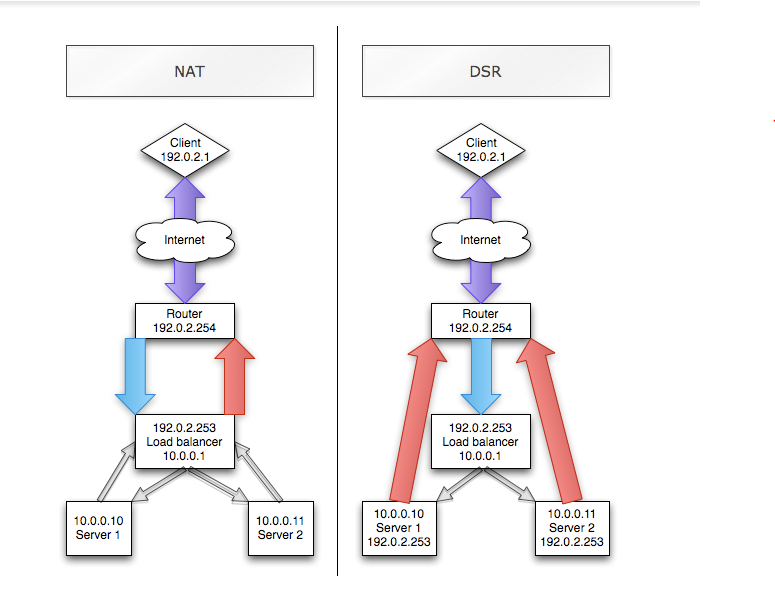

### A. Layer 4 vs layer 7 Load Balancing on Linux

### 1. Tổng quan về Load balancing.

> Load balancing là một thiết bị hoạt động như một reverse proxy để phân phối lưu lượng truy cập mạng hoặc ứng dụng trên một
số máy chủ . Load balancer được sử dụng để tăng khả năng sử dụng ứng dụng đồng thời và độ tin cậy của ứng dụng. Nhằm cải thiện
hiệu suất tổng thể của ứng dụng bằng cách giảm gánh nặng trên máy chủ liên quan đến việc quản ls và duy trì cá ứng dụng và phiên 
mạng , cũng như bằng cachs thực hiện nhiệm vụ dành riêng cho ứng dụng.

##### Load balancing được chia thành 2 loại chính : Layer 4 và Layer 7 ( tương ứng là các layer trong mô hình OSI).

- Layer 4 load balancer xử lý dữ liệu thìm thấy trong các giao thức tầng mạng và giao vận (IP , TCP , FTP, UDP).
- Layer 7 load balancer phân phối yêu cầu dựa trên dữ liệu tìm thấy trong tầng ứng dụng , lớp giao thức như HTTP.

### 2. Tổng qua về Layer 4 và Layer 7 Load Balancing

- Layer 4 load balancing hoạt động ở tầng trung gian với tầng giao vận của tin nhắn và không liên quan đến nội dung của các tin
nhắn . Transmission Control Protocal (TCP) là các giao thức Layer 4 cho giao thức truyền siêu văn bản (HTTP) lưu lượng truy cập 
trên internet . Layer 4 load balancer chỉ đơn giản là chuyển tiếp gói dữ liệu mang đến và đi từ máy chủ upstream mà không kiểm tra
tới nội dung của các gói dữ liệu . Có thể đưa ra quyết định định tuyến giới hạn bằng kiểm tra vài gói đầu tiên trong dòng TCP.

- Layer 7 load balancing hoạt động ở các lớp ứng dụng cao cấp , xử lý trực tiếp với nội dung thực tế của mỗi thư. HTTP là giao thức
chủ yếu của layer 7 cho việc điều phối lưu lượng truy cập trang web trên internet. Layer 7 load balancer điều phối lưu lượng theo 
một cách tinh vi hơn so với layer 4 load balancer, đặc biệt là áp dụng đói với TCP dựa trên lưu lượng truy cập chẳng hạn như HTTP.
một Layer 7 load balancer chấm dứt mạng lưới giao vận và đọc message bên trong. Nó có thể quyết định cân bằng tải dựa trên nội 
dung của thư (URL hoặc cookie,..). Sau đó tạo mới một kết nối TCP mới đến máy chủ upstream đã chọn ( hoặc tái sử dụng nếu sẵn
sangfcos bằng phương pháp HTTP keepalives) và tạo ra yêu cầu đến máy chủ.

### 3. Sự khác biệt giữa NAT và DSR trong cân bằng tải

- Dễ dàng thấy các client(192.0.2.1) kết nối đến tải cân bằng (LB) trên VIP (192.0.2.25).
- Trong trường hợp NAT các kết nối truyền tải từ client đến server hoặc từ server tới client đều phải thông qua LB-server
- Trong trường hợp DSR : các kết nối từ client phải thông qua LB_serever , còn các server có thể truyền tải trực tiếp tới Client.

### 4. Các loại và cách hoạt động của thuật toán cân bằng tải

### 4.1 Random

- Phương pháp này phân phối tải trọng trên các máy chủ có sẵn một cách ngẫu nhiên ,chọn một máy chủ thông qua thế hệ số ngẫu nhiên 
và gửi kết nối tạm thời cho nó. Phương pháp này được sử dụng phổ biến và hữu dụng trên cân bằng tải ngoại trừ trường hợp xuất hiện
các server bị ngừng hoạt động (down).

### 4.2 Round Robin

- Round Robin chuyển một yêu cầu kết nối tới server tiếp theo trong hệ thống , kết quả cuối ùng là phân phối kết nối đồng đều trên 
các server. Round Robin hoạt động tốt trong hầu hết các cấu hình , nhưng có thể tốt hơn nếu thiết bị bạn đang tải cân bằng không
phải là đương trong về processing speed , connection speed , memory.

### 4.3 Weighted round robin

- Số lượng kết nối tới mỗi máy được nhận qua thời gian tương ứng với một trọng lượng tỉ lệ xác định trên mỗi máy. Đây là một sự
cải tiến trong Round Robin bởi vì ta có thể thiết lập kết nối tùy thuộc vào cấu hình riêng của từng máy sao cho phù hợp nhất.

### 4.4 Least connections

- Hệ thống chuyển một kết nối mới tới máy chủ và tại thời điểm đó có ít kết nối nhất. Ít kết nối nhất là phương pháp làm việc tốt
nhất trong môi trường mà cá máy chủ hoặc các biết bị khác mà bạn đang áp dụng cân bằng tải có khả năng tương đương nhau. Đây
là phương pháp cân bằng tài động,phân phối các kết nối dựa trên khía cạnh khác nhau của thời gian thực của máy chủ phân tích hiệu suất
chẳng hạn như sooss kết nối mỗi nút hoặc thời gian phản ứng nhanh nhất nứt ở thời điểm hiện tại .

### 4.5 Least response time

- Phương pháp này chọn máy chủ có số lượng kết nối đang hoạt động ít và thời gian phản ứng trung bình ít nhất. Thời gian phản ứng 
cũng được gọi là Time to Fist Byte hoặc TTFB là khoảng thời gian giữa gửi một gói dữ liệu yêu cầu đến một áy chủ và nhận gói tin 
trả lời đầu tiên trở lại. Phân phối giao vận dựa trên thời gian phản ứng nhanh nhất từ các máy chủ , điều này cho phép các máy 
chủ đáp ứng một cách nhanh chóng nhất các yêu cầu từ client.

###  5. Các Aplication thường sử dụng để tạo Load Balancer trong Linux

- Trong Linux , chúng ta có thể sử dụng máy chủ ảo Linux(LVS) như là một cân bằng tải, cho phép tải cân bằng của cá dịch vụ mạng như
web và thu bằng cách sử dụng Layer 4 Switching . Đây là cách cự kì nhanh chóng và cho phép các dịch vụ nhỏ có thể phục vụ 10s hoặc 100s
của hàng ngàn kết nối đồng thời.

- Ngoài ra , có thể sử dụng HAProxy , Pond và Nginx hoạt động như một Layer 7 reverse proxy.

### B. Cơ chế load balancing của NGINX

##### Với NGINX , chúng ta có thể sử dụng 3 cơ chế load balancin

- Round-robin : Đây là phương pháp đơn giản nhất, các request sẽ được gửi tới lần lượt tới từng server theo một vòng tròn kín.

- Least-connected : Đây là phương pháp phân phối các request tiếp theo tới server có lượng kết nối thấp nhất.

- Ip-hash : Phương pháp này sử dụng một hàm băm để xác định máy chủ nào sẽ xử lý yêu cầu dựa vào thuật toán hash 3 octet đầu của IP client.

### C. HAProxy vs NGINX : Lựa chọn Load Balancer cho Production ???

- Tài liệu tham khảo : https://viblo.asia/p/haproxy-vs-nginx-lua-chon-load-balancer-cho-production-XWkKAvyNzjy

### 1.Enable monitoring trên Load Balancer
##### Thứ tự triển khai trên Production
- Cài đặt
- Enable trạng thái và theo dõi stuff
- Enable log

### 2. Tổng hợp thông tin từ Load Balancer

- Có một số giải pháp monitor tiêu chuẩn như : datadog , signalfx , prometheus,graphite... Những công cụ này thu thập số liệu
từ các ứng dụng , máy chủ và cơ sở hạ tầng. Sau đó chúng vẽ đồ thị từ dữ liệu thu thập được và gửi thông báo.

- Việc tích hợp Load Balancer vào hệ thống monitor là rất quan trọng . Chúng ta cần biết các htoong số active client , request/s, tỷ lệ lỗi ...
Hệ thống monitor sẽ bị giới hạn bởi những thông tin được đo và cung cấp bởi các cân bằng tải.

#### 2.1 Dữ liệu cung cấp từ NGINX
- NGINX cung cấp 7 loại số liệu:
	- Active connections
	- Accepts
	- Handled
	- Requests
	- Reading
	- Writing
	- Waiting
- NGINX chỉ cung cấp tổng trên tất cả các site . Nó không thể lấy được bất kỳ số liệu cho mỗi trang web cũng như cho một ứng dụng.

#### 2.2 Dữ liệu cung cấp từ HAProxy
- HAProxy cung cấp lên tới 61 loại số liệu

- Các số liệu được đưa ra trên mỗi frontend và backend . Tất cả đề có sẵn sàng trên 1 trang web hoặc trên file CSV

### 3. Giám sát hoạt động của Load Balancer

- Với NGINX thì các thông số không trực quan , không hiểu thị ứng dụng trên LB (load balancer) không hiển thị thông tin server nào đang online.

- Với HAProxy các thông tin liên quan tới server như up/down , băng thông , lượng client đã kết nối ...... Đây là những thông tin rất hữu 
ích cho việc quản trị hệ thống. Tuy nhiên đôi khi quá nhiều thông tin khiến chúng ta mất tập chung và mất thời gian tìm kiếm khắc
phục cho 1 web cụ thể.

=> Chính vì vậy chúng ta nên cần sử dụng tới phần mềm của bên thứ 3.

### 4. Tích hợp với hệ thống Monitor

### 4.1 NGINX

- Requests có lẽ là thông số đáng chú ý nhất trong 7 loại số liệu do NGINX cung cấp. NGINX khong cung cấp API để lấy ra các thông
số cho từng trang web. Cách duy nhất là lấy dữ liệu test , sử Zabbix để monitor nginx ( tự viets 1 template) nhưng thiếu sự ổn định, và không đáp ứng được yêu cầu.

### 4.2 HAProxy

- HAProxy có sẵn định dạng CVS , các thông số HAProxy cung cấp rất dễ xem và dễ hiểu . Có thể sử dụng Datadog cho moniter HAProxy.

### 5. NGINX tại sao không có monitoring ?

- Tất cả tính năng monitor còn thiếu trên ngĩn chỉ có 1 mục đích đó là lợi nhận. Tính năng này không bao h được cung cấp miễn phí
Nếu muốn cần monitor trên NGINX và cần tích hợp JSON API , ta cần trả tiền cho NGINX Plus và giá khởi điểm là 1900$ cho mỗi server/năm.

### 6. Vậy nên chọn NGINX hay HAProxy cho Load Balancer.

- Còn rất nhiều yếu tố khác như hiệu năng và sự ổn định để quyết định lựa chọn NGINX hay HAProxy , tuy nhiên với một kinh phí eo 
hẹp ta nên sử dụng HAProxy để vừa đảm bảo chi phí mà vẫn đáp ứng được yêu cầu .

