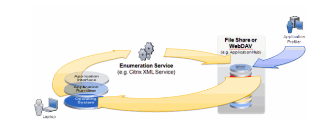
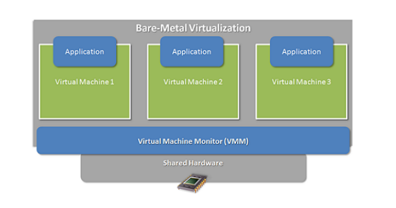
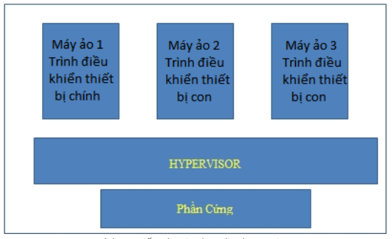
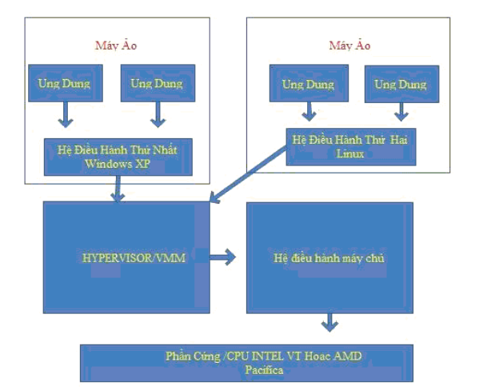
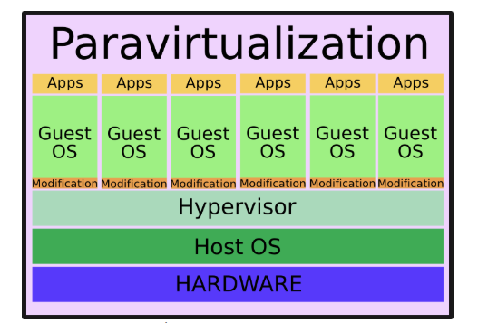

### 1.Virtualzation ( Ảo Hóa)

> Ảo hóa được hiểu đơn giản là phần mềm trung gian giữa hệ thống phần cứng và phần mềm lớp trên nó. Ý tưởng của công nghệ là tạo ra 
nhiều máy tính ảo hoạt động độc lập từ một máy chủ vật lý duy nhất.

#### 1.1 Các ưu điểm mà ảo hóa đem lại :
##### Máy ảo được tạo ra với 4 mục tiêu chính: Availability , scalability , optimization , Management.
- Giảm chi phí hạ tầng.
- Hợp nhất được các phần cứng đem lại hiệu quả to lớn hơn từ vài server.
- Quản lý , bảo trì hạ tầng CNTT và triển khai các ứng dụng mới thuận tiện hơn.
- Tối ưu hiệu suất làm việc của mỗi server. 
- Linh hoạt thay đổi theo nhu cầu thực tế. 
- Tăng cường HA (high availability )
#### 1.2 Virtual machine (Máy Ảo)

> Máy ảo hoạt động cùng với máy chủ , nhưng độc lập về hệ điều hành.
 
### 2. Kiến trúc của ảo hóa
#### 2.1 Kiến trúc ảo hóa Hosted-based.
> Hosted-based hay còn gọi là kiến trúc hosted hypervisor.Kiến trúc này sử dụng một lớp hypervisor chạy trên nền tảng hệ điều hành , cung 
cấp phân chia tài nguyên tới các máy ảo. Hypervisor được coi là một lớp của ảo hóa thì nó sẽ nằm giữa lớp phần cứng và hệ điều hành của 
máy khách.




##### Hệ thống ảo hóa sử dụng mô hình Hypervisor ( Hosted-based) được chia làm 4 lớp hoạt động
- Nền tảng phần cứng : Bao gồm CPU , RAM , Storage , thiết vị ngoại vi và các thiết bị khác.
- Hệ điều hành Host : Hệ điều dùng để giao tiếp trực tiếp với các thiết bị phần cứng.
- Hệ thống Virtual machine monitor (Hypervisor) : Chạy trên hệ điều hành của Host .
- Các ứng dụng của máy ảo: Sử dụng tài nguyên do Hypervisor quản lý 
###### Một số hệ thống Hypervisor dạng Hosted-base thường gặp như : VMware server , máy ảo java.....

#### 2.2 Kiến trúc ảo hóa Hypervisor-based
> Hypervisor-based hay còn đươc gọi là bare-metal hypervisor , chạy trực tiếp trên lớp phần cứng của máy chủ .



##### Hệ thống ảo hóa máy chủ sử dụng Hypervisor-based (bare-metal hypervisor) bao gồm 3 lớp chinh.
- Nền tảng phần cứng : Bao gồm CPU , RAm  , Storage , thiết bị ngoại vi và các thiết bị khác.
- Lớp nền tảng ảo hóa Virtual machine moniter: Kết nối liên lạc trực tiếp với các thiết bị phần cứng
- Các ứng dụng máy ảo: Các máy ảo này sẽ lấy tài nguyên từ phần cứng, thông qua sự cấp phát và quản lý của hypervisor.
- Mô hình Hypervisor-based có 2 dạng là : Monothic Hypervisor và Microkernel Hypervisor.
###### Một số hệ thống Bare-metal hypervisor thường gặp như : Oracle VM , VMware EXR server, Microsoft`s Hyper-V.......
#### 2.2.1 Monolithic Hypervisor 



- Trong mô hình này , Hypervisor đóng vai trò điều khiển , cấp phát tài nguyên cho các máy ảo khi có yêu cầu . Nếu lớp điều khiển này gặp lỗi
thì các máy ảo ở trên sẽ bị ảnh hưởng . Monolithic Hypervisor bị phụ thuộc nhiều vào phần cứng , gây khó khăn trong việc phát triển công 
nghệ về sau.

#### 2.2.2 Microkernel Hypervisor



- Microkernel Hypervisor gần giống Monolithic Hypersivor nhưng khác nhau ở điểm , trình điều khiển được cài trên một máy ảo và được gọi là trình 
điều khiển chính , trình điều khiển này quản lý các trình điều khiển con .
#### 2.3 Kiến trúc ảo hóa Hybrid



- Trong mô hình này , lớp ảo hóa Hypervisor chạy song song với hệ điều hành máy chủ . Máy chủ ảo vẫn phải đi qua hệ điều hành máy chủ chính 
để truy cập tơi phần cứng. Điểm khác biệt giúp Hypervisor nhanh hơn là cả hệ điều hành máy chủ ảo và máy chủ đều hoạt động ở chế độ hạt nhân. 

### 3. Các mức độ ảo hóa
#### 3.1 Ảo hóa toàn phần.
- Full-virtualization : Hệ điều hành các máy khách hoạt động như các máy vật lý thông thường.Tuy nhiên , hỗ trợ khá ít hệ điều hành
### 3.2 Ảo hóa song song(Paravirtualization) 




- Paravirtualization là phương pháp ảo hóa máy chủ . Dồn các truy cập từ các máy ảo xuống hệ điều hành của máy chủ vật lý. Ảo hóa song song 
giúp tăng tốc độ và hiệu quả sử dụng tài nguyên hơn so với ảo hóa toàn phần. Nhưng không phải bất cứ hệ điều hành nào cũng chạy được ảo
hóa song song

### 3.2 Ảo hóa hệ điều hành.
### 3.2 Ảo hóa ứng dụng.

### 4 Một số điều lưu ý khi triển khai Ảo hóa.
#### 4.1 Giai đoạn phân tích  và lên kế hoạch.
- Khả năng tương thích: Phân tích đáp ứng sự tương thích của phần mềm và phần cứng trong hệ thống cần triển khai.
- Bản quyền: Cần tìm hiểu kỹ các hệ điều hành và các ứng dụng cài trên ảo hóa vì một số có thể bị lỗi trong quá trình triển khai.
- Lên kế hoạch triển khai: lên kế hoạch triển khai và các biện pháp dự trù khi có sự cố sảy ra
#### 4.2 Giai đoạn triển khai.
- Độ tin cậy : Vì hạ tầng phần cứng có thể sảy ra lỗi, nên cần có các công cụ tích hợp cho việc sao lưu phục hồi dữ liệu
- HA (high availability): đam bảo hệ thống luôn sẵn sàng trước các sự cố.
#### 4.3 Duy trì và bảo trì hệ thống
- Khả năng quản lý và mở rộng: Đảm bảo hệ thống có khả năng co dãn theo nhu cầu sử dụng
- Vấn đề bảo mật : Đảm bảo máy ảo và máy chủ vật lý cần được duy trì bảo vệ.


 

